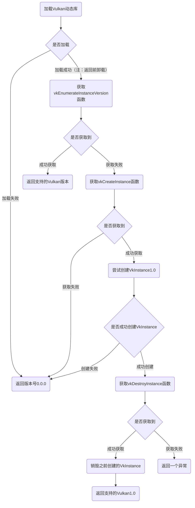
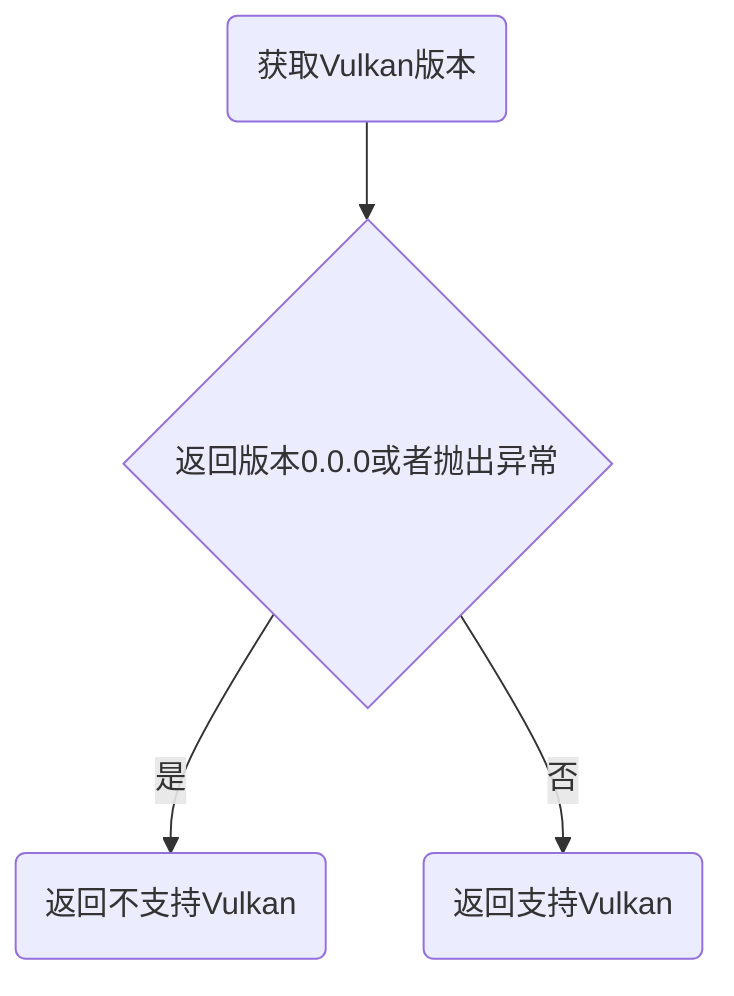
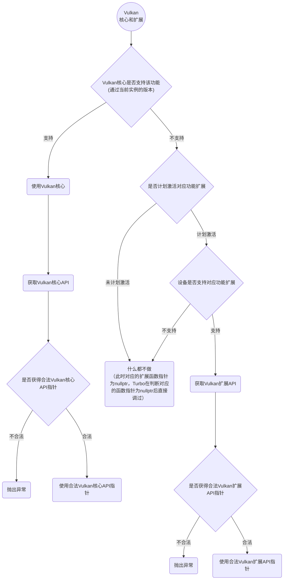
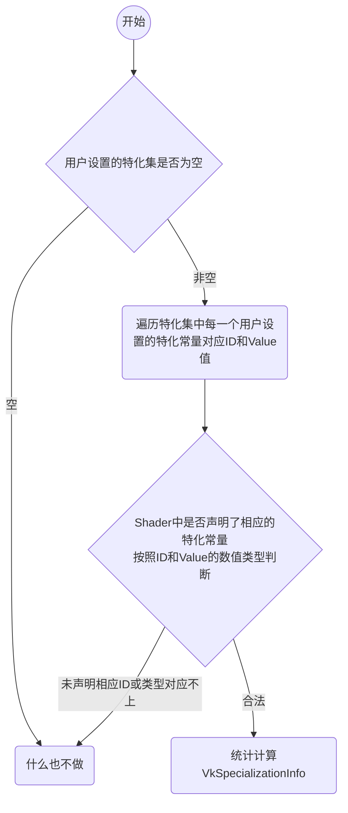

# 核心设计

## 更新日志

* 2023/3/19
  >
  >* 更新`Dynamic Rendering`章节
  >* 创建`Device Feature`章节

* 2023/3/20
  >
  >* 创建更新`Device Feature`章节

* 2023/3/22
  >
  >* 创建更新`Dynamic Rendering的Pipeline`章节

* 2023/3/25
  >
  >* 更新`Dynamic Rendering的Pipeline`章节

* 2023/3/29
  >
  >* 更新`Dynamic Rendering的Pipeline`章节
  >* 创建`Dynamic Rendering的渲染`章节

* 2023/4/10
  >
  >* 创建`Tessellation`章节
  >* 创建`Device Tessellation Feature`章节
  >* 创建`Tessellation Graphics Pipeline`章节

* 2023/4/16
  >
  >* 创建`Mesh Shader`章节
  >* 创建`Mesh Shader 接口函数`章节
  >* 创建`Mesh Shader Feature`章节

* 2023/4/17
  >
  >* 更新`Mesh Shader`章节

* 2023/4/18
  >
  >* 创建`获取 Vulkan API`章节
  >* 创建`实例级别`章节
  >* 创建`物理设备级别`章节
  >* 创建`设备级别`章节
  >* 创建`获取Vulkan版本`章节
  >* 创建`是否支持Vulkan`章节

* 2023/4/19
  >
  >* 更新`获取 Vulkan API`章节
  >* 更新`物理设备级别`章节
  >* 更新`设备级别`章节

* 2023/4/21
  >
  >* 更新`Mesh Shader`章节
  >* 创建`Vulkan标准和扩展`章节

* 2023/4/24
  >
  >* 创建`Mesh Shader GraphicsPipeline`章节

* 2023/4/25
  >
  >* 更新`Mesh Shader GraphicsPipeline`章节

* 2023/4/27
  >
  >* 创建`Specialization Constants`章节

* 2023/5/2
  >
  >* 更新`VkSpecializationInfo`章节

* 2023/5/4
  >
  >* 创建`特化判断流程`章节

---

## 获取 Vulkan API

由于`Vulkan`中有三种级别的函数

* 实例级别（instance-level）的函数（使用`vkGetInstanceProcAddr`获取）
* 物理设备级别（physical-device-level）的函数（使用`vkGetInstanceProcAddr`获取）
* 设备级别（device-level）的函数（使用`vkGetDeviceProcAddr`获取）

随着`Vulkan`的发展版本的更新，会随着版本的更新增加新的函数，如果创建`VkInstance`时指定的版本和物理设备获取的函数的`Vulkan`发布版本（`VkPhysicalDeviceProperties::apiVersion`）早的话，就算返回了有效函数也不应该使用（但有例外，见下文`物理设备级别`章节），比如：创建`VkInstance`时指定的版本为`Vulkan1.0`而之后使用该实例去获取`Vulkan1.1`发布的`vkBindBufferMemory2`函数，此时就算返回的函数可用也不应该使用。

### 实例级别

实例级别的函数广义上是指`Vulkan`中的所有可使用`VkInstance`，`VkPhysicalDevice`，`VkDevice`，`VkQueue`或者`VkCommandBuffer`调度的函数，并且在获取这些函数时需要传递一个有效`VkInstance`。

其中有一些函数比较特殊，为全局函数，在获取时不需要传递有效`VkInstance`，直接传递`VK_NULL_HANDLE`既可以有效获取：

* vkEnumerateInstanceVersion
* vkEnumerateInstanceExtensionProperties
* vkEnumerateInstanceLayerProperties
* vkCreateInstance

### 物理设备级别

物理设备级别的函数是指接口函数第一个参数是`VkPhysicalDevice`的函数，比如`vkGetPhysicalDeviceProperties`或者`vkGetPhysicalDeviceFeatures`等函数。

物理设备级别函数的获取有特例，可以获取`Vulkan`高版本的物理设备级别函数进行使用（前提是物理设备支持高版本的`Vulkan`）。比如：创建`VkInstance`时指定的版本为`Vulkan1.0`而之后使用该实例去获取`Vulkan1.1`发布的`vkGetPhysicalDeviceFeatures2`函数，如果设备支持高版本的`Vulkan`并且返回正常则可使用该函数，反之则不行

### 设备级别

设备级别的函数是指接口函数第一个参数是`VkDevice`，`VkQueue`或`VkCommandBuffer`的函数，比如`vkCmdDraw`或`vkCreateBuffer`等。

## 获取Vulkan版本

由于历史原因，在`Vulkan1.0`版本中获取不到系统支持的`Vulkan`版本，只能获取到显卡设备支持的`Vulkan`版本，后来在`Vulkan1.1`后增加了`vkEnumerateInstanceVersion`函数来获取`Vulkan`版本，而`vkEnumerateInstanceVersion`为全局函数，可能会返回`nullptr`（当系统只支持`Vulkan1.0`时）。所以需要有一个判断流程用于获取`Vulkan`版本



## 是否支持Vulkan

通过获取`Vulkan`版本判断



## Vulkan标准和扩展

随着`Vulkan`的发展，每一个`Vulkan`核心版本都会发布新的扩展，并在下一个`Vulkan`核心版中将之前的一部分扩展提升为核心，而`Turbo`也需要随着`Vulkan`的发展进行适配。首要原则是能使用核心标准，尽量使用核心标准，如果设备支持的核心标准过低（导致高版本的`Vulkan`核心功能还处于扩展状态），尝试获取扩展（在用户开启对应扩展功能之后才去获取扩展功能，否则就算用户使用`Turbo`调用了扩展函数，`Turbo`也不会做任何扩展函数调用）。

如果低版本的`Vulkan`实例获取高版本的`Vulkan`核心`API`，所有的高版本的函数皆为`nullptr`，即使调用也不做任何事情。（注：`Vulkan1.0`版本的核心`API`一定不能为`nullptr`）



## Device Feature

随着`Vulkan`标准的发展，每次新版本的发布都会带来新的特性，这就需要`Turbo`维护自己的特性，提供维护自己的`TFeature`数据

经常需要使用的特性如下：

* `geometryShader`在`Vulkan1.0`
* `tessellationShader`在`Vulkan1.0`
* `sampleRateShading`在`Vulkan1.0`
* `depthClamp`在`Vulkan1.0`
* `depthBiasClamp`在`Vulkan1.0`
* `wideLines`在`Vulkan1.0`
* `fillModeNonSolid`在`Vulkan1.0`
* `timelineSemaphore`在`Vulkan1.2`
* `dynamicRendering`在`Vulkan1.3`

`Vulkan`中获取核心特性和扩展的特性需要通过`vkGetPhysicalDeviceFeatures2`或者`vkGetPhysicalDeviceFeatures2KHR`函数获取。

*注意`vkGetPhysicalDeviceFeatures2`是`Vulkan1.1`的函数*

```CXX
// Provided by VK_VERSION_1_1
void vkGetPhysicalDeviceFeatures2(
    VkPhysicalDevice                            physicalDevice,
    VkPhysicalDeviceFeatures2*                  pFeatures);
```

```CXX
// Provided by VK_KHR_get_physical_device_properties2
void vkGetPhysicalDeviceFeatures2KHR(
    VkPhysicalDevice                            physicalDevice,
    VkPhysicalDeviceFeatures2*                  pFeatures);
```

```CXX
// Provided by VK_VERSION_1_1
typedef struct VkPhysicalDeviceFeatures2 {
    VkStructureType             sType;
    void*                       pNext;
    VkPhysicalDeviceFeatures    features;
} VkPhysicalDeviceFeatures2;
```

```CXX
// Provided by VK_KHR_get_physical_device_properties2
typedef VkPhysicalDeviceFeatures2 VkPhysicalDeviceFeatures2KHR;
```

*如果想要使用`vkGetPhysicalDeviceFeatures2KHR`需要激活`VK_KHR_get_physical_device_properties2`的`Instance`扩展*

其中`VkPhysicalDeviceFeatures2`结构体除了可以在`vkGetPhysicalDeviceFeatures2`和`vkGetPhysicalDeviceFeatures2KHR`中使用，也可以用于`VkDeviceCreateInfo`的`pNext`链中，相当于在创建`VkDevice`时通过`pEnabledFeatures`指定支持的特性。

对于`Vulkan1.1`的特性的获取是通过在`vkGetPhysicalDeviceFeatures2`函数中`VkPhysicalDeviceFeatures2`的`pNext`中指定`VkPhysicalDeviceVulkan11Features`

`VkDeviceCreateInfo`的`pNext`链中指定`VkPhysicalDeviceVulkan11Features`，用于激活`Vulkan1.1`特性

*注：`VkPhysicalDeviceVulkan11Features`是`Vulkan1.2`中定义的*

同获取`Vulkan1.2`的特性方式与获取`Vulkan1.1`特性一样，通过在`vkGetPhysicalDeviceFeatures2`函数中`VkPhysicalDeviceFeatures2`的`pNext`中指定`VkPhysicalDeviceVulkan12Features`

`VkDeviceCreateInfo`的`pNext`链中指定`VkPhysicalDeviceVulkan12Features`，用于激活`Vulkan1.2`特性

获取`Vulkan1.3`的特性方式与之前相同，通过在`vkGetPhysicalDeviceFeatures2`函数中`VkPhysicalDeviceFeatures2`的`pNext`中指定`VkPhysicalDeviceVulkan13Features`

`VkDeviceCreateInfo`的`pNext`链中指定`VkPhysicalDeviceVulkan13Features`，用于激活`Vulkan1.3`特性

在`Vulkan1.3`版本中，对于`DynamicRendering`特性，除了`VkBool32 VkPhysicalDeviceVulkan13Features::dynamicRendering`中可以获取之外，还可以通过在`vkGetPhysicalDeviceFeatures2`函数中`VkPhysicalDeviceFeatures2`的`pNext`中指定`VkPhysicalDeviceDynamicRenderingFeatures`获取

```CXX
// Provided by VK_VERSION_1_3
typedef struct VkPhysicalDeviceDynamicRenderingFeatures {
    VkStructureType    sType;
    void*              pNext;
    VkBool32           dynamicRendering;
} VkPhysicalDeviceDynamicRenderingFeatures;
```

并且`VkPhysicalDeviceDynamicRenderingFeatures`也可以用于`VkDeviceCreateInfo`的`pNext`链中，用于激活`DynamicRendering`特性

*注：按照`Vulkan1.3`的标准，如果`VkDeviceCreateInfo::pNext`中已经链上了`VkPhysicalDeviceVulkan13Features`则不能再链接`VkPhysicalDeviceDynamicRenderingFeatures`*

## Dynamic Rendering

对于`Vulkan`中的`Dynamic Rendering`主要如下函数

* `vkCmdBeginRenderingKHR`或者`vkCmdBeginRendering`
* `vkCmdEndRenderingKHR`或者`vkCmdEndRendering`

```CXX
// Provided by VK_VERSION_1_3
void vkCmdBeginRendering(
    VkCommandBuffer                             commandBuffer,
    const VkRenderingInfo*                      pRenderingInfo);
```

```CXX
// Provided by VK_KHR_dynamic_rendering
void vkCmdBeginRenderingKHR(
    VkCommandBuffer                             commandBuffer,
    const VkRenderingInfo*                      pRenderingInfo);
```

```CXX
// Provided by VK_VERSION_1_3
void vkCmdEndRendering(
    VkCommandBuffer                             commandBuffer);
```

```CXX
// Provided by VK_KHR_dynamic_rendering
void vkCmdEndRenderingKHR(
    VkCommandBuffer                             commandBuffer);
```

### Dynamic Rendering的Pipeline

对于`Dynamic Rendering`，不需要提前创建`Framebuffer`和`RenderPass`，对于`Framebuffer`和`RenderPass`的指定是在`vkCmdBeginRenderingKHR`构建时指定的，由于不需要`RenderPass`了，所以需要`Turbo`提供不需要`TRenderPass`和`Subpass`(`Vulkan`中对于`Dynamic Rendering`默认只支持一个`Subpass`的情况)的`GraphicsPipeline`版本。

对于提供不需要`TRenderPass`的`GraphicsPipeline`版本，目前有两种选择

1. 将当前`TGraphicsPipeline`提供一个没有`TRenderPass`和`Subpass`的版本，用于适配支持`Dynamic Rendering`的`Pipeline`(在此基础上可以考虑从`TGraphicsPipeline`派生一个`TRenderingPipeline`)

2. 从`TPipeline`派生出一个新的类`TRenderingPipeline`（内容和`TGraphicsPipeline`基本相同），专门用于适配支持`Dynamic Rendering`的`Pipeline`

根据`Vulkan`标准创建支持`Dynamic Rendering`需要在创建`Graphics Pipeline`时指定`VkPipelineRenderingCreateInfoKHR`（对于扩展）或者`VkPipelineRenderingCreateInfo`（对于标准），所以采用方式`2`中从`TPipeline`派生一个`TRenderingPipeline`比较符合一般直觉

```CXX
//in Turbo::Core
class TRenderingPipeline : public Turbo::Core::TPipeline
{
  //大部分与TGraphicsPipeline一样
  //不需要指定RenderPass
  //不需要指定Subpass
};
```

创建`Dynamic Rendering Pipeline`时不需要指定`RenderPass`和`Subpass`了，只需要指定要使用的附件`Attachment`的格式

```CXX
// Provided by VK_VERSION_1_3
typedef struct VkPipelineRenderingCreateInfo {
  VkStructureType sType;
  const void* pNext;
  uint32_t viewMask;
  uint32_t colorAttachmentCount;
  const VkFormat* pColorAttachmentFormats;
  VkFormat depthAttachmentFormat;
  VkFormat stencilAttachmentFormat;
} VkPipelineRenderingCreateInfo;
```

对于`Dynamic Rendering`需要指定的附件`Attachment`仅仅为对应的`VkFormat`。为此声明一个`TAttachmentsFormats`用于记录各个附件的格式

```CXX
//in Turbo::Core
class TAttachmentsFormats
{
  private:
    std::vector<TFormatType> colorAttachmentFormats;
    TFormatType depthAttachmentFormat = TFormatType::UNDEFINED;
    TFormatType stencilAttachmentFormat = TFormatType::UNDEFINED;

    void AddColorAttachmentFormat(TFormatType formatType);
    void SetDepthAttachmentFormat(TFormatType formatType);
    void SetStencilAttachmentFormat(TFormatType formatType);
};
```

### Dynamic Rendering的渲染

对于`Dynamic Rendering`的渲染最基本的就两个调用函数：

```CXX
// Provided by VK_VERSION_1_3
void vkCmdBeginRendering(
    VkCommandBuffer                             commandBuffer,
    const VkRenderingInfo*                      pRenderingInfo);
```

```CXX
// Provided by VK_VERSION_1_3
void vkCmdEndRendering(
    VkCommandBuffer                             commandBuffer);
```

而对于`vkCmdBeginRendering`在渲染时需要指定`VkRenderingInfo`

```CXX
// Provided by VK_VERSION_1_3
typedef struct VkRenderingInfo {
    VkStructureType                     sType;
    const void*                         pNext;
    VkRenderingFlags                    flags;
    VkRect2D                            renderArea;
    uint32_t                            layerCount;
    uint32_t                            viewMask;
    uint32_t                            colorAttachmentCount;
    const VkRenderingAttachmentInfo*    pColorAttachments;
    const VkRenderingAttachmentInfo*    pDepthAttachment;
    const VkRenderingAttachmentInfo*    pStencilAttachment;
} VkRenderingInfo;
```

默认情况下`viewMask`设置为`0`表示所有的附件的`layer`都按照`layerCount`的值来设置。最终要的是设置`VkRenderingAttachmentInfo`用于指定真正的附件。

```CXX
// Provided by VK_VERSION_1_3
typedef struct VkRenderingAttachmentInfo {
    VkStructureType          sType;
    const void*              pNext;
    VkImageView              imageView;
    VkImageLayout            imageLayout;
    VkResolveModeFlagBits    resolveMode;
    VkImageView              resolveImageView;
    VkImageLayout            resolveImageLayout;
    VkAttachmentLoadOp       loadOp;
    VkAttachmentStoreOp      storeOp;
    VkClearValue             clearValue;
} VkRenderingAttachmentInfo;
```

为此声明一个`TRenderingAttachments`用于记录各个附件

```CXX
//in Turbo::Core
class TRenderingAttachments
{
};
```

为了在`Turbo`中能够执行`Dynamic Rendering`指令，`TCommandBufferBase`中需要提供相应接口。

```CXX
//in Turbo::Core::TCommandBufferBase
void CmdBeginRendering(const TRenderingAttachments& renderingAttachment);
```

```CXX
//in Turbo::Core::TCommandBufferBase
void CmdEndRendering();
```

## Tessellation

细分（`Tessellation`）。用于细分网格。

细分流程分为如下三个阶段：

1. 细分控制着色器（可编程） Tessellation Control Shader
2. 生成细分图元（不可编程） Tessellation Primitive Generator
3. 细分评估（计算）着色器（可编程） Tessellation Evaluation Shader

### Device Tessellation Feature

`Vulkan`中想要使用细分特性，需要查看和激活对应的设备`feature`。有关的细分的`feature`如下：

```CXX
//in VkPhysicalDeviceFeatures
VkBool32    tessellationShader;
VkBool32    shaderTessellationAndGeometryPointSize;
```

* 如果设备获取的特性中`tessellationShader`为`VK_FALSE`的话，说明该设备不支持细分特性。
* `shaderTessellationAndGeometryPointSize`用于说明细分控制着色器和细分评估着色器和几何着色器中的内置变量`PointSize`是否有效可用，如果为`VK_FALSE`的话相关着色器禁止对其进行读写

```CXX
//in VkPhysicalDeviceVulkan11Features 
VkBool32           multiviewTessellationShader;
```

* `multiviewTessellationShader`用于说明一个`RenderPass`中的细分着色器是否支持`multiview rendering`，如果该特性为`VK_FALSE`的话，对于`view mask`非零的管线其不能包括任何细分着色器

```CXX
//in VkPhysicalDeviceVulkan12Features 
VkBool32           shaderOutputLayer;
```

* `shaderOutputLayer` indicates whether the implementation supports the ShaderLayer SPIR-V capability enabling variables decorated with the Layer built-in to be exported from vertex or tessellation evaluation shaders. If this feature is not enabled, the Layer built-in decoration must not be used on outputs in vertex or tessellation evaluation shaders.（没看懂干啥的，好像是顶点着色器和细分着评估色器中有个内置`Layer`声明，这个`shaderOutputLayer`好像是用来指示这个内置`Layer`声明能不能用）

还有一个特性需要明确一下：

```CXX
//in VkPhysicalDeviceFeatures  
VkBool32           fillModeNonSolid;
```

* `fillModeNonSolid`用于说明是否支持点`point`和线框`wireframe`的填充模式，如果该特性不支持的话`VK_POLYGON_MODE_POINT`和`VK_POLYGON_MODE_LINE`是不能使用的（很多时候是将模型渲染成线框看细分结果）

### Tessellation Graphics Pipeline

根据`Vulkan`标准，细分着色器是指定于:

```CXX
//位于VkGraphicsPipelineCreateInfo中
const VkPipelineShaderStageCreateInfo* pStages;
```

对于`Tessellation`的配置是指定于：

```CXX
//位于VkGraphicsPipelineCreateInfo中
const VkPipelineTessellationStateCreateInfo* pTessellationState;
```

根据`Vulkan`标准，有如下要求：

>[VUID-VkGraphicsPipelineCreateInfo-pStages-00729](https://registry.khronos.org/vulkan/specs/1.3/html/chap10.html#VUID-VkGraphicsPipelineCreateInfo-pStages-00729)  
>If the pipeline is being created with `pre-rasterization shader state` and `pStages` includes a tessellation control shader stage, it `must` include a tessellation evaluation shader stage
>
>如果`VkGraphicsPipelineCreateInfo`中的`pStages`中包括细分控制着色器话，`VkGraphicsPipelineCreateInfo`中的`pStages`必须也包含一个细分评估着色器

>[VUID-VkGraphicsPipelineCreateInfo-pStages-00730](https://registry.khronos.org/vulkan/specs/1.3/html/chap10.html#VUID-VkGraphicsPipelineCreateInfo-pStages-00730)  
>If the pipeline is being created with `pre-rasterization shader state` and `pStages` includes a tessellation evaluation shader stage, it `must` include a tessellation control shader stage
>
>如果`VkGraphicsPipelineCreateInfo`中的`pStages`中包括细分评估着色器话，`VkGraphicsPipelineCreateInfo`中的`pStages`必须也包含一个细分控制着色器

>[VUID-VkGraphicsPipelineCreateInfo-pStages-00731](https://registry.khronos.org/vulkan/specs/1.3/html/chap10.html#VUID-VkGraphicsPipelineCreateInfo-pStages-00731)  
>If the pipeline is being created with `pre-rasterization shader state` and `pStages` includes a tessellation control shader stage and a tessellation evaluation shader stage, pTessellationState `must` be a valid pointer to a valid `VkPipelineTessellationStateCreateInfo`structure
>
>如果`VkGraphicsPipelineCreateInfo`中的`pStages`中包括细分控制着色器和细分评估着色器的话，`VkGraphicsPipelineCreateInfo`中的`pTessellationState`必须是个有效的`VkPipelineTessellationStateCreateInfo`结构值

>[VUID-VkGraphicsPipelineCreateInfo-pStages-00736](https://registry.khronos.org/vulkan/specs/1.3/html/chap10.html#VUID-VkGraphicsPipelineCreateInfo-pStages-00736)  
>If the pipeline is being created with `pre-rasterization shader state` and `pStages` includes tessellation shader stages, the `topology` member of pInputAssembly `must` be `VK_PRIMITIVE_TOPOLOGY_PATCH_LIST`
>
>如果`VkGraphicsPipelineCreateInfo`中的`pStages`中包括细分着色器的话，`VkGraphicsPipelineCreateInfo`中的`pInputAssemblyState`中的`topology`成员值必须是`VK_PRIMITIVE_TOPOLOGY_PATCH_LIST`

>[VUID-VkGraphicsPipelineCreateInfo-topology-00737](https://registry.khronos.org/vulkan/specs/1.3/html/chap10.html#VUID-VkGraphicsPipelineCreateInfo-topology-00737)  
>If the pipeline is being created with `pre-rasterization shader state` and the topology member of `pInputAssembly` is `VK_PRIMITIVE_TOPOLOGY_PATCH_LIST`, pStages `must` include tessellation shader stages
>
>如果，`VkGraphicsPipelineCreateInfo`中的`pInputAssemblyState`中的`topology`成员值是`VK_PRIMITIVE_TOPOLOGY_PATCH_LIST`的话，`VkGraphicsPipelineCreateInfo`中的`pStages`中必须包括细分着色器

>[VUID-VkPipelineTessellationStateCreateInfo-patchControlPoints-01214](https://registry.khronos.org/vulkan/specs/1.3/html/chap22.html#VUID-VkPipelineTessellationStateCreateInfo-patchControlPoints-01214)  
>`patchControlPoints` must be greater than zero and less than or equal to `VkPhysicalDeviceLimits::maxTessellationPatchSize`
>
>如果，`VkGraphicsPipelineCreateInfo`中的`pTessellationState`中的`patchControlPoints`成员变量必须大于`0`，并且小于等于`VkPhysicalDeviceLimits::maxTessellationPatchSize`

综上：

* 如果想要使用细分特性，必须同时指定对应的细分控制着色器和细分评估着色器
* 如果想要使用细分特性，`VkGraphicsPipelineCreateInfo`中的`pTessellationState`必须是个有效值
* 如果想要使用细分特性，`VkGraphicsPipelineCreateInfo`中的`pInputAssemblyState`中的`topology`必须是`VK_PRIMITIVE_TOPOLOGY_PATCH_LIST`

## Mesh Shader

`Mesh Shader`在`Vulkan`中作为`NVIDIA`显卡上的一个设备扩展，被命名为`VK_NV_mesh_shader`。该扩展依赖于`VK_KHR_get_physical_device_properties2`扩展

有两种新的可编程着色器

* Task Shader
* Mesh Shader

这两个着色器可以用于替代如下过程

* 获取顶点属性
* 顶点着色器
* 细分着色器
* 几何着色器

同时该扩展同时会开启`SPV_NV_mesh_shader`的`SPIR-V`扩展

`Vulkan`中还有一个名为`VK_EXT_mesh_shader`的设备扩展，该扩展为更加通用的扩展。与`VK_NV_mesh_shader`不完全一样，有区别。

其中`VK_NV_mesh_shader`依赖`VK_KHR_get_physical_device_properties2`扩展

* `VK_KHR_get_physical_device_properties2`在`Vulkan1.1`标准中被提升为核心标准

其中`VK_EXT_mesh_shader`依赖`VK_KHR_spirv_1_4`扩展

* `VK_KHR_spirv_1_4`在`Vulkan1.2`标准中被提升为核心标准
* `VK_KHR_spirv_1_4`依赖`VK_KHR_shader_float_controls`扩展
* `VK_KHR_shader_float_controls`在`Vulkan1.2`标准中被提升为核心标准
* `VK_KHR_shader_float_controls`依赖`VK_KHR_get_physical_device_properties2`扩展

### Mesh Shader Feature

需要查看设备是否支持`Mesh Shader`特性，之后再去激活相关特性。对于特性获取有两种方式：

1. 通过`Vulkan 1.1`的`vkGetPhysicalDeviceFeatures2`函数：

    ```CXX
    // Provided by VK_VERSION_1_1
    void vkGetPhysicalDeviceFeatures2(
      VkPhysicalDevice physicalDevice,
      VkPhysicalDeviceFeatures2* pFeatures);

    ```

2. 通过`VK_KHR_get_physical_device_properties2`扩展获得：

    ```CXX
    // Provided by VK_KHR_get_physical_device_properties2
    void vkGetPhysicalDeviceFeatures2KHR(
      VkPhysicalDevice physicalDevice,
      VkPhysicalDeviceFeatures2* pFeatures);

    ```

### Mesh Shader 接口函数

新增如下接口函数

```CXX
// Provided by VK_NV_mesh_shader
void vkCmdDrawMeshTasksIndirectCountNV(
  VkCommandBuffer commandBuffer,
  VkBuffer buffer,
  VkDeviceSize offset,
  VkBuffer countBuffer,
  VkDeviceSize countBufferOffset,
  uint32_t maxDrawCount,
  uint32_t stride)
```

```CXX
// Provided by VK_NV_mesh_shader
void vkCmdDrawMeshTasksIndirectNV(
  VkCommandBuffer commandBuffer,
  VkBuffer buffer,
  VkDeviceSize offset,
  uint32_t drawCount,
  uint32_t stride);

```

```CXX
// Provided by VK_NV_mesh_shader
void vkCmdDrawMeshTasksNV(
  VkCommandBuffer commandBuffer,
  uint32_t taskCount,
  uint32_t firstTask);
```

主要看一下`vkCmdDrawMeshTasksNV`函数，其中

* `taskCount`是设置本地工作组（`local workgroup`）在`X`轴处的数量，对于`Y`轴和`Z`轴其数量隐示默认为`1`
* `firstTask`是`X`轴上的第一个工作组的`ID`

当`vkCmdDrawMeshTasksNV`被调用时会有`taskCount`个本地工作组组成全局工作组

### Mesh Shader GraphicsPipeline

当创建`GraphicsPipeline`图形管线时使用`Mesh Shader`有一些限值

* 对于`VkGraphicsPipelineCreateInfo::pVertexInputState`如果使用了`Mesh Shader`的话这个参数将会被忽略
* 对于`VkGraphicsPipelineCreateInfo::pInputAssemblyState`如果使用了`Mesh Shader`的话这个参数将会被忽略
* 对于`VkGraphicsPipelineCreateInfo::pStages`中指定的`Shader`只能是一下两种组合不能混合使用：

  ```mermaid
  graph LR
  style id0 stroke-dasharray: 5 5
  MeshShader
  id0(TaskShader)-->MeshShader
  ```

  ```mermaid
  graph LR
  style id0 stroke-dasharray: 5 5
  style id1 stroke-dasharray: 5 5
  style id2 stroke-dasharray: 5 5
  VertxShader

  FragmentShader
  VertxShader-->id0(TessellationControlShader)-->id1(TessellationEvaluationShader)-->id2(GeometryShader)-->FragmentShader
  ```

* 如果使用了`Mesh Shader`的话`VkGraphicsPipelineCreateInfo::pDynamicStates`中不能包含`VK_DYNAMIC_STATE_PRIMITIVE_TOPOLOGY`，`VK_DYNAMIC_STATE_VERTEX_INPUT_BINDING_STRIDE`，`VK_DYNAMIC_STATE_PRIMITIVE_RESTART_ENABLE`，`VK_DYNAMIC_STATE_PATCH_CONTROL_POINTS_EXT`，`VK_DYNAMIC_STATE_VERTEX_INPUT_EXT`
* 对于`VkGraphicsPipelineCreateInfo::pTessellationState`如果使用了`Mesh Shader`的话这个参数将会被忽略(`Vulkan`标准中没有明文指出该限值，只是说如果`VkGraphicsPipelineCreateInfo::pStages`有细分着色器的话此项目需要合法，通过`Shader`组合限制可推出该条目)

## Specialization Constants

`Specialization Constants`用于在着色器中定义特化常量，这个`特化`的意思为在创建该着色器的`Pipeline`中可以指定该常量的值。

在`GLSL`中声明如下：

```CXX
layout(constant_id = 17) const int arraySize = 12;
```

根据`GLSL`标准：`12`为用户设置`arraySize`的默认值，`17`是用户自定义设置的特化常量`id`号。并且特化常量只能声明成标量数据，包括`bool`，`int`，`uint`，`float`，`double`类型。

`GLSL`内置的常量也可以声明成特化常量，比如：

```CXX
layout(constant_id = 31) gl_MaxClipDistances; 
```

如果在该内置常量使用后再声明成特化常量的话会在编译时产生编译错误，也就是要求一个常量要么是非特化的普通常量，要么是特化常量，不能两个都是。

对于特化常量最常见的用法是通过使用`local_size_{xyz}_id`特化常量来分别指定计算着色器的`gl_WorkGroupSize`每个分量的`id`。比如：

```CXX
layout(local_size_x_id = 18, local_size_z_id = 19) in;
```

这里没有设置`local_size_y_id`表明`gl_WorkGroupSize.y`是一个非特化常量值，也就是设定`gl_WorkGroupSize`为部分特化向量值。

对于`x`和`z`的值可以滞后进行特化。在生成`SPIR-V`之后，使用`id`号分别为`18`和`19`进行分别声明工作组纬度大小：

```CXX
layout(local_size_x = 32, local_size_y = 32) in; // 大小为 (32,32,1)
layout(local_size_x_id = 18) in; // x的constant_id 
layout(local_size_z_id = 19) in; // z的constant_id
```

现有标准对于声明`local_size_x`，`local_size_y`和`local_size_z`并不会改变。对于相同的`local-size`的`id`设置了不同的值或者在使用后再设置特化值都会产生编译错误。对于顺序、位置、声明和重复都不会导致错误

### VkSpecializationInfo

在`Vulkan`中通过创建`Pipeline`时设置`VkPipelineShaderStageCreateInfo::pSpecializationInfo`进行特化常量的数值设定。

```CXX
// Provided by VK_VERSION_1_0
typedef struct VkPipelineShaderStageCreateInfo {
    VkStructureType                     sType;
    const void*                         pNext;
    VkPipelineShaderStageCreateFlags    flags;
    VkShaderStageFlagBits               stage;
    VkShaderModule                      module;
    const char*                         pName;
    const VkSpecializationInfo*         pSpecializationInfo;
} VkPipelineShaderStageCreateInfo;
```

```CXX
// Provided by VK_VERSION_1_0
typedef struct VkSpecializationInfo {
    uint32_t                           mapEntryCount;
    const VkSpecializationMapEntry*    pMapEntries;
    size_t                             dataSize;
    const void*                        pData;
} VkSpecializationInfo;
```

```CXX
// Provided by VK_VERSION_1_0
typedef struct VkSpecializationMapEntry {
    uint32_t    constantID;
    uint32_t    offset;
    size_t      size;
} VkSpecializationMapEntry;
```

其中`Vulkan`标准要求：`VkSpecializationInfo`中所有的`VkSpecializationMapEntry`的`constantID`不能重复
其中`Vulkan`标准要求：如果特化常量的类型为`bool`类型的话`VkSpecializationMapEntry`中的`size`大小必须是`VkBool32`的大小值

每一个`Shader`都会有自己的特化常量，对于特化常量的对外接口应该位于每个`Shader`中，大致流程如下：

```CXX
TShader* some_shader = new TShader();
some_shader->SetConstant(0, true);
some_shader->SetConstant(1, 10);
some_shader->SetConstant(8, 20.0);
some_shader->SetConstant(13, 400);
```

之后在创建`VkPipeline`时根据指定的多个`Shader`中的特化常量进行数据设置。

* 如果用户通过的`TShader::SetConstant`设置的`id`在`Shader`代码中并没有声明的话，不会造成任何问题，`Turbo`将会跳过该`id`（详情请查看后文的`特化判断流程`）
* 如果用户在`Shader`代码中已经声明了某个`id`的特化常量，而未通过的`TShader::SetConstant`设置特化常量值，则使用`Shader`代码中声明的默认值

#### 特化判断流程


