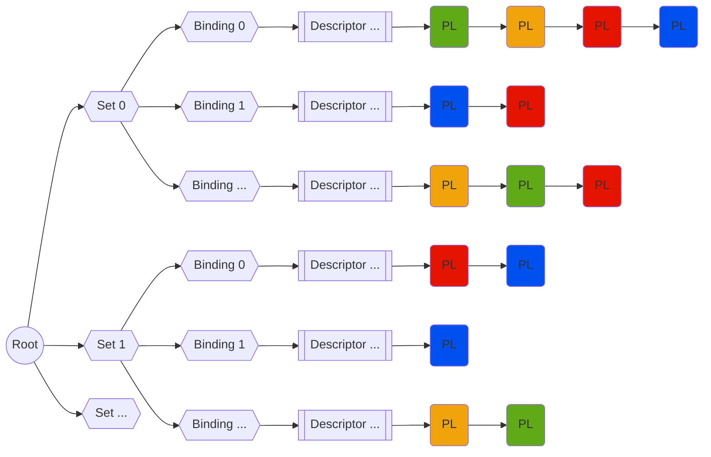
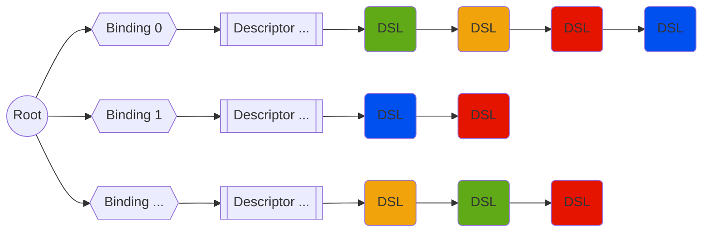
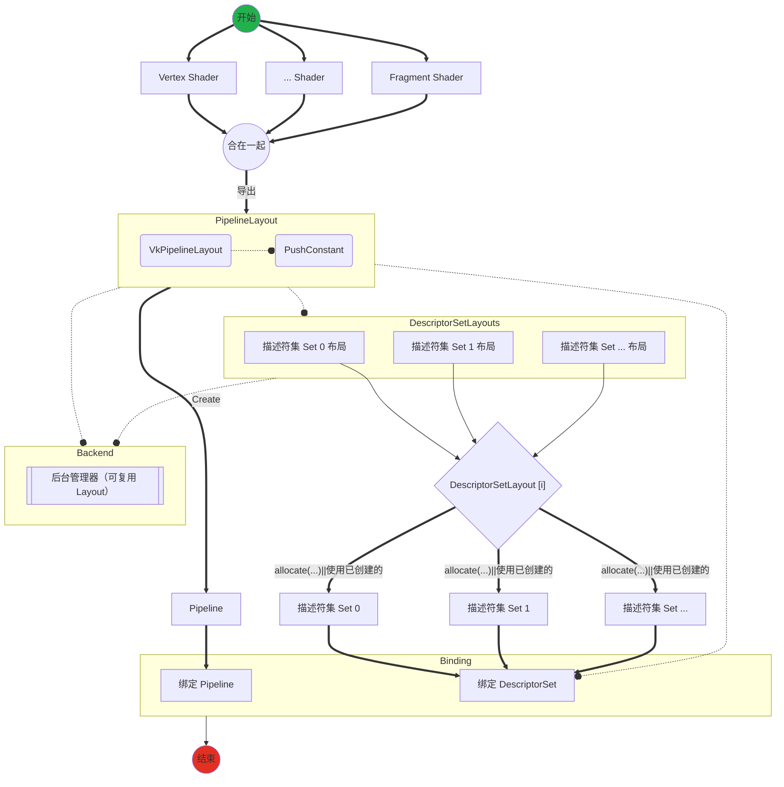
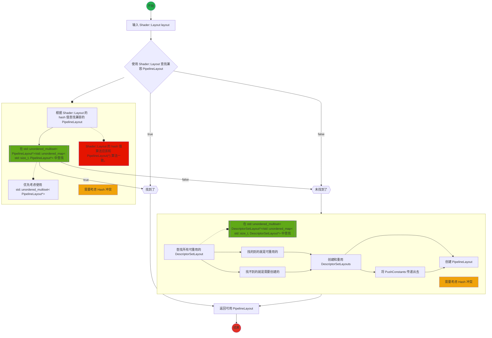

# 设计

## 需求

* ``TShader`` 解析 ``SPIR-V`` 返回 ``TShader::TLayout``

## Descriptor

* 一个 `VkDescriptorSetLayout` 对应一个 ``set 号`` （简称 ``set``）
* 一个 `set` 下有多个不同的 `binding`
* 一个 `binding` 对应一个类型资源数组（单一资源是长度为 ``1`` 的数组）

分配描述符时，是以 ``set`` 为单位分配的。

### 描述符

描述符（ ``Descriptor`` ）主要需要如下数据：

1. 类型
2. 数量（数组元素个数）

### 描述符 binding

主要对应 ``VkDescriptorSetLayoutBinding`` ，主要需要如下数据：

1. binding 号。绑定在哪一个位置。
2. 描述符
3. 都有哪些着色器阶段需要访问该绑定（*可选项：* 可使用 ``VK_SHADER_STAGE_ALL`` 表示任意着色器阶段都可以使用该绑定）
4. 常驻采样器（*可选项：* 可以不使用，赋空）

* *注：* 如果是 input attachment 类型的描述符绑定，只有 fragment 着色阶段（片元着色）可访问。
* *注：* 如果 ``descriptorCount`` 为 ``0`` 用于占位符（``pipeline layout`` 中不连续 ``set`` 号时）。

### 描述符 set

多个【描述符 binding】的集合

*注：*

### Pipeline Layout

多个 【set】的集合

多出个 `PushConstant` 特性。

不依赖 pipeline

```CXX
typedef struct VkPipelineLayoutCreateInfo {
    VkStructureType                 sType;
    const void*                     pNext;
    VkPipelineLayoutCreateFlags     flags;
    uint32_t                        setLayoutCount;
    const VkDescriptorSetLayout*    pSetLayouts;
    uint32_t                        pushConstantRangeCount;
    const VkPushConstantRange*      pPushConstantRanges;
} VkPipelineLayoutCreateInfo;
```

```CXX
// Provided by VK_VERSION_1_0
typedef struct VkPushConstantRange {
    VkShaderStageFlags    stageFlags;
    uint32_t              offset;
    uint32_t              size;
} VkPushConstantRange;
```

>* Any two elements of VkPipelineLayoutCreateInfo::pPushConstantRanges must not include the same stage in stageFlags. 不同着色器阶段可以有不同的 push constant

> * VkPipelineLayoutCreateInfo::pSetLayouts must not contain more than one descriptor set layout that was created with VK_DESCRIPTOR_SET_LAYOUT_CREATE_PUSH_DESCRIPTOR_BIT set

根据 `GLSL` 的标准：每一个着色器阶段，只能有一个 `push constant` 。

### 总结

```CXX
PipelineLayout<Set<Binding{id, Descriptor{type, count}}>> pipeline_layout
```

#### 分配

分配的单位是 ``Set`` 。可以一次性分配多个 ``Set`` 。

DescriptorSetLayout -> DescriptorSet

```CXX
// Provided by VK_VERSION_1_0
VkResult vkAllocateDescriptorSets(
    VkDevice                                    device,
    const VkDescriptorSetAllocateInfo*          pAllocateInfo,
    VkDescriptorSet*                            pDescriptorSets);
```

```CXX
// Provided by VK_VERSION_1_0
typedef struct VkDescriptorSetAllocateInfo {
    VkStructureType                 sType;
    const void*                     pNext;
    VkDescriptorPool                descriptorPool;
    uint32_t                        descriptorSetCount;
    const VkDescriptorSetLayout*    pSetLayouts;
} VkDescriptorSetAllocateInfo;
```

#### 更新

更新从 set 为定位开端。

* 更新 某一个set->某个binding->描述符->（多个）资源
* 拷贝 某一个set->某个binding->描述符->（多个）资源

可一次性 更新 多批

DescriptorSet[binding]=...;

```CXX
// Provided by VK_VERSION_1_0
void vkUpdateDescriptorSets(
    VkDevice                                    device,
    uint32_t                                    descriptorWriteCount,
    const VkWriteDescriptorSet*                 pDescriptorWrites,
    uint32_t                                    descriptorCopyCount,
    const VkCopyDescriptorSet*                  pDescriptorCopies);
```

```CXX
// Provided by VK_VERSION_1_0
typedef struct VkWriteDescriptorSet {
    VkStructureType                  sType;
    const void*                      pNext;
    VkDescriptorSet                  dstSet;
    uint32_t                         dstBinding;
    uint32_t                         dstArrayElement;
    uint32_t                         descriptorCount;
    VkDescriptorType                 descriptorType;
    const VkDescriptorImageInfo*     pImageInfo;
    const VkDescriptorBufferInfo*    pBufferInfo;
    const VkBufferView*              pTexelBufferView;
} VkWriteDescriptorSet;
```

```CXX
// Provided by VK_VERSION_1_0
typedef struct VkCopyDescriptorSet {
    VkStructureType    sType;
    const void*        pNext;
    VkDescriptorSet    srcSet;
    uint32_t           srcBinding;
    uint32_t           srcArrayElement;
    VkDescriptorSet    dstSet;
    uint32_t           dstBinding;
    uint32_t           dstArrayElement;
    uint32_t           descriptorCount;
} VkCopyDescriptorSet;
```

#### 绑定

绑定的单位：

某个 ``Pipeline Layout`` 下的多个 描述符集。

```CXX
// Provided by VK_VERSION_1_0
void vkCmdBindDescriptorSets(
    VkCommandBuffer                             commandBuffer,
    VkPipelineBindPoint                         pipelineBindPoint,
    VkPipelineLayout                            layout,
    uint32_t                                    firstSet,
    uint32_t                                    descriptorSetCount,
    const VkDescriptorSet*                      pDescriptorSets,
    uint32_t                                    dynamicOffsetCount,
    const uint32_t*                             pDynamicOffsets);
```

```CXX
// Provided by VK_VERSION_1_0
void vkCmdPushConstants(
    VkCommandBuffer                             commandBuffer,
    VkPipelineLayout                            layout,
    VkShaderStageFlags                          stageFlags,
    uint32_t                                    offset,
    uint32_t                                    size,
    const void*                                 pValues);
```

#### Pipeline Layout 兼容性

如果满足如下条件，说明两个 Pipeline Layout 兼容：

* ``push constants`` 兼容: 使用 相同 的 ``push constant ranges`` 。
* ``set N`` 兼容: 从 ``set 0`` 到 ``set N`` 使用 相同定义(Identically Defined) 的 ``descriptor set layouts`` 。
  * 此外：要求 ``Pipeline Layout`` 要么 ``不`` 使用 ``VK_PIPELINE_LAYOUT_CREATE_INDEPENDENT_SETS_BIT_EXT`` 要么 ``都`` 使用 创建
  * 此外：要求 ``push constants`` 兼容

推导 ``set N`` 兼容：如果其中的 Pipeline Layout m 是 Pipeline Layout M 的子集（[0,m]∈[0,M]）则 m 被 M 兼容。

相同定义:

Identically Defined Objects:
Objects of the same type where all arguments to their creation or allocation functions, with the exception of pAllocator, are

1. Vulkan handles which refer to the same object or
2. identical scalar or enumeration values or
3. Host pointers which point to an array of values or structures which also satisfy these three constraints.

如果对象的创建如下所有的参数或分配函数相同，则为 相同定义 对象：

1. 相同的 Vulkan 句柄 或
2. 相同的 标量 或 枚举值 或
3. Host 端的指针指向数组或结构体，满足这三点的

>* 根据 Vulkan 标准的要求，两 Pipeline Layout 兼容意味着，两个 Pipeline Layout 在形式上一致（结构完全相同），而不存在 子父级 相互兼容的概念？

##### 归总

###### Descriptor Set Layout 间兼容

如果两个 ``Descriptor Set Layout`` ``A`` 和 ``B`` ，其中 ``B`` 是 ``A`` 的子集（ ``B`` ∈ ``A`` ），则 ``B`` 被 ``A`` 兼容。

###### Pipeline Layout 间兼容

如果两个 ``Pipeline Layout`` ``A`` 和 ``B`` ，其中 ``B`` 中所有的 ``Descriptor Set Layout`` 被 ``A`` 兼容，则 ``B`` 被 ``A`` 兼容。+ Push_Constants 兼容限定

###### 主要要解决的问题

* 如何快速确定 A 和 B 之间的 子父集关系？

集合关系有如下几种：

* 被包含关系：B 是 A 的子集 -> A 是 B 的父集
* 部分包含关系：B 部分包含于 A -> A 部分包含于 B
* 无包含关系：B 与 A 没有交集

##### 绑定时 Pipeline Layout 兼容性

绑定 ``descriptor set`` 时：

```CXX
...
vkCmdBindingDescriptorSet(PipelineLayout x, Set M...);
vkCmdBindingDescriptorSet(PipelineLayout y, Set N);
```

如果绑定 ``Set N`` ，比 ``N`` 小的哪些绑定的 ``Set M`` 们：

* 如果这两次绑定的 ``PipelineLayout x`` 和 ``y`` 之间： ``set M`` 兼容的话，则 [小于M ~ M] 的绑定不受影响。
* 如果这两次绑定的 ``PipelineLayout x`` 和 ``y`` 之间： ``set M`` ``不`` 兼容的话，则 [小于M ~ M] 的绑定 ``会`` 受影响。

此外

* 如果两次绑定的 ``PipelineLayout x`` 和 ``y`` 之间：``set N`` ``不`` 兼容的话，则之后所有大于 ``N`` 的绑定 ``都会`` 受影响。

当绑定 ``Pipeline`` 的时候，如果与使用的 ``PipelineLayout`` 之间 ``Set N`` 兼容的话，Pipeline 就可以正确访问 [小于N ~ N] 绑定的描述符集。

Pipeline Layout 兼容意味着： 描述符集 可被任意 Pipeline Layout 兼容的 Pipeline 所访问，而不需要提前绑定某个特定的 Pipeline。同样意味着，当绑定的 Pipeline 发生变化时，描述符集仍可以保持有效，照样可以被新绑定的 Pipeline 所访问。

当绑定 描述符集 的时候 描述符 受到影响（不兼容）的话，则对应的描述符集会被解析成 未定义 形式。

##### 放置位置推荐说明

更新频率越低的 descriptor sets ，越放到 pipeline layout 的开头。更新频率越高的，越放到 pipeline layout 的底部。

##### 兼容性设计



> 说明
>
>``PL`` 即 ``Pipeline Layout`` ，相同颜色的 ``PL`` 为同一个 ``Pipeline Layout`` 。将同一个 ``PL`` 根据布局安插在不同“set，binding，descriptor 组”中。
>
>当想查询某一输入的`PL`布局是否有兼容的`PL`时，可按照输入的布局查询各binding对应支持的所有`PL`。之后两两合并，保留都存在的元素，最终如果有元素剩余，说明为兼容 `PL` ，否则说明没有找到兼容的 `PL` 需要创建新 `PL`。
>
>其中 `两两合并，保留都存在的元素` 有一个快捷的方式：元素教少的先去元素多的中查询，如果有就保留，没有就移除，这样比较调用次数少，快。
>
>其中 `查询` 使用 `hash` 值进行查找，快。
>

> **!!!问题!!!**：冗余使用
>
>相同类型的描述符但数量不同，数量大的应该是兼容数量小的。比如：
>
>
>```CXX
>layout(set = 0, binding = 0) uniform sampler[10];//A
>layout(set = 0, binding = 0) uniform sampler[5];//B
>```
>
>* `B` 应该被 `A` 兼容。
>
>但是由于分配描述符集的时候，是按照 `Descriptor Set` 进行分配的，虽然兼容，但可能并不是最优分配，会有冗余。
>比如使用`A`的布局来承接`B`的描述符，会根据`A`创建`10`个`sampler`，但只使用其中`5`个元素。另外`5`个为冗余创建，造成浪费。

>从描述符池中分配的描述符，使用的是 ``描述符集`` ，如果分配的描述符集有冗余，则会白白浪费珍贵的 ``描述符`` 资源，所以考虑不使用子父兼容性查找，直接按照 `pipeline layout` 中的 `set, binding, descriptor` 进行一致性 `hash` 查找（一样的描述就是一样的布局）。
>

```CXX

class PipelineLayout;//指针可为Key（unorder_set，需要特化出对象的hash，而不是用指针形式的hash）
class Descriptor//可为Key（unorder_map）
{
    size_t type;
    size_t count;
};

// 兼容性方案:
using PipelineLayouts = std::unorder_set<PipelineLayout*>;

using DescriptorsMap = std::unorder_map<Descriptor, PipelineLayouts>;

using Binding = size_t;
using BindingsMap = std::unorder_map<Binding, DescriptorsMap>;

using Set = size_t;
using SetsMap = std::unorder_map<Set, BindingsMap>;

using Sets = std::unordered_map<Set, DescriptorSetLayout*>;
using PushConstants = std::unordered_map<Offset, std::unordered_map<Size, VkShaderStageFlags>>;//NOTE: PushConstants 也可以将其定义成一个类。
                                                                                               //NOTE: 目前只有 pipeline layout 会使用该结构，合并到 `pipeline layout` 中。

using Root = SetsMap;

//如上等价展开
std::unorder_map<Set, std::unorder_map<Binding, std::unorder_map<Descriptor, std::unorder_set<PipelineLayout>>>> root；

// 一致性方案:
// 需要处理可能的 hash 冲突问题（冲突的概率应该尽可能的小），所以需要 std::unordered_multimap
std::unordered_multimap<std::size_t/*hash*/, PipelineLayout> root；
//Hash 使用如下计算得出
class PipelineLayout
{
  private:
    VkPipelineLayout vkPipelineLayout = VK_NULL_HANDLE;

    Sets sets;
    PushConstants pushConstants;
};// sets 和 pushConstants 生成 hash
//TODO: sets 和 pushConstants 最好合一起归成一个类，这样好封装 hash 算法。这个类叫什么好呢？如下：
class PipelineLayout
{
    class Layout //也许是个好主意
    {
        Sets sets;
        PushConstants pushConstants;
    };//该类可作为 键 使用
};
// 一致性方案(使用 Layout 作为键):
std::unordered_multimap<PipelineLayout::Layout/*hash*/, PipelineLayout> root；
```

是否有兼容的 `Descriptor Set Layout` 也可以使用类似该方式进行快速查询。



```CXX
class Descriptor
{
    Type type; //描述符类型
    size_t count; //数量
};

class DescriptorSetLayout;//指针可为Key（unorder_set，需要特化出对象的hash，而不是用指针形式的hash）
using DescriptorSetLayouts = std::unorder_set<DescriptorSetLayout*>;
using DescriptorsMap = std::unorder_map<Descriptor, DescriptorSetLayouts>;

using Binding = size_t;
using BindingsMap = std::unorder_map<Binding, DescriptorsMap>;

using Bindings = std::unordered_map<Binding, Descriptor>;

// 一致性方案:
// 需要处理可能的 hash 冲突问题（冲突的概率应该尽可能的小），所以需要 std::unordered_multimap
std::unordered_multimap<std::size_t/*hash*/, DescriptorSetLayout> root;
//Hash 使用如下计算得出
class DescriptorSetLayout
{
    Bindings bindings;//生成 DescriptorSetLayout 的 hash
};

//TODO: bindings 最好为一个类，这样好封装 hash 算法。这个类叫什么好呢？如下：
class DescriptorSetLayout
{
    class Layout //也许是个好主意
    {
        Bindings bindings;
    };//该类可作为 键 使用
};
// 一致性方案(使用 Layout 作为键):
std::unordered_multimap<DescriptorSetLayout::Layout/*hash*/, DescriptorSetLayout> root;
```

DescriptorSetLayout::Layout 的 Hash 计算：

```CXX
使用 std::bitset 或 将 DescriptorSetLayout::Layout::bindings 数据按照二进制铺开计算 hash 值
````

### Specialization Constant

在着色器中还可以定义一系列 `固定常量`（Specialization Constant）：

```CXX
layout(constant_id = 0) const bool bool_const_vlaue = true;
layout(constant_id = 1) const int int_const_vlaue = 1;
layout(constant_id = 2) const uint uint_const_vlaue = 2;
layout(constant_id = 3) const float float_const_vlaue = 3.0;
layout(constant_id = 10) const double double_const_vlaue = 4.0;
```

而在创建 `Pipeline` 的时候是通过 `VkPipelineShaderStageCreateInfo::pSpecializationInfo` 指定 `固定常量`：

```CXX
// Provided by VK_VERSION_1_0
typedef struct VkPipelineShaderStageCreateInfo {
    VkStructureType                     sType;
    const void*pNext;
    VkPipelineShaderStageCreateFlags    flags;
    VkShaderStageFlagBits               stage;
    VkShaderModule                      module;
    const char*                         pName;
    const VkSpecializationInfo*         pSpecializationInfo;
} VkPipelineShaderStageCreateInfo;
```

```CXX
// Provided by VK_VERSION_1_0
typedef struct VkSpecializationInfo {
    uint32_t                           mapEntryCount;
    const VkSpecializationMapEntry*    pMapEntries;
    size_t                             dataSize;
    const void*                        pData;
} VkSpecializationInfo;
```

所以需要在创建 `pipeline` 的时候需要提供设置自定义`固定常量`的接口。

*注：目前`固定常量`是通过着色器设置的。不是很合理。*

### 概要设计

描述符集的原始声明是在着色器中，需要从着色器中反序列化出相关描述符集信息。

```GLSL
layout(push_constant) uniform xxx;
layout(set = 0, binding = 0) yyy;
layout(set = 0, binding = 1) zzz;
layout(set = 2, binding = 0) nnn;
...
```

单个着色器只能推出描述符集的一部分，比如:

```GLSL
//顶点着色器
layout(set = 0, binding = 0) x;

//片元着色器
layout(set = 0, binding = 1) y;
```

同一个 ``set(0)`` 的不同 ``binding`` 在不同着色器中。这样就需要所有渲染流程（pipeline）的着色器，才能知道全貌。

* shader -> 部分 描述符集
* pipeline -> 全部 描述符集 （目前Turbo使用该方式）

``分配`` 的单位是 ``Set Layout`` 。可以一次性根据不同 ``Set Layout`` 分配多个 ``Set`` 。

多个 管线着色器 -> Program



```CXX
class Descriptor;

using Set = std::size_t;
using Binding = std::size_t;
std::unordered_map<Set, std::unordered_map<Binding, Descriptor>> shader_layout = shader->GetLayout();//太长了，集成到 Shader::Layout 中

class Shader
{
    class PushConstant
    {
    public:
        using TOffset = uint32_t;
        using TSize = uint32_t;

    private:
        VkShaderStageFlags stageFlags = 0;
        TPushConstant::TOffset offset = 0;
        TPushConstant::TSize size = 0;
    };

    class Layout
    {
        //std::unordered_map<Set, std::unordered_map<Binding, Descriptor>> layout;
        //其中 std::unordered_map<Binding, Descriptor> 与 DescriptorSetLayout::Layout（Bindings）表示同一个事物，替换：
        std::unordered_map<Set, DescriptorSetLayout::Layout> layout;
        PushConstant pushConstant;//NOTE: 一个着色器只能有一个 push constant 所以这里不应该是 PushConstants，而是 Push Constant
        
        void merge(const Layout& layout);
    };
};

//in Pipeline Create
Pipeline(shaders)
{
    Pipeline::Layout layout;//作为最终多个 shader 总和（合并）的布局：也就是用于创建 Pipeline Layout 的布局结构
    for(auto& shader : shaders)
    {
        layout.merge(shader.GetLayout());
    }

    PipelineLayout pipeline_layout(layout);//创建 pipeline layout 时指定整体（全部）shader layout
}
```

PipelineLayout 创建流程



### 详细设计

```CXX
//LayoutManager.h
//DescriptorLayout.h

class Descriptor
{
    Type type; //描述符类型
    size_t count; //数量
};

class PushConstant
{
    //VkShaderStageFlags    stageFlags;

    uint32_t              offset;
    uint32_t              size;
};

using Set = size_t;
using Binding = size_t;
using Offset = uint32_t;
using Size = uint32_t;

using Bindings = map<Binding, Descriptor>;
using Descriptors = map<Set, Bindings>; // 目前只在 Shader.GetDescriptors() 中会用到
//using PushConstants = map<PushConstant, VkShaderStageFlags>;//FIXME: 也许这个可以使用 unorder_map 效率会更高
using PushConstants = map<Offset, map<Size, VkShaderStageFlags>>;//FIXME: 也许这个可以使用 unorder_map 效率会更高

class DescriptorSetLayout : public Referenced
//真正的创建在 Manager 中
//RefPtr 计数引用自动化管理内存
//内部存有 VkDescriptorSetLayout 句柄
{
    VkDescriptorSetLayout vkDescriptorSetLayout = VK_NULL_HANDLE;
    Bindings bindings;
};

class PipelineLayout : public Referenced
//真正的创建在 Manager 中
//RefPtr 计数引用自动化管理内存
//内部存有 VkPipelineLayout 句柄
{
    VkPipelineLayout vkPipelineLayout = VK_NULL_HANDLE;
    map<Set, RefPtr<DescriptorSetLayout>> layout;
    PushConstants pushConstants;

    PipelineLayout(const vector<Shader*> shaders)
    {
        auto pipeline_layout_pair = shaders[0].GetDevice().GetLayoutManager()->ReuseOrCreatePipelineLayout(shaders);

        this->vkPipelineLayout = pipeline_layout_pair.pipelineLayout;
        this->layout = pipeline_layout_pair.layout;
        this->pushConstants = pipeline_layout_pair.pushConstants;
    }
};

using Hash = std::size_t;

// 由 Device 创建是个好主意。一个 Device 对应一个 LayoutManager
class LayoutManager
{
    unorder_map<Hash, forward_lis<RefPtr<PipelineLayout>>> pipelineLayouts;//NOTE:forward_lis 用于解决 hash 冲突的（概率很小，但不代表不会发生）。

    pair<VkPipelineLayout, map<Set, RefPtr<DescriptorSetLayout>>> ReuseOrCreatePipelineLayout(const vector<Shader*>& shaders)
    {
        PushConstants push_constants;//NOTE: 每一个 PushConstant 都需要知道哪些着色器会访问自身
        Descriptors descriptors;
        for(auto& shader : shaders)
        {
            PushConstant push_constant = shader.GetPushConstant();
            auto& shader_type = shader.GetType();
            switch(shader_type)
            {
                case VERTEX:{push_constants[push_constant.offset][push_constant.size] |= vertex_flag;}break;
                case FRAGMENT:{push_constants[push_constant.offset][push_constant.size] |= fragment_flag;}break;
                case ...;
            }

            descriptors.merge(shader.GetDescriptors());
        }

        auto pipeline_layout_hash = [](const PushConstants& pushConstants, const Descriptors& descriptors)->std::size_t
        {

        };

        //Find compatible DescriptorSetLayout use Bindings
        //If had found a compatible PipelineLayouts means we can reuse it, otherwise we need create a new one.
        auto find_result = pipelineLayouts.find(pipeline_layout_hash(push_constants, descriptors));//性能敏感性查找。NOTE: 需要单独设计，找的越快越好！见如下设计说明。
        if(find_result != pipelineLayouts.end())
        {
            return *find_result;
        }

        //TODO: create new pipeline layout

        // If can't found compatible pipeline layout
        //1. Output(find_result) DescriptorSetLayout which can be reusable and create which didn't exist previous.
        //2. Create a new PipelineLayouts.
            //3.1 
    }
};
```

#### PipelineLayout find_compatible 快速查找

每一个 ``PipelineLayout`` 都是由 ``push_constants`` 和 ``descriptors`` 组成的。

最快的查找方式就是根据 ``push_constants`` 和 ``descriptors`` 生成一个 ``hash`` 值。该值由如下特点：

* 相同的 ``push_constants`` 和 ``descriptors`` 对应的 ``hash`` 值是一样的。
* ``push_constants`` 和 ``descriptors`` 其中只要有一个项目不相同，``hash`` 值就不一样。

具有相同内容的对象将具有相同的哈希值，不同内容的对象将具有不同的哈希值。

* **现在的问题变成** ：如何对 ``PipelineLayout`` 生成 ``hash`` 值？

``C++`` 标准库中一个 ``hash`` 值为一个 ``std::size_t`` （C++11 起 std::size_t 的位宽度不小于 16，也就是 128 bits）

* **重要** ：需要支持 ``hash`` 冲突处理（哈希碰撞）

##### PipelineLayout 生成 hash

可以选择很多种方案都可生成 ``hash`` ：

* 将 PipelineLayout 结构转换成字符串，再根据字符串生成 ``hash`` 值。
  * 字符串越短越好，越简洁越好
    * json
    * 自定义结构字符串

    * 优势：简单，可读性强
    * 劣势：相较于直接操作二进制，可能较慢。

* 将 PipelineLayout 结构转换成结构体，再根据结构体数据（二进制）生成 ``hash`` 值。
  * 结构体越短越好，越简洁越好
    * 结构体

    * 优势：简单，速度极快。
    * 劣势：可读性差

**重要：** 声明 ``PipelineLayout`` 生成 ``hash`` 的接口，这样就可以选择不同的 ``hash`` 算法。

**重要：** 根本上是使用 ``PushConstants`` 和 ``Descriptors`` 生成对应 ``PipelineLayout`` 的 ``hash`` 值。

```glsl
//descriptor set layout A
(set=0, binding=0) sampler;
(set=0, binding=1) image2D;
(set=0, binding=2) AccelerationStructure;

//descriptor set layout B
(set=0, binding=0) sampler;
(set=0, binding=1) image2D;

//descriptor set layout C
(set=0, binding=0) sampler;
(set=0, binding=2) AccelerationStructure;
```
