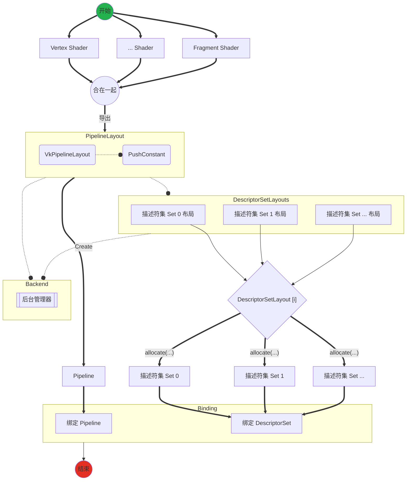

# 设计

## Descriptor

* 一个 `VkDescriptorSetLayout` 对应一个 ``set 号`` （简称 ``set``）
* 一个 `set` 下有多个不同的 `binding`
* 一个 `binding` 对应一个类型资源数组（单一资源是长度为 ``1`` 的数组）

分配描述符时，是以 ``set`` 为单位分配的。

### 描述符

描述符（ ``Descriptor`` ）主要需要如下数据：

1. 类型
2. 数量（数组元素个数）

### 描述符 binding

主要对应 ``VkDescriptorSetLayoutBinding`` ，主要需要如下数据：

1. binding 号。绑定在哪一个位置。
2. 描述符
3. 都有哪些着色器阶段需要访问该绑定（*可选项：* 可使用 ``VK_SHADER_STAGE_ALL`` 表示任意着色器阶段都可以使用该绑定）
4. 常驻采样器（*可选项：* 可以不使用，赋空）

* *注：* 如果是 input attachment 类型的描述符绑定，只有 fragment 着色阶段（片元着色）可访问。
* *注：* 如果 ``descriptorCount`` 为 ``0`` 用于占位符（``pipeline layout`` 中不连续 ``set`` 号时）。

### 描述符 set

多个【描述符 binding】的集合

*注：*

### Pipeline Layout

多个 【set】的集合

多出个 `PushConstant` 特性。

不依赖 pipeline

```CXX
typedef struct VkPipelineLayoutCreateInfo {
    VkStructureType                 sType;
    const void*                     pNext;
    VkPipelineLayoutCreateFlags     flags;
    uint32_t                        setLayoutCount;
    const VkDescriptorSetLayout*    pSetLayouts;
    uint32_t                        pushConstantRangeCount;
    const VkPushConstantRange*      pPushConstantRanges;
} VkPipelineLayoutCreateInfo;
```

```CXX
// Provided by VK_VERSION_1_0
typedef struct VkPushConstantRange {
    VkShaderStageFlags    stageFlags;
    uint32_t              offset;
    uint32_t              size;
} VkPushConstantRange;
```

>* Any two elements of VkPipelineLayoutCreateInfo::pPushConstantRanges must not include the same stage in stageFlags. 不同着色器阶段可以有不同的 push constant

> * VkPipelineLayoutCreateInfo::pSetLayouts must not contain more than one descriptor set layout that was created with VK_DESCRIPTOR_SET_LAYOUT_CREATE_PUSH_DESCRIPTOR_BIT set

### 总结

```CXX
PipelineLayout<Set<Binding{id, Descriptor{type, count}}>> pipeline_layout
```

#### 分配

分配的单位是 ``Set`` 。可以一次性分配多个 ``Set`` 。

DescriptorSetLayout -> DescriptorSet

```CXX
// Provided by VK_VERSION_1_0
VkResult vkAllocateDescriptorSets(
    VkDevice                                    device,
    const VkDescriptorSetAllocateInfo*          pAllocateInfo,
    VkDescriptorSet*                            pDescriptorSets);
```

```CXX
// Provided by VK_VERSION_1_0
typedef struct VkDescriptorSetAllocateInfo {
    VkStructureType                 sType;
    const void*                     pNext;
    VkDescriptorPool                descriptorPool;
    uint32_t                        descriptorSetCount;
    const VkDescriptorSetLayout*    pSetLayouts;
} VkDescriptorSetAllocateInfo;
```

#### 更新

更新从 set 为定位开端。

* 更新 某一个set->某个binding->描述符->（多个）资源
* 拷贝 某一个set->某个binding->描述符->（多个）资源

可一次性 更新 多批

DescriptorSet[binding]=...;

```CXX
// Provided by VK_VERSION_1_0
void vkUpdateDescriptorSets(
    VkDevice                                    device,
    uint32_t                                    descriptorWriteCount,
    const VkWriteDescriptorSet*                 pDescriptorWrites,
    uint32_t                                    descriptorCopyCount,
    const VkCopyDescriptorSet*                  pDescriptorCopies);
```

```CXX
// Provided by VK_VERSION_1_0
typedef struct VkWriteDescriptorSet {
    VkStructureType                  sType;
    const void*                      pNext;
    VkDescriptorSet                  dstSet;
    uint32_t                         dstBinding;
    uint32_t                         dstArrayElement;
    uint32_t                         descriptorCount;
    VkDescriptorType                 descriptorType;
    const VkDescriptorImageInfo*     pImageInfo;
    const VkDescriptorBufferInfo*    pBufferInfo;
    const VkBufferView*              pTexelBufferView;
} VkWriteDescriptorSet;
```

```CXX
// Provided by VK_VERSION_1_0
typedef struct VkCopyDescriptorSet {
    VkStructureType    sType;
    const void*        pNext;
    VkDescriptorSet    srcSet;
    uint32_t           srcBinding;
    uint32_t           srcArrayElement;
    VkDescriptorSet    dstSet;
    uint32_t           dstBinding;
    uint32_t           dstArrayElement;
    uint32_t           descriptorCount;
} VkCopyDescriptorSet;
```

#### 绑定

绑定的单位：

某个 ``Pipeline Layout`` 下的多个 描述符集。

```CXX
// Provided by VK_VERSION_1_0
void vkCmdBindDescriptorSets(
    VkCommandBuffer                             commandBuffer,
    VkPipelineBindPoint                         pipelineBindPoint,
    VkPipelineLayout                            layout,
    uint32_t                                    firstSet,
    uint32_t                                    descriptorSetCount,
    const VkDescriptorSet*                      pDescriptorSets,
    uint32_t                                    dynamicOffsetCount,
    const uint32_t*                             pDynamicOffsets);
```

### 流程 接口

描述符集的原始声明是在着色器中，需要从着色器中反序列化出相关描述符集信息。

```GLSL
layout(push_constant) uniform xxx;
layout(set = 0, binding = 0) yyy;
layout(set = 0, binding = 1) zzz;
layout(set = 2, binding = 0) nnn;
...
```

单个着色器只能推出描述符集的一部分，比如:

```GLSL
//顶点着色器
layout(set = 0, binding = 0) x;

//片元着色器
layout(set = 0, binding = 1) y;
```

同一个 ``set(0)`` 的不同 ``binding`` 在不同着色器中。这样就需要所有渲染流程（pipeline）的着色器，才能知道全貌。

* shader -> 部分 描述符集
* pipeline -> 全部 描述符集 （目前Turbo使用该方式）

``分配`` 的单位是 ``Set Layout`` 。可以一次性根据不同 ``Set Layout`` 分配多个 ``Set`` 。

多个 管线着色器 -> Program


