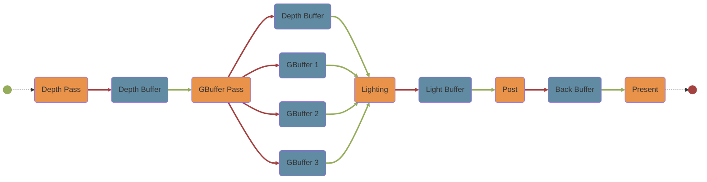

# FrameGraph设计

*注：在书写该文档之前已经存在一部分设计，位于`./docs/TurboDesign.drawio:FrameGraph`中。由于`Markdown`文件书写起来比较方便，所以使用该文档继续书写设计*

*注：该文档与`./docs/Design/FrameGraphAdvance.md`文档配合使用，`FrameGraphAdvance.md`文档是书写`Turbo`引擎如何基于`FrameGraph`驱动起来的设计文档*

## 更新日志

* 2022/12/30
  >
  >* 创建`FrameGraph`文档
  >* 创建`PassNode与RenderPass`章节
  >* 创建`FrameGraph::Subpass`章节
  >* 创建`FrameGraph::RenderPass`章节

* 2022/12/31
  >
  >* 更新`FrameGraph::Subpass`章节
  >* 更新`FrameGraph::RenderPass`章节

* 2023/1/1
  >
  >* 将`FrameGraph::Subpass`章节重命名为`FrameGraph::Builder::Subpass`，并更新`FrameGraph::Builder::Subpass`章节
  >* 更新`FrameGraph::RenderPass`章节
  >* 创建`FrameGraph::Subpass`章节

* 2023/1/3
  >
  >* 创建`FrameGraph::Mermaid`章节


## PassNode与RenderPass

在`PassNode::Setup`阶段需要配置当前`PassNode`的各种`Subpass`，之后`Turbo`引擎会根据用户的配置创建`RenderPass`和`FrameBuffer`

```CXX
//FrameGraph::PassNode::Setup
[&](TFrameGraph::TBuilder &builder, CustomPassData &data)
{
    data.colorTex = builder.Create<Texture2D>("color",{512,512,Usage::Color})
    data.normalTex = builder.Create<Texture2D>("normal",{512,512,Usage::Normal})
    data.depthTex = builder.Create<DepthTexture2D>("depth",{512,512,Usage::Depth})

    Subpass subpass0 = builder.CreateSubpass();    
    subpass0.Write(data.colorTex);
    subpass0.Write(data.depthTex);

    Subpass subpass1 = builder.CreateSubpass();
    subpass1.Read(data.colorTex);
    subpass1.Read(data.depthTex);
    subpass1.Write(data.normalTex);
}
```

用户每调用一次`TFrameGraph::TBuilder::CreateSubpass()`就是声明一个`Subpass`，并且创建一个`Subpass`并添加进`PassNode`所代表的`RenderPass`中，而`Subpass`中有对应资源的读写配置

`Subpass`对应资源测操作有：

1. 读，`Subpass::Read(Resource)`
2. 写，`Subpass::Write(Resource)`

> `FrameGraph::RenderPass`转`Render::RenderPass`
>
> * `Subpass::Read(Resource)`，对应于`Vulkan`底层的`InputAttachment`
> * `Subpass::Write(Resource)`，对应于`Vulkan`底层的`ColorAttachment`或 `DepthStencilAttachment`，具体需要看是什么资源
>
> 对于当`Subpass::Write(Resource)`资源为`DepthStencil`纹理时，会有个问题，按照`Vulkan`标准每个`Subpass`只能绑定一个`DepthTexture`，而`Turbo`并不会制止用户往多个`DepthTexture`中写入，这会与`Vulkan`标准冲突，一种解决方案是当写入多个`DepthStencil`纹理时，只有最后一个深度模板纹理有效，`Turbo`输出警告信息

## FrameGraph::Builder::Subpass

位于：

```CXX
namespace TFrameGraph
{
    class FrameGraph
    {
        class Builder
        {
            class Subpass;//位于此处
        };
    };
}
```

`Builder::Subpass`中的`class Subpass`是真正的`PassNode::RenderPass::Subpass`的代理（也可理解成前端），用户利用`Builder::Subpass`这个前端类来完善底层的`RenderPass`数据

由于原先是使用`TFrameGraph::Builder::Write(...)`和`TFrameGraph::Builder::Read(...)`函数，现由于资源的读写由`Subpass`负责，则`TFrameGraph::Builder`对于资源的读写改成私有，通过友元`Subpass`调用`TFrameGraph::Builder`对于资源的读写即可，所以`Subpass`中需要存有`TFrameGraph::Builder`引用

而对于资源的读写，同样要注册到`PassNode`对应的`RenderPass`中，所以

* `Subpass::Write()`的同时将向其中的`RenderPass`下对应的`Subpass`中注册资源
* `Subpass::Read()`的同时将向其中的`RenderPass`下对应的`Subpass`中注册资源

~~*考虑:是否将`Subpass::Write(...)`和`Subpass::Read(...)`设计成私有，并成为`TBuilder`的友元，这样只有在`PassNode::Setup`阶段可以调用`Subpass::Write(...)`和`Subpass::Read(...)`，如果设计成友元，其他私有成员也可以访问到了，也是个问题*~~

```CXX
//in FrameGraph::TBuilder
class Subpass
{
    private:
        TBuilder& builder;
        RenderPass& renderPass;

        uint32_t subpass;//当前subpass在RenderPass中的index

    public:
        TSubpass();
        TSubpass(TBuilder& builder);

        Resource Write(Resource);
        Resource Read(Resource);
}

Resource Subpass::Write(Resource resource)
{
   Resource write_resource = builder.Write(resource);
   renderPass.Subpasses[subpass].Write(write_resource);

   return write_resource;
}

Resource Subpass::Read(Resource resource)
{
   Resource read_resource = builder.Read(resource);
   renderPass.Subpasses[subpass].Read(read_resource);

   return read_resource;
}
```

## FrameGraph::Subpass

与`FrameGraph::Builder::Subpass`大致差不多，为其后端，本质上用于存储资源的读写情况

```CXX
//in FrameGraph
class TSubpass
{
  private:
    std::vector<TResource> writes;
    std::vector<TResource> reads;

  public:
    TSubpass() = default;
    ~TSubpass() = default;

    void Write(TResource resource);
    void Read(TResource resource);
};

void Write(TResource resource)
{
    this->writes.push_back(resource);
}

void Read(TResource resource)
{
    this->reads.push_back(resource);
}
```

## FrameGraph::RenderPass

`Subpass`对于资源的读写，其实就是将对应的读写注册到`RenderPass`中，而一个`PassNode`代表一个`RenderPass`，所以一个`PassNode`中就应该存有一个`RenderPass`信息。

```CXX
//in FrameGraph
class PassNode
{
    private:
        RenderPass renderPass;
};
```

而一个`RenderPass`下有多个`Subpass`

```CXX
class RenderPass
{
    private:
        std::vector<Subpass> subpasses;

    public:
        RenderPass();
       
        void AddSubpass(Subpass& subpass);
};
```

## FrameGraph::Mermaid

`FrameGraph`中应该提供一种接口，用于输出通用图形化图表结构，目前常见的通用图形化图表标准有：

1. [Graphviz](http://www.graphviz.org/)
2. [Mermaid](https://mermaid.js.org/)

`Turbo`选择`Mermaid`标准作为通用图形化图表接口。

```CXX
std::string FrameGraph::ToMermaid();
```
该接口将会输出`Mermaid`标准字符串，之后最常见的用法有两种：

1. 推送到`http`服务器，展示在浏览器页面上
2. 保存到本地，进而在本地打开，浏览查看
Pass
示例：
