# FrameGraph设计

*注：在书写该文档之前已经存在一部分设计，位于`./docs/TurboDesign.drawio:FrameGraph`中。由于`Markdown`文件书写起来比较方便，所以使用该文档继续书写设计*

*注：该文档与`./docs/Design/FrameGraphAdvance.md`文档配合使用，`FrameGraphAdvance.md`文档是书写`Turbo`引擎如何基于`FrameGraph`驱动起来的设计文档*

## 更新日志

* 2022/12/30
  >
  >* 创建`FrameGraph`文档
  >* 创建`PassNode与RenderPass`章节
  >* 创建`FrameGraph::Subpass`章节
  >* 创建`FrameGraph::RenderPass`章节

* 2022/12/31
  >
  >* 更新`FrameGraph::Subpass`章节
  >* 更新`FrameGraph::RenderPass`章节

* 2023/1/1
  >
  >* 将`FrameGraph::Subpass`章节重命名为`FrameGraph::Builder::Subpass`，并更新`FrameGraph::Builder::Subpass`章节
  >* 更新`FrameGraph::RenderPass`章节
  >* 创建`FrameGraph::Subpass`章节

* 2023/1/3
  >
  >* 创建`FrameGraph::Mermaid`章节

* 2023/1/4
  >
  >* 更新`FrameGraph::Mermaid`章节
  
* 2023/1/11
  >
  >* 更新`PassNode与RenderPass`章节

* 2023/1/12
  >
  >* 更新`PassNode与RenderPass`章节
  >* 更新`FrameGraph::Builder::Subpass`章节
  >* 更新`FrameGraph::Subpass`章节

## PassNode与RenderPass

在`PassNode::Setup`阶段需要配置当前`PassNode`的各种`Subpass`，之后`Turbo`引擎会根据用户的配置创建`RenderPass`和`FrameBuffer`

```CXX
//FrameGraph::PassNode::Setup
[&](TFrameGraph::TBuilder &builder, CustomPassData &data)
{
    data.colorTex = builder.Create<Texture2D>("color",{512,512,Usage::Color})
    data.normalTex = builder.Create<Texture2D>("normal",{512,512,Usage::Normal})
    data.depthTex = builder.Create<DepthTexture2D>("depth",{512,512,Usage::Depth})

    Subpass subpass0 = builder.CreateSubpass();    
    subpass0.Write(data.colorTex);
    subpass0.Write(data.depthTex);

    Subpass subpass1 = builder.CreateSubpass();
    subpass1.Read(data.colorTex);
    subpass1.Read(data.depthTex);
    subpass1.Write(data.normalTex);
}
```

用户每调用一次`TFrameGraph::TBuilder::CreateSubpass()`就是声明一个`Subpass`，并且创建一个`Subpass`并添加进`PassNode`所代表的`RenderPass`中，而`Subpass`中有对应资源的读写配置

`Subpass`对应资源测操作有：

1. 读，`Subpass::Read(Resource)`
2. 写，`Subpass::Write(Resource)`

> `FrameGraph::RenderPass`转`Render::RenderPass`
>
> * `Subpass::Read(Resource)`，对应于`Vulkan`底层的`InputAttachment`
> * `Subpass::Write(Resource)`，对应于`Vulkan`底层的`ColorAttachment`或 `DepthStencilAttachment`，具体需要看是什么资源
>
> 对于当`Subpass::Write(Resource)`资源为`DepthStencil`纹理时，会有个问题，按照`Vulkan`标准每个`Subpass`只能绑定一个`DepthTexture`，而`Turbo`并不会制止用户往多个`DepthTexture`中写入，这会与`Vulkan`标准冲突，一种解决方案是当写入多个`DepthStencil`纹理时，只有最后一个深度模板纹理有效，`Turbo`输出警告信息

>此处有一点要注意一下，如下：
>
>```CXX
>subpass.Write(DepthStencilTexture);
>```
>
>此时代表`DepthStencilTexture`在`Vulkan`底层作为`DepthStencilAttachment`进行使用
>
>```CXX
>subpass.Read(DepthStencilTexture);
>```
>
>此时代表`DepthStencilTexture`在`Vulkan`底层作为`InputAttachment`进行使用
>

>此时可能会有如下问题：
>
>```mermaid
>graph LR;
>    classDef Resource fill:#608ba3
>    classDef Pass fill:#e8924a
>    classDef Subpass fill:#8474a0
>    classDef Start fill:#95ad5b,stroke:#95ad5b,stroke-width:4px
>    classDef End fill:#a44141,stroke:#a44141,stroke-width:4px
>
>    Start((" ")):::Start
>    End((" ")):::End
>    
>    DepthBuffer0("Depth Buffer"):::Resource
>    DepthBuffer1("Depth Buffer"):::Resource
>   
>    PassNode0:::Pass
>        subgraph PassNode0["PassNode0"]
>            direction TB
>            PassNode0Subpass0("Subpass 0"):::Subpass
>        end
>    PassNode1:::Pass
>        subgraph PassNode1["PassNode1"]
>            direction TB
>            PassNode1Subpass0("Subpass 0"):::Subpass
>        end
>
>    Start-.->PassNode0
>    PassNode0Subpass0-->DepthBuffer0
>    DepthBuffer0-.->PassNode1Subpass0
>    PassNode1Subpass0-->DepthBuffer1
>    DepthBuffer1-.->End
>
>    linkStyle 1 stroke:#a44141,stroke-width:3px %% write link style
>    linkStyle 2 stroke:#95ad5b,stroke-width:0.5px %% read link style
>    linkStyle 3 stroke:#a44141,stroke-width:3px
>    linkStyle 4 stroke:#a44141,stroke-width:3px
>```
>
>此时对应的代码为：
>
>```CXX
>DepthTexture2D depth_texture;
>
>PassNode pass_node0;
>pass_node0.Subpass0.Write(depth_texture);
>
>PassNode pass_node01;
>pass_node01.Subpass0.Write(depth_texture);
>```
>
>如果此时调用`FrameGraph::Compile()`，当走到`pass_node01`之后写入`Depth Buffer`时，发现没有人使用该`Depth Buffer`，这会导致`FrameGraph`进行一系列剔除操作。此非良构。
>
>---
>
>### 如何解决该问题呢？
>
>问题的根源在于对于像`DepthStencilTexture`这样的资源，目前`FrameGraph::Read(...)`可以解释成`Vulkan`的`InputAttachment`，但对于`DepthStencilTexture`这样的资源这不是必须的，`DepthStencilTexture`可以不作为`InputAttachment`而被其他`PassNode`使用。
>
>目前能想到的解决方案就是:`FrameGraph::Read(someResource)`唯一的作用是告诉`FrameGraph`有人要使用该`someResource`，请在`FrameGraph::Compile()`阶段不要剔除相关节点，之后为`FrameGraph::Read(someResource)`增加一个`标志位`，用于表示此次读操作是否作为`InputAttachment`进行解析。可能的函数声明如下：
>
>```CXX
>//in FrameGraph
>FrameGraph::Read(Resource resource, bool isInput=false);
>```
>
>或许给`Subpass`中添加`Subpass::Input(Resource resource)`会更加方便
>
>```CXX
>//in FrameGraph
>FrameGraph::Input(Resource resource)
>{
>    FrameGraph::Read(resource, true);
>}
>```
>详情请预览下面的`FrameGraph::Builder::Subpass`章节和`FrameGraph::Subpass`章节

## FrameGraph::Builder::Subpass

位于：

```CXX
namespace TFrameGraph
{
    class FrameGraph
    {
        class Builder
        {
            class Subpass;//位于此处
        };
    };
}
```

`Builder::Subpass`中的`class Subpass`是真正的`PassNode::RenderPass::Subpass`的代理（也可理解成前端），用户利用`Builder::Subpass`这个前端类来完善底层的`RenderPass`数据

由于原先是使用`TFrameGraph::Builder::Write(...)`和`TFrameGraph::Builder::Read(...)`函数，现由于资源的读写由`Subpass`负责，则`TFrameGraph::Builder`对于资源的读写改成私有，通过友元`Subpass`调用`TFrameGraph::Builder`对于资源的读写即可，所以`Subpass`中需要存有`TFrameGraph::Builder`引用

而对于资源的读写，同样要注册到`PassNode`对应的`RenderPass`中，所以

* `Subpass::Write(Resource)`的同时将向其中的`RenderPass`下对应的`Subpass`中注册资源
* `Subpass::Read(Resource)`的同时将向其中的`RenderPass`下对应的`Subpass`中注册资源
* `Subpass::Input(Resource)`的同时将向其中的`RenderPass`下对应的`Subpass`中注册资源

*注：`Subpass::Input(Resource)`与`Subpass::Read(Resource)`本质上没区别，唯一的区别就是`Subpass::Input(Resource)`会将对应得`Resource`的`input`标志位设置成`true`*

~~*考虑:是否将`Subpass::Write(...)`和`Subpass::Read(...)`设计成私有，并成为`TBuilder`的友元，这样只有在`PassNode::Setup`阶段可以调用`Subpass::Write(...)`和`Subpass::Read(...)`，如果设计成友元，其他私有成员也可以访问到了，也是个问题*~~

```CXX
//in FrameGraph::TBuilder
class Subpass
{
    private:
        TBuilder& builder;
        RenderPass& renderPass;

        uint32_t subpass;//当前subpass在RenderPass中的index

    public:
        TSubpass();
        TSubpass(TBuilder& builder);

        Resource Write(Resource);
        Resource Read(Resource);
        Resource Input(Resource);
}

Resource Subpass::Write(Resource resource)
{
   Resource write_resource = builder.Write(resource);
   renderPass.Subpasses[subpass].Write(write_resource);

   return write_resource;
}

Resource Subpass::Read(Resource resource)
{
   Resource read_resource = builder.Read(resource, false/*Input标志位*/);
   //对于FrameGraph::Subpass来说read信息对其不重要，该信息只用于FrameGraph计算是否进行剔除，FrameGraph::Subpass保留read信息也不是一件坏事，在转成图表化信息时可以有更丰富的信息
   renderPass.Subpasses[subpass].Read(read_resource);

   return read_resource;
}

Resource Subpass::Input(Resource resource)
{
   Resource read_resource = builder.Read(resource，true/*Input标志位*/);
   renderPass.Subpasses[subpass].Input(read_resource);

   return read_resource;
}
```

## FrameGraph::Subpass

与`FrameGraph::Builder::Subpass`大致差不多，为其后端，本质上用于存储资源的读写情况

```CXX
//in FrameGraph
class TSubpass
{
  private:
    std::vector<TResource> writes;
    std::vector<TResource> inputs;

  public:
    TSubpass() = default;
    ~TSubpass() = default;

    void Write(TResource resource);
    //void Read(TResource resource);
    void Input(TResource resource);
};

void Write(TResource resource)
{
    this->writes.push_back(resource);
}

// void Read(TResource resource)
// {
//     this->reads.push_back(resource);
// }

void Input(TResource resource)
{
    this->inputs.push_back(resource);
}
```

* 其中`TSubpass::writes`如果是`ColorImage`，应该对应`Vulkan`的`ColorAttachment`。
* 其中`TSubpass::writes`如果是`DepthStencil`，应该对应`Vulkan`的`DepthStencilAttachment`。
* 其中`TSubpass::inputs`应该对应`Vulkan`的`InputAttachment`。

## FrameGraph::RenderPass

`Subpass`对于资源的读写，其实就是将对应的读写注册到`RenderPass`中，而一个`PassNode`代表一个`RenderPass`，所以一个`PassNode`中就应该存有一个`RenderPass`信息。

```CXX
//in FrameGraph
class PassNode
{
    private:
        RenderPass renderPass;
};
```

而一个`RenderPass`下有多个`Subpass`

```CXX
class RenderPass
{
    private:
        std::vector<Subpass> subpasses;

    public:
        RenderPass();
       
        void AddSubpass(Subpass& subpass);
};
```

## FrameGraph::Mermaid

`FrameGraph`中应该提供一种接口，用于输出通用图形化图表结构，目前常见的通用图形化图表标准有：

1. [Graphviz](http://www.graphviz.org/)
2. [Mermaid](https://mermaid.js.org/)

`Turbo`选择`Mermaid`标准作为通用图形化图表接口。

```CXX
std::string FrameGraph::ToMermaid();
```

该接口将会输出`Mermaid`标准字符串，之后最常见的用法有两种：

1. 推送到`http`服务器，展示在浏览器页面上
2. 保存到本地，进而在本地打开，浏览查看

示例：

```mermaid
graph LR;
    classDef Resource fill:#608ba3
    classDef Pass fill:#e8924a
    classDef Subpass fill:#8474a0
    classDef Start fill:#95ad5b,stroke:#95ad5b,stroke-width:4px
    classDef End fill:#a44141,stroke:#a44141,stroke-width:4px

    Start((" ")):::Start
    End((" ")):::End
    
    DepthBuffer0("Depth Buffer"):::Resource
    DepthBuffer1("Depth Buffer"):::Resource
    GBuffer1("GBuffer 1"):::Resource
    GBuffer2("GBuffer 2"):::Resource
    GBuffer3("GBuffer 3"):::Resource
    LightBuffer("Light Buffer"):::Resource
    BackBuffer("Back Buffer"):::Resource

    DepthPass:::Pass
        subgraph DepthPass["Depth Pass"]
            direction TB
            DepthPassSubpass0("Subpass 0"):::Subpass
        end
    GBufferPass:::Pass
        subgraph GBufferPass["GBuffer Pass"]
            direction TB
            GBufferPassSubpass0("Subpass 0"):::Subpass
        end
    LightingPass:::Pass
        subgraph LightingPass["Lighting"]
            direction TB
            LightingPassSubpass0("Subpass 0"):::Subpass
        end
    PostPass:::Pass
        subgraph PostPass["Post"]
            direction TB
            PostPassSubpass0("Subpass 0"):::Subpass
        end
    PresentPass:::Pass
        subgraph PresentPass["Present"]
            direction TB
            PresentPassSubpass0("Subpass 0"):::Subpass
        end

    Start-.->DepthPass
    DepthPassSubpass0-->DepthBuffer0
    DepthBuffer0-->GBufferPassSubpass0
    GBufferPassSubpass0-->DepthBuffer1
    GBufferPassSubpass0-->GBuffer1
    GBufferPassSubpass0-->GBuffer2
    GBufferPassSubpass0-->GBuffer3
    DepthBuffer1-->LightingPassSubpass0
    GBuffer1-->LightingPassSubpass0
    GBuffer2-->LightingPassSubpass0
    GBuffer3-->LightingPassSubpass0
    LightingPassSubpass0-->LightBuffer
    LightBuffer-->PostPassSubpass0
    PostPassSubpass0-->BackBuffer
    BackBuffer-->PresentPassSubpass0
    PresentPass-.->End

    linkStyle 1 stroke:#a44141,stroke-width:3px %% write link style
    linkStyle 2 stroke:#95ad5b,stroke-width:3px %% read link style
    linkStyle 3 stroke:#a44141,stroke-width:3px
    linkStyle 4 stroke:#a44141,stroke-width:3px
    linkStyle 5 stroke:#a44141,stroke-width:3px
    linkStyle 6 stroke:#a44141,stroke-width:3px
    linkStyle 7 stroke:#95ad5b,stroke-width:3px
    linkStyle 8 stroke:#95ad5b,stroke-width:3px
    linkStyle 9 stroke:#95ad5b,stroke-width:3px
    linkStyle 10 stroke:#95ad5b,stroke-width:3px
    linkStyle 11 stroke:#a44141,stroke-width:3px
    linkStyle 12 stroke:#95ad5b,stroke-width:3px
    linkStyle 13 stroke:#a44141,stroke-width:3px
    linkStyle 14 stroke:#95ad5b,stroke-width:3px
```


