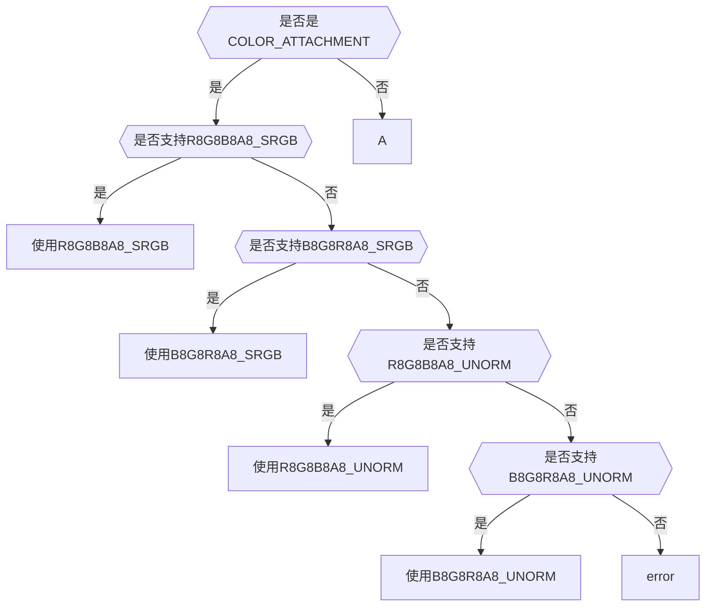

# Turbo引擎使用FrameGraph驱动设计

最终会映射到`./docs/TurboDesign:Render`设计中  
*注：该文档有些图表是使用[mermaid](https://mermaid-js.github.io/mermaid/#/)进行书写的，`github`并不支持复杂的`mermaid`语法，导致在线查看该文档会渲染不出图表，本人是使用`VSCode`安装`Markdown Preview Mermaid Support`插件进行查看和书写的。*

## 更新日志

* 2022/12/4
  >
  >* 结束琐碎设计文档化
  >* 创建`Turbo驱动设计`章节，用于开始`Turbo`引擎`Engine`层面与`FrameGraph`配合的设计

* 2022/12/5
  >
  >* 创建`资源的创建与销毁`章节
  >* 创建`Context上下文`章节
  >* 创建`WorldRender/Render 渲染器`章节

* 2022/12/7
  >
  >* 更新`资源的创建与销毁`章节
  >* 更新`Context上下文`章节

* 2022/12/8
  >
  >* 创建`Surface、Swapchain和Context`章节
  >* 创建`Surface`章节
  >* 创建`Swapchain`章节

* 2022/12/9
  >
  >* 创建`离屏渲染流程`章节
  >* 创建`将RenderTarget结果拷贝给用户`章节
  >* 创建`用户自定义PassNode`章节
  >* `Image`资源派生中增加`CubeImage`资源类
  >* `资源的创建与销毁`章节中增加在使用`Render::TContext`创建`Redner::TImage`时与`Turbo::Core::TImage`资源类的对应说明
  >

* 2022/12/10
  >
  >* 将原先的`TImage`资源说明，创建成`资源`章节
  >* 更新`资源`资源章节中的`Descriptor`与`资源的创建与销毁`章节对应上
  >* 创建`Format格式`章节，用于规定创建`Image`和`Buffer`时的资源格式
  >* 创建`Turbo驱动初步`章节，用于将琐碎设计和之后的`Turbo驱动设计`做区分
  >

* 2022/12/11
  >
  >* 创建`资源的所有者端域`章节
  >* 更新`资源`章节，增加`端域`
  >

* 2022/12/12
  >
  >* 创建`Usage和Domain`章节

* 2022/12/13
  >
  >* 更新`Usage和Domain`章节
  >* 创建`资源拷贝传输`章节

* 2022/12/14
  >
  >* 更新`Usage和Domain`章节
  >* 更新`资源拷贝传输`章节

* 2022/12/15
  >
  >* 更新`Usage和Domain`章节。回读内存位标应为`HOST_ACCESS_RANDOM`，而不是`HOST_ACCESS_SEQUENTIAL_WRITE`
  >* 创建`Image的Format`章节

* 2022/12/16
  >
  >* 更新`Usage和Domain`章节。高频内存位标`条件`应为`TRANSFER_DST`，而不是`TRANSFER_SRC`
  >* 更新`资源`章节。增加`Vulkan`标准对于`3D纹理`资源的`layer`限值，由`Turbo`引擎维护
  >* 创建`Image的Format`章节
  >* 更新`Image的Format`章节
  
---

# Turbo驱动初步

来源于`docs/images`下的一些平日琐碎设计，该文档是琐碎设计的整理

> `Unity`中的一个材质就可以看成对应`fg`的一个`PassNode`，多个可渲染物体绑定同一个材质是，其实就是在当前的`Material`所对应的的那个`PassNode`内渲染绑定的`Mesh`，换句话说就是多个`DrawableObject`如果绑定了同一个`Material`，就在`Material`对应的`PassNode`下渲染多个`DrawableObject`

> 根据`Material`中的渲染配置生成对应的`RenderPass`、`Subpass`和`Pipeline`

随即引发了一些问题：

1. 这些材质应该放在`fg`的何处？，换句话说就是，材质对应的应该是哪个`PassNode`？这些`PassNode`的前后关系是啥？  
**答**：分两种情况：`GBuffer`的延迟渲染和`Forward`的前向渲染。还可能有特殊的自定义的`Material`可能会在后处理阶段等

2. 后处理材质放在何处？（属于问题1的范畴）

3. 比如`DepthPass`会去渲染所有物体，`ColorPass`也会去渲染所有物体，也就是说`DepthPass`中会有`Drawable`对`DepthMaterial`的绑定，`ColorPass`中会有`Drawable`对`ColorMaterial`的绑定。  
**答**：这时`Drawable`最好是引擎临时构建的，如果不是临时构建的话，在渲染前就要构建出很多`Drawable`对象，而很多对象只是材质不同，而`Mesh`都是相同的

---

> `Turbo`的目的是灵活性并不是强制用户使用`fg`，也就是说`fg`只是`Turbo`中可有可无的架构，为了达到这个目的`Turbo`需要细化`fg`中的步骤，将其抽出来作为单独的内容或是类，而`fg`只是使用这些`Turbo`引擎提供的功能类来将渲染流程驱动起来。比如如下结构流程：

```TXT
RenderPass
|_Pass0
|   |_inputs(对应PassNode的输入)
|   |_outputs(对应PassNode的输出)
|   |...(渲染时绑定)pipeline
|_Pass1
|   |_inputs(对应PassNode的输入)
|   |_outputs(对应PassNode的输出)
|   |...(渲染时绑定)pipeline
|_Pass...

Pipeline
|_vertex shader
|_...几何，细分等
|_fragment shader
|_各种pipeline配置
```

**如上对应示意的所有均为声明，Turbo引擎并不会构建真正的底层对象，只有运行时，渲染时会去构建相应的对象，以此来实现动态渲染**

> 首先明确的是`Material`的层级高于`fg`，也就是说`Material`用于最终声明对应的`PassNode`，`fg`不应该内嵌`Material`

```TXT
Mesh some_mesh;

Material color_material;
Material pbr_material;

MeshRender mesh_render0;
mesh_render0.mesh=some_mesh0;
mesh_render0.material=pbr_material;

MeshRender mesh_render1;
mesh_render1.mesh=some_mesh1;
mesh_render1.material=color_material;
```

转成对应的`fg`

```TXT
Material color_material => [Color PassNode]
Material pbr_material => [PBR PassNode]
```

现在解决两个问题：

1. 某个`MeshRender`何时进行真正的渲染绘制？  
**答**：引擎会收集所有绑定同一个`Material`的`MeshRender`的网格顶点信息(也就是`vertex buffer`之类的)，并将在对应的底层`PassNode`的`Execute`阶段渲染收集到的所有`MeshRender`  
*注*：为了快速得到`Material`都绑定了哪些`MeshRender`，有两种方案：
    1. `Material`内部维护一个数组，用于存放对应的`MeshRender`对象
    2. `MeshRender`中的`Material`只是`Material`的句柄，这样就可以快随找到对应的`Material`

---
> `Engine`与`FrameGraph`

```TXT
Engine中该有的类

Shader
|_Vertex Shader
|_Geometry Shader
|_细分着色器
|_Fragment Shader
|_光追标准着色器
|_...

Pipeline
|_Graphic Pipeline
|_Compute Pipeline
|_Raytracing Pieline

Image
|_Color Image
|_Depth Image
|_...

Subpass

RenderPass
```

对应代码结构示意：

```CXX
ColorImage some_color_image;
DepthImage some_depth_image;

VertexShader vertex_shader;
FragmentShader fragment_shader;

GraphicPipeline some_graphic_pipeline;
some_graphic_pipeline.SetVertexShader(vertex_shader);
some_graphic_pipeline.SetFragmentShader(fragment_shader);
some_graphic_pipeline.Set几何拓扑配置(...);
some_graphic_pipeline.Set透明融合配置(...);
some_graphic_pipeline.Set...配置(...);

Subpass subpass0;
subpass0.BindingColorImage(some_color_image);
subpass0.BindingDepthImage(some_depth_image);

Subpass subpass1;
subpass1.Binding...Image(...);

RenderPass render_pass;
render_pass.AddSubpass(subpass0);
render_pass.AddSubpass(subpass1);
```

`Engine`与`FrameGraph`对应示意

```TXT
RenderPass············PassNode
|_Subpass0············|_pass0
|_Subpass1············|_pass1
|_Subpassn············|_passn
              \||/
               \/
             Execute
             执行阶段
              \||/
               \/
 commandBuffer.BindingPipeline(...)
 commandBuffer.BindingVertexBuffer(...)
 commandBuffer.Draw(...)
```

---

> 渲染流程

```CXX
VertexShader vertex_shader;
FragmentShader fragment_shader;
ColorImage color_image;//或者叫RenderTarget更能体现其作用

GraphicPipeline some_graphic_pipeline;
some_graphic_pipeline.BindVertexShader(vertex_shader);
some_graphic_pipeline.BindFragmentShade(fragment_shader);

Mesh mesh;

//<对应FrameGraph::PassNode::Setup阶段>
Subpass subpass0;
subpass0.AddColorImage(color_image);

RenderPass render_pass;
render_pass.AddSubpass(subpass0);
//</对应FrameGraph::PassNode::Setup阶段>

//<对应FrameGraph::PassNode::Execute阶段>
CommandBuffer command_buffer;
command_buffer.BindRenderPass(render_pass);
command_buffer.BindPipeline(some_graphic_pipeline);
command_buffer.BindMesh(mesh);
command_buffer.Draw(...);
//</对应FrameGraph::PassNode::Execute阶段>

//注：PassNode的对应FrameBuffer需要引擎内部自动构建
//这就需要CommandBuffer也是Virtual虚的（因为按照Vulkan标准，CommandBuffer使用图形管线，必须提前构建好FrameBuffer）
```

**问**：真正的Pipeline和RenderPass何时创建？
**答**：如果使用`fg`的话，每一帧都会根据配置重新构建

**问**：如果不使用`fg`呢？

---
`FrameGraph`示意

```TXT
PassNode
    Setup
        //设置当前RenderPass的各种Subpass
        Subpass subpass0;
        subpass0.Read(someImage);
        subpass0.Write(someImage);

        Subpass subpass1;
        subpass1.Read(someImage);
        subpass1.Write(someImage);
    
    Execute
        1. 背后根据Setup阶段的配置创建RenderPass
        2. 背后根据RenderPass创建FrameBuffer
        3. 背后调用BeginRenderPass(图形管线)
        4. 调用各种渲染指令，例如:(BBBD)
        BindPipeline(...)
        BindVertexBuffer/BindIndexBuffer(...)
        BindPipelineData(...)
        Draw/DrawIndex(...)

        NextSubpass()
        BBBD
        ...

        NextSubpass()
        BBBD
        ...
```

**问**：Pipeline何时构建？  
**答**：现用先构建，或其他更好的方案

> `VertexBuffer`和`IndexBuffer`或许可以通过`Mesh`简化流程

---

**问**：目前`RenderPass`和`Subpass`基本上整理清楚了，但是`Pipeline`一直没有一个良好的架构，比如`Pipeline何时构建?  
**答**：由于`Vulkan`标准，在创建`Pipeline`是需要指定如下数据

1. RenderPass
2. Subpass
也就是说，`Pipeline`是特定于某一个`RenderPass`的某一个`Subpass`下的，换一句话说就是，`Pipeline`应该在`RenderPass::Begin`后`Subpass`执行时，`Pipeline`绑定中创建

**问**：如果`Pipeline`应该在`RenderPass::Begin`后`Subpass`执行时，`Pipeline`绑定中创建的话，会有个问题：

1. 当用户在同一个`RenderPass`下同一个`Subpass`下绑定多个相同的`Pipeline`
2. 当用户在同一个`RenderPass`下不同的`Subpass`下绑定多个相同的`Pipeline`
3. 当用户在不同`RenderPass`下不同的`Subpass`下绑定多个相同的`Pipeline`

会如何？

**答**：首先`Pipeline`只对某一`RenderPass`下的某一`Subpass`创建，这是一个`Pipeline`的最小活动范围，所以是个树状图。

```TXT
RenderPass
|_Subpass0
|   |_Pipeline 0...n
|_Subpass1
|   |_Pipeline 0...n
|_Subpass2
|   |_Pipeline 0...n
|_Subpass...
|   |_Pipeline 0...n
```

所以在绑定`Pipeline`时，引擎会根据当前的`RenderPass`下的当前`Subpass`中的`Pipeline`数组中找是否已经创建此`Pipeline`，如果已经创建就不用创建了，如果没创建就创建。

**问**：如何判断已经构建该`Pipeline0`？换句话说，如何判断两个`Pipeline`相等？  
**答**：目前能够想到的是主色器相同，配置相同，`RenderPass`相同，`Subpass`相同  
*注*：`Vulkan`标准中`Pipeline`有兼容性特性

---

**问**：如何创建`Pipeline`并保存在何处？如何管理？  
**答**：一个`Pipeline`属于某一个`RenderPass`下的某一个`Subpass`，一个`Subpass`可以绑定多个`Pipeline`，而对于`Vulkan`是基于`Command`驱动的，而不像`OpenGL`是基于`Context`。所以`Pipeline`正常来说生命周期应该和`CommandBuffer`相同，也就是说当`CommandBuffer`绑定`Pipeline`是引擎需要去查看当前`RenderPass`下的当前`Subpass`下有没有创建相应的`Pipeline`，如果
没有创建则创建，创建完直接使用。由于`Pipeline`每一帧都会重新创建，这样就可以满足动态改变`Pipeline`了。如果使用`fg`的话，`fg`，`Pipeline`，`CommandBuffer`的生命周期应该都是一样的，都是一帧的生命周期。

总结一下：

**如何创建`Pipeline`?**:
**答**：某一帧，某一`RenderPass`下某一`Subpass`下使用，`CommandBuffer`绑定时，引擎会使用当前`RenderPass`当前`Subpass`创建`Pipeline`并存入`CommandBuffer`中。

*注*：存入`CommandBuffer`可能不是最优解，可能搞一个类似一帧的`Context`之类会更加合理。

**保存在何处？**：  
**答**：搞一个类似一帧的`Context`之类会更加合理

**如何管理**：  
**答**：

* 增 ：搞一个类似一帧的`Context`之类会更加合理
* 删 ：在一帧`Context`结束时
* 改 ：用户动态改变`Pipeline`的配置，引擎根据用户配置生成真正的`Pipeline`
* 查 ：略 。目前没想到实际用途。

---

**问**：现在面临的问题是，如何判断某个被绑定的`RenderPass`的`Pipeline`已经被创建，而不需要重复创建。换句话说：如何判断两个`RenderPass`两`Pipeline`相同，相等？

---

用户端可能的用法（不使用`fg`）

```CXX
//创建一些有用的Image
vector<Images> some_images;

//声明一个Subpass
Subpass sp0;
sp0.AddColorImage(some_images[color_index]);
sp0.AddColorImage(some_images[depth_index]);

//声明一个Subpass
Subpass sp1;
sp0.AddInput(some_images[input1_index]);
sp0.AddColorImage(some_images[input2_index]);

//声明一个RenderPass
RenderPass rp;
rp.AddSubpass(sp0);
rp.AddSubpass(sp1);

//声明一些Pipeline
Pipeline pipeline0(拓扑类型，混合，深度...);
Pipeline pipeline1(拓扑类型，混合，深度...);
Pipeline pipeline...(拓扑类型，混合，深度...);

//创建CommandBuffer
CommandBuffeer cb;
cb.RenderPassBegin(rp);
cb.BindVertexBuffer(...);
cb.BindPipeline(some_pipeline);
cb.Draw(...)
cb.NextSubpass();
cb.[...];

//推送执行
DeviceQueue.Submit(cb);
```

---

现在要解决的问题是：  
**问**：如何断定两个`RenderPass`相等？如何断定两个`Pipeline`相等  
**原因**：因为用户绑定到`RenderPass`中的`Pipeline`只是个描述，引擎需要判断是否底层已经创建了符合此描述的对象。  
**答**：一帧的对应资源会存入`Context`中（这里的`Context`确切的说应该是一帧内拥有的所有资源和环境，包括所有的创建的`RenderPass`和`Pipeline`）

每一帧的`RenderPass`，`Subpass`和绑定的`Pipeline`都会变，所以一帧的资源函数需要存入`Context`中

结构示意：

```TXT
Context
|_RenderPass 0
|   |_Subpass 0------BindPipeline(....)
|   |_Subpass 1------BindPipeline(....)
|_RenderPass 1
|   |_Subpass 0------BindPipeline(....)
|   |_...
|_RenderPass ...
```

* 判断两个`RenderPass`相同。`RenderPass A``RenderPass B`  

```TXT
    所有对应的Subpass要兼容  
    如果B的Subpass数量小于等于A的数量，再判断  
        如果B的Subpass对应的写入写出与A的Subpass的相等
        否则两个RenderPass不相等
    否则两个RenderPass不相等
```

* 判断两个`Pipeline`相同(发生在`Pipeline`绑定时)

```TXT
如果两个Pipeline绑定到同一个RenderPass下的同一个Subpass，并且Pipeline配置相同，则两个Pipeline相同，反之则不相同
```

---

> `RenderPass`与资源(`Image`)之间的关系  

首先明确`RenderPass`并不会创建和销毁资源，`RenderPass`只绑定`Subpass`，`Subpass`中绑定`Image`资源，资源的创建和销毁应交由用户或`FrameGraph`驱动，资源的创建应该在`CommandBufer`绑定`RenderPass`之前完成，**销毁需要在合适的时候(异步的)**，在`CommandBuffer`绑定`RenderPass`时会基于`RenderPass`的`Subpass`对资源的引用情况去创建`FrameBuffer`，换句话说，`FrameBuffer`的生命周期与`RenderPass`同在，`FrameBuffer`应该存在`Context`中与`RenderPass`同在。当调用`CommandBuffer`的`BeginRenderPass()`时引擎会去找是否已经创建该`RenderPass`，如果已经创建，再去看对应的`FrameBuffer`有没有创建，如果没有创建就去创建，反之则不创建。

```TXT
                   没创建<------RenderPass创建了吗------>创建了
                     |                                   |
              RenderPass创建任务     创建了<------对应的FrameBuffer创建了吗？------>没创建
                                      |                                            |
                                     返回                                     创建对应的FrameBuffer     
```

---

> 首先像`Image`，`Buffer`这样的资源是不会采用构造函数去创建真正的资源的，而是调用对应资源类的`Create(...)`和`Destroy()`成员函数创建和销毁，所以资源只能通过`new`和`delete`创建和销毁对应的资源对象(注：这里不是资源，而是资源对象)，引擎架构中资源类中会存有真正的资源，而资源类的`Create(...)`和`Destroy()`成员函数则是真正去创建和销毁资源的函数。如果资源对象销毁了，而资源没有销毁，触发异常。

> 引擎架构中，资源类，`RenderPass`类，`Pipeline`类全都是先声明配置，后引擎会进行相应的创建和销毁，这样就可以实现动态改变资源，`RenderPass`和`Pipeline`了。其中`Shader`资源比较特殊，由于`Shader`的创建是个性能影响的元素，所以`Shader`资源的构造就是创建了相应的资源。

```CXX
VertexShader* vs=new ...(FilePath);
FragmentShader* fs=new ...(FilePath);

//Pipeline 不应该使用new创建，应该使用临时声明，并使用`Context`真正的在引擎内部进行管理
Pipeline pipeline(vs,fg);

ColorImage* color = new ColorImage();
color->Create(...);

DepthImage* depth = new DepthImage();
depth->Create(...);

Subpass sp0;
sp0.AddColor(color);
sp0.SetDepth(depth);

//RenderPass不应该使用new创建，同Pipeline一样用`Context`真正的在引擎内部进行管理
RenderPass rp;
rp.AddSubpass(sp0);

CommnadBuffer* cb=new ...;
cb->BeginRenderPass(rp);
cb->BindPipeline(pipeline);
cb->.../DrawCall(...);
cb->EndRenderPass();
```

---

首先将`CommandBuffer`中的`RenderPass`和`Pipeline`转移出来，到一个`Context`中，`Context`中存有一帧中所有的数据，包括当前真的`RenderPass`，`pipeline`，`CommandBuffer`等

---
> 如果不使用`FrameGraph`，那么`Turbo`的流程应该是

1. 初始化：包括`Instance`，`Device`，`DeviceQueue`的创建
2. 创建各种资源：最常见的就是`Image`，还有就是`Shader`等
3. 使用创建的各种资源声明`Subpass`
4. 使用声明的`Subpass`组建声明`RenderPass`
5. 由`CommandBuffer`去`Begin()`和`End()`绑定的`RenderPass`。在绑定时需要传入一帧的上下文`Context`，用于查看当前上下文是否已经创建了此`RenderPass`，如果已经创建了就不用创建了直接用，反之要创建后再用
6. 声明`Pipeline`（注意是声明，不是创建，创建`Pipeline`是引擎`Context`的任务）
7. 由`CommandBuffer`去`BindingPipeline`绑定`Pipeline`，同绑定`RenderPass`一样需要传入`Context`用于判断是否创建了此`Pipeline`
8. 将`CommandBuffer`提交并运行

---

接着不使用`FrameGraph`的说明，`Turbo`流程，现在整理一下那些任务时`FrameGraph`能够帮助我们完成的。

先强调几点：贴图纹理，`Shader`之类的资源还是需要手动管理的，`Context`将会帮助我们管理`RenderPass`和`Pipeline`。

`FrameGraph`能够帮助我们完成的：

1. 帮助我们管理`FrameBuffer`相关`Image`及其生命周期
2. 帮助我们声明和管理`RenderPass`及其内部的`Subpass`（这点很重要）
3. 帮助我们调用一些可以提前确定的指令，比如`RenderPassBegin()`，`RenderPassEnd()`等
4. 帮助我们将指令提交到`DeviceQueue`中

---
资源回收同步点

方案示意如下：

假如`Swapchain`中有三张图，正常来说`Swapchain`中每一张图片都是一帧，都是一个`FrameGraph`。

```TXT
Image 0;
Image 1;
Image 2;
```

```TXT
同步点：Fence0--->|0|Present(第1帧)
  同步点：Fence1--->|1|Present(第2帧)
    同步点：Fence2--->|2|Present(第3帧)
      同步点：Fence0--->|0|Present(第4帧)
        同步点：Fence1--->|1|Present(第5帧)
          同步点：Fence2--->|2|Present(第6帧)
            ...以此类推
---------------------------------------------->time
```

**解释**：每一帧都会等待上次用到自己(图片0,1,2)的那一帧结束后再使用自己，每一帧等待上次结束是回收资源的好时候，可能的行为：唤醒资源回收线程等。

---

# Turbo驱动设计

## 资源

主要有两种资源`Image`和`Buffer`，每个资源内部都有一个`Descriptor`的结构体，用于创建时描述该资源。  
>`Image`派生有：
>
>* ColorImage
>* DepthImage
>* StencilImage
>* DepthStencilImage
>
>`ColorImage`派生有：
>
>* ColorImage1D（这个可能用处不多）
>* ColorImage2D
>* ColorImage3D
>
>`DepthImage`派生有：
>
>* DepthImage2D (二维的Depth纹理比较常用)
>
>`StencilImage`派生有：
>
>* StencilImage2D
>
>`DepthStencilImage`派生有：
>
>* DepthStencilImage2D
>
>`ColorImage2D`派生有：
>
>* CubeImage

>`Buffer`派生有：
>
>* VertexBuffer
>* IndexBuffer

**注：按照`Vulkan`标准：[If imageType is VK_IMAGE_TYPE_3D, arrayLayers must be 1](https://registry.khronos.org/vulkan/specs/1.3/html/chap12.html#VUID-VkImageCreateInfo-imageType-00961)（如果创建三维纹理资源，layer必须是1）**

```CXX
typedef uint32_t TFlags;

enum TImageType
{
    1D,
    2D,
    3D
};

enum TFormat//这个枚举放到TFormat.h中作为通用枚举（Buffer也要用）
{...};

enum TUsageFlagsBits
{
    TRANSFER，
    SAMPLED，
    STORAGE，
    COLOR_ATTACHMENT，
    DEPTH_STENCIL，
    INPUT_ATTACHMENT，
};
typedef TFlags TUsages;

enum TImageCreateFlagBits
{
    CUBE//用于天空盒
};
using TImageCreateFlags = uint32_t;

class Image{
    struct Image::Descriptor
    {
        TImageCreateFlags flags;//CUBE用于六面体纹理，多用于天空盒（详见CubeImage）
        TFormat format;
        uint32_t width;//1D轴，当（width≠0,height=0,depth=0）时，对应Turbo::Core::TImageType::1D
        uint32_t height;//2D轴，当（width≠0,height≠0,depth=0）时，对应Turbo::Core::TImageType::2D
        uint32_t depth;//3D轴，当（width≠0,height≠0,depth≠0）时，对应Turbo::Core::TImageType::3D
        uint32_t mipLevels;
        uint32_t layers;
        TImageUsages usages;
        TDomain domain;//详见[资源的所有者端域]章节
    };

void Create(const std::string &name, const Image::Descriptor &descriptor,void* allocator);
void Destroy();
};

class ColorImage: public Image
{
    struct ColorImage::Descriptor
    {
        TImageCreateFlags flags;
        //TFormat format; //该属性由Turbo维护(Turbo会设置支持颜色的格式)
        uint32_t width;
        uint32_t height;
        uint32_t depth;
        uitn32_t mipLevels;
        uint32_t layers;
        TUsages usages;
        TDomain domain;//详见[资源的所有者端域]章节
    };
};

class Texture: public Image
{
    struct Texture::Descriptor
    {
        TImageCreateFlags flags;
        TFormat format; 
        uint32_t width;
        uint32_t height;
        uint32_t depth;
        uitn32_t mipLevels;
        //uint32_t layers;//该属性由Turbo维护，默认值为1
        TUsages usages;
        TDomain domain;//详见[资源的所有者端域]章节
    };
};

class ColorImage1D:public ColorImage
{
    struct ColorImage1D::Descriptor
    {
        //TImageCreateFlags flags; //flags值为0，Cube纹理需要六个二维纹理，一维不满足该条件
        //TFormat format; //该属性由Turbo维护(Turbo会设置支持颜色的格式)
        uint32_t width;//width不能为0
        //uint32_t height;//该属性由Turbo维护，值为1
        //uint32_t depth; //该属性由Turbo维护，值为1
        uitn32_t mipLevels; //默认值为1
        uint32_t layers; //默认值为1，TODO:考虑是否由Turbo维护
        TUsages usages;
        TDomain domain;//详见[资源的所有者端域]章节
    };
};

class Texture1D: public Texture
{
    struct Texture1D::Descriptor
    {
        //TImageCreateFlags flags;//flags值为0，Cube纹理需要六个二维纹理，一维不满足该条件
        TFormat format; 
        uint32_t width;
        //uint32_t height;//该属性由Turbo维护，默认值为1
        //uint32_t depth;//该属性由Turbo维护，默认值为1
        uitn32_t mipLevels;
        //uint32_t layers;//该属性由Turbo维护，默认值为1
        TUsages usages;
        TDomain domain;//详见[资源的所有者端域]章节
    };
};

class ColorImage2D: public ColorImage
{
    struct ColorImage2D::Descriptor
    {
        TImageCreateFlags flags; //TODO:考虑是否由Turbo维护，由于有了CubeImage类，这个flags对于ColorImage2D有点多余
        //TFormat format; //该属性由Turbo维护(Turbo会设置支持颜色的格式)
        uint32_t width;//width不能为0
        uint32_t height;//height不能为0
        //uint32_t depth; //该属性由Turbo维护，值为1
        uitn32_t mipLevels; //默认值为1
        uint32_t layers; //默认值为1，TODO:考虑是否由Turbo维护
        TUsages usages;
        TDomain domain;//详见[资源的所有者端域]章节
    };
};

class Texture2D: public Texture
{
    struct Texture2D::Descriptor
    {
        //TImageCreateFlags flags;//flags值为0，Cube纹理需要六个二维纹理，一维不满足该条件
        TFormat format; 
        uint32_t width;//width不能为0
        uint32_t height;//height不能为0
        //uint32_t depth;//该属性由Turbo维护，默认值为1
        uitn32_t mipLevels;
        //uint32_t layers;//该属性由Turbo维护，默认值为1
        TUsages usages;
        TDomain domain;//详见[资源的所有者端域]章节
    };
};

class ColorImage3D: public ColorImage
{
    struct ColorImage3D::Descriptor
    {
        //TImageCreateFlags flags;//flags值为0，Cube纹理需要六个二维纹理，三维不满足该条件
        //TFormat format; //该属性由Turbo维护(Turbo会设置支持颜色的格式)
        uint32_t width;//width不能为0
        uint32_t height;//height不能为0
        uint32_t depth;//depth不能为0
        uitn32_t mipLevels; //默认值为1
        //uint32_t layers; //默认值为1，由Turbo维护
        TUsages usages;
        TDomain domain;//详见[资源的所有者端域]章节
    };
};

class Texture3D: public Texture
{
    struct Texture3D::Descriptor
    {
        //TImageCreateFlags flags;//flags值为0，Cube纹理需要六个二维纹理，一维不满足该条件
        TFormat format; 
        uint32_t width;//width不能为0
        uint32_t height;//height不能为0
        uint32_t depth;//depth不能为0
        uitn32_t mipLevels;
        //uint32_t layers;//该属性由Turbo维护，默认值为1
        TUsages usages;
        TDomain domain;//详见[资源的所有者端域]章节
    };
};

class CubeImage: public ColorImage2D
{
    struct CubeImage::Descriptor
    {
        //TImageCreateFlags flags;//该属性由Turbo维护，为CUBE
        //TFormat format; //该属性由Turbo维护(Turbo会设置支持颜色的格式)
        uint32_t width;
        uint32_t height;
        //uint32_t depth; //该属性由Turbo维护，值为1
        uitn32_t mipLevels; //默认值为1
        //uint32_t layers; //该属性由Turbo维护，默认值为6
        TUsages usages;
        TDomain domain;//详见[资源的所有者端域]章节
    };
};

class Cubemap: public Texture2D
{
    struct Texture3D::Descriptor
    {
        //TImageCreateFlags flags;//该属性由Turbo维护，为CUBE
        TFormat format;
        uint32_t width; //width不能为0
        uint32_t height; //height不能为0
        //uint32_t depth; //该属性由Turbo维护，值为1
        uitn32_t mipLevels;
        //uint32_t layers; //该属性由Turbo维护，默认值为6
        TUsages usages;
        TDomain domain;//详见[资源的所有者端域]章节
    };
};

class DepthStencilImage: public Image
{...}

class DepthImage:public DepthStencilImage
{...}
```

## Format格式

```CXX

namespace Turbo::Render
typedef enum class TFormat
{
    R8G8B8A8_SRGB,
    B8G8R8A8_SRGB,
    R8G8B8_SRGB,
    B8G8R8_SRGB,
    R8G8B8A8_UNORM,
    B8G8R8A8_UNORM,
    R8G8B8_UNORM,
    B8G8R8_UNORM,
    D32_SFLOAT,
    D16_UNORM
}TFormat;
```

## 资源的创建与销毁

资源的创建与销毁需要一个资源分配器，而该资源分配器因该由`Context`上下文来创建

资源分配器命名为`TResourceAllocator`，其构造函数参数：`context`。

资源分配器只要分配两种资源：

1. Image
2. Buffer

资源分配器只分配基础资源，比如`class Image`类的资源，而不会分配其派生的子类(因为子类都是派生自`Image`)，`class Buffer`资源类似。

方案一（弃用）×
>
>* 由于创建`Turbo::Render::Image`需要返回`Turbo::Core::TImage`和`Turbo::Core::TImageView`两个类，所以`TResourceAllocator`在创建`Image`时需要返回`std::pair<Turbo::Core::TImage*, Turbo::Core::TImageView*>`。
>* 对于销毁`Turbo::Render::Image`，需要传入`Turbo::Core::TImage`和`Turbo::Core::TImageView`两个类，其中`Turbo`在销毁时查看`Turbo::Core::TImageView`是否能与`Turbo::Core::TImage`对应上，能对上就删除，对不上直接返回异常。

方案二（采纳）√
>
>* 由于`Turbo::Render::TContext`来创建和销毁`Turbo::Core::TImage`并由`Turbo::Render::TImage`来创建和销毁`Turbo::Core::TImageView`(其原因是`Turbo::Core::TImageView`其实可以动态的改变，当将某`Image`解释成`Color Image`，对应生成支持`Color`的`ImageView`即可，当想解释成`Depth`时，重新建立支持`Depth`的`ImageView`即可，灵活管理，方便扩展)

```CXX
class TResourceAllocator
{
    public:
    TResourceAllocator(TContext* context);

    Turbo::Core::TImage* CreateImage(const Turbo::Render::TImage::Descriptor& des)
    {
        //返回使用context创建的图片资源
        return context->CreateImage(des.width,des.height,des.depth,...);
    }

    void DestroyImage(Turbo::Core::TImage* image)
    {
        context->DestroyImage(image,imageView);
    }
}
```

`Buffer`同`Image`

>* 对于`TContext::CreateImage(...)`与`Turbo::Core::TImage`参数对应
>
> ```CXX
>struct Turbo::Render::Image::Descriptor
>{
>    Turbo::Render::TFlag flag;//用于CubeImage
>    Turbo::Render::TFormat format;
>    uint32_t width;//1D轴，当（width≠0,height=0,depth=0）时，对应Turbo::Core::TImageType::1D
>    uint32_t height;//2D轴，当（width≠0,height≠0,depth=0）时，对应Turbo::Core::TImageType::2D
>    uint32_t depth;//3D轴，当（width≠0,height≠0,depth≠0）时，对应Turbo::Core::TImageType::3D
>    uitn32_t mipLevels;
>    uint32_t layers;
>    TUsages usages;
>};
>
>Turbo::Render::TContext::CreateImage(const Turbo::Render::Image::Descriptor& descriptor);
>Turbo::Core::TImage::TImage(
>       TDevice *device, //由TContext指定
>       VkImageCreateFlags imageFlags, //由Render层传入，一般Render::TCubeImage创建指定
>       TImageType type, //由Render层转换推出（根据Turbo::Render::Image::Descriptor的长宽高转换推出）
>       TFormatInfo format, //由Render层传入
>       uint32_t width, //由Render层传入
>       uint32_t height, //由Render层传入
>       uint32_t depth, //由Render层传入
>       uint32_t mipLevels, //由Render层传入
>       uint32_t arrayLayers, //由Render层传入
>       TSampleCountBits samples, //由Turbo维护
>       TImageTiling tiling, //由Turbo维护
>       TImageUsages usages, //由Render层传入
>       TMemoryFlags memoryFlags, //由Turbo维护
>       TImageLayout layout//由Turbo维护，默认值TImageLayout::UNDEFINED
>)
>```

### 资源的所有者端域

所谓的资源所有者端位，其实是指资源是在`CPU`端创建，还是在`GPU`端创建。对于`CPU`和`GPU`的资源之间可以互相拷贝传输，所以需要在创建资源时设置资源的端域

有多种情况：

>1. `CPU`端到`GPU`端
>
>```mermaid
>graph TD;
>    CreateCPUDomainResource["创建CPU端资源"]
>    CreateGPUDomainResource["创建GPU端资源"]
>    SetDataIntoCPUDomainResource[将数据设置到CPU端资源中]
>    CopyCPUDomainResourceIntoGPUDomainResource[将CPU端资源数据拷贝到GPU端资源中]
>    ReleaseCPUDomainResource[释放CPU端资源]
>    
>    CreateCPUDomainResource-->CreateGPUDomainResource
>    CreateGPUDomainResource-->SetDataIntoCPUDomainResource
>    SetDataIntoCPUDomainResource-->CopyCPUDomainResourceIntoGPUDomainResource
>    CopyCPUDomainResourceIntoGPUDomainResource-->ReleaseCPUDomainResource
>```
>
>---
>
>2. `GPU`端到`CPU`端
>
>```mermaid
>graph TD;
>    CreateCPUDomainResource["创建CPU端资源"]
>    CreateGPUDomainResource["创建GPU端资源"]
>    SetDataIntoGPUDomainResource["通过运行CommandBuffer(Draw/Dispatch等)，将数据设置到GPU端资源中"]
>    CopyGPUDomainResourceIntoCPUDomainResource[将GPU端资源数据拷贝到CPU端资源中]
>    ReleaseGPUDomainResource[释放GPU端资源]
>    
>    CreateCPUDomainResource-->CreateGPUDomainResource
>    CreateGPUDomainResource-->SetDataIntoGPUDomainResource
>    SetDataIntoGPUDomainResource-->CopyGPUDomainResourceIntoCPUDomainResource
>    CopyGPUDomainResourceIntoCPUDomainResource-->ReleaseGPUDomainResource
>```
>
>---
>
>3. `CPU`端到`CPU`端
>
>```mermaid
>graph TD;
>    CreateCPUDomainResourceCPUa["创建CPU端资源CPUa"]
>    CreateCPUDomainResourceCPUb["创建CPU端资源CPUb"]
>    Copy["使用CommandBuffer或者memcpy在CPUa和CPUb之间拷贝数据"]
>    CreateCPUDomainResourceCPUa-->CreateCPUDomainResourceCPUb
>    CreateCPUDomainResourceCPUb-->Copy
>```
>
>---
>
>4. `GPU`端到`GPU`端
>
>```mermaid
>graph TD;
>    CreateGPUDomainResourceGPUa["创建GPU端资源GPUa"]
>    CreateGPUDomainResourceGPUb["创建GPU端资源GPUb"]
>    Copy["使用CommandBuffer在GPUa和GPUb之间拷贝数据"]
>    CreateGPUDomainResourceGPUa-->CreateGPUDomainResourceGPUb
>    CreateGPUDomainResourceGPUb-->Copy
>```
>
>5. `CPU`端与`GPU`端兼容  
>有时可以创建`CPU`端和`GPU`端共享的资源
>
```CXX
namespace Turbo::Render
typedef enum TDomainBits
{
    CPU=0x00000001,
    GPU=0x00000002
}TDomainBits;
using TDomain = uint32_t;
```

## Usage和Domain

>**考虑是否向用户开放`TRANSFER_SRC`和`TRANSFER_DST`？如果`Turbo`负责维护该属性应该会更符合设计思想，用户只需要考虑使用Domain[CPU,GPU]即可，会比较简单**

不同的`Usage`和`Domain`会影响`Turbo`底层对于具体资源的创建策略。  
常见的资源创建策略有一下几种：
>
>1. GPU独占资源（GPU）  
>表示该资源只有`GPU`可以访问。
>
>```mermaid
>graph TD;
>    direction TB
>    subgraph GPU
>        subgraph GPUImage["Image"]
>        direction TB
>           subgraph GPUImageDescriptor[Descriptor]
>                GPUImageDescriptorArgs["Usages:不限\nDomain:GPU"]
>           end
>           subgraph GPUImageCreateTImage["创建Core::TImage"]
>                GPUImageCreateTImageArgs["Tiling:OPTIMAL\nMemoryFlags:DEDICATED_MEMORY"]
>           end
>           GPUImageDescriptor--对应底层-->GPUImageCreateTImage
>        end
>        subgraph GPUBuffer["Buffer"]
>        direction TB
>           subgraph GPUBufferDescriptor[Descriptor]
>                GPUBufferDescriptorArgs["Usages:不限\nDomain:GPU"]
>           end
>           subgraph GPUBufferCreateTImage["创建Core::TBuffer"]
>                GPUBufferCreateTImageArgs["MemoryFlags:DEDICATED_MEMORY"]
>           end
>           GPUBufferDescriptor--对应底层-->GPUBufferCreateTImage
>        end
>    end
>```
>
>满足以下条件即为`GPU独占资源`：
>
> * `Domain`只有`GPU`位标  
>>
>>* 对应`Turbo::Core`底层资源内存分配为：`Turbo::Core::TMemoryFlagsBits::DEDICATED_MEMORY`
>>* `Turbo::Core::Image`对应的构造参数：
>>   * Turbo::Core::TImageTiling::OPTIMAL
>>* `Turbo::Core::TBuffer`对应的构造参数：
>>   * 略

>2. 用于传输拷贝的暂存副本（CPU→GPU）  
>*注：暂存副本多为`Buffer`资源*  
>由于`GPU独占资源`只能使用`GPU`进行访问，有时需要将`CPU`端的数据赋值给`GPU`端，所以需要使用一个`CPU`端可写入并且可以拷贝到`GPU`端的资源，此种资源叫做`暂存副本`（`Staging`）。  
>
>```mermaid
>graph TD;
>    direction TB
>    subgraph CPU[CPU端资源]
>        subgraph CPUImage["Image"]
>        direction TB
>           subgraph CPUImageDescriptor[Descriptor]
>                CPUImageDescriptorArgs["Usages:TRANSFER_SRC+除了TRANSFER_DST所有\nDomain:CPU"]
>           end
>           subgraph CPUImageCreateTImage["创建Core::TImage"]
>                CPUImageCreateTImageArgs["Tiling:LINEAR（注意：Vulkan标准限值）\nMemoryFlags:HOST_ACCESS_SEQUENTIAL_WRITE"]
>           end
>           CPUImageDescriptor--对应底层-->CPUImageCreateTImage
>        end
>        subgraph CPUBuffer["Buffer"]
>        direction TB
>           subgraph CPUBufferDescriptor[Descriptor]
>                CPUBufferDescriptorArgs["Usages:TRANSFER_SRC+除了TRANSFER_DST所有\nDomain:CPU"]
>           end
>           subgraph CPUBufferCreateTImage["创建Core::TBuffer"]
>                CPUBufferCreateTImageArgs["MemoryFlags:HOST_ACCESS_SEQUENTIAL_WRITE"]
>           end
>           CPUBufferDescriptor--对应底层-->CPUBufferCreateTImage
>        end
>    end
>
>    CPUImage--"使用Map/Copy将数据赋值给CPU端Image"-->UseMapCopyDataIntoImage[刷新CPU端Image数据]
>    CPUBuffer--"使用Map/Copy将数据赋值给CPU端Image"-->UseMapCopyDataIntoBuffer[刷新CPU端Buffer数据]
>
>    subgraph CreateGPUOnlyResource["GPU独占资源"]
>        GPUOnlyImage["Image"]
>        GPUOnlyBuffer["Buffer"]
>    end
>
>    UseMapCopyDataIntoImage--"使用CopyCommand将CPU端数据拷贝至GPU端"-->GPUOnlyImage
>    UseMapCopyDataIntoImage--"使用CopyCommand将CPU端数据拷贝至GPU端"-->GPUOnlyBuffer
>
>    UseMapCopyDataIntoBuffer--"使用CopyCommand将CPU端数据拷贝至GPU端"-->GPUOnlyImage
>    UseMapCopyDataIntoBuffer--"使用CopyCommand将CPU端数据拷贝至GPU端"-->GPUOnlyBuffer
>```

>满足以下条件即为`暂存副本`：
>
> * `Usage`包含`TRANSFER_SRC`位标，不包括`TRANSFER_DST`位标，并且`Domain`只包含`CPU`位标
>
>>对应`Turbo::Core`底层资源内存分配为：`Turbo::Core::TMemoryFlagsBits::HOST_ACCESS_SEQUENTIAL_WRITE`
>>
>>* `Turbo::Core::Image`对应的构造参数：
>>   * (一般都是创建暂存`Buffer`，之后`Command`拷贝到`OPTIMAL`和`DEDICATED_MEMORY`的`Image`中)
>>   * Turbo::Core::TImageTiling::~~OPTIMAL~~（目前有问题[VMA:OPTIMAL with HOST_ACCESS_SEQUENTIAL_WRITE](https://github.com/GPUOpen-LibrariesAndSDKs/VulkanMemoryAllocator/issues/305)）
>>     * 作为传输的数据源`usage`应该为`TRANSFER_SRC`
>>* `Turbo::Core::TBuffer`对应的构造参数：
>>   * ...

>3. 回读（CPU←GPU）  
>`回读`是将`GPU独占资源`回读拷贝至`CPU`端，简单来说是`暂存副本`（CPU→GPU）的逆向。  
>
>```mermaid
>graph TD;
>    direction TB
>    subgraph CPU[CPU端资源]
>        subgraph CPUImage["Image"]
>        direction TB
>           subgraph CPUImageDescriptor[Descriptor]
>                CPUImageDescriptorArgs["Usages:TRANSFER_DST+除了TRANSFER_SRC所有\nDomain:CPU"]
>           end
>           subgraph CPUImageCreateTImage["创建Core::TImage"]
>                CPUImageCreateTImageArgs["Tiling:LINEAR（注意：Vulkan标准限值）\nMemoryFlags:HOST_ACCESS_RANDOM"]
>           end
>           CPUImageDescriptor--对应底层-->CPUImageCreateTImage
>        end
>        subgraph CPUBuffer["Buffer"]
>        direction TB
>           subgraph CPUBufferDescriptor[Descriptor]
>                CPUBufferDescriptorArgs["Usages:TRANSFER_DST+除了TRANSFER_SRC所有\nDomain:CPU"]
>           end
>           subgraph CPUBufferCreateTImage["创建Core::TBuffer"]
>                CPUBufferCreateTImageArgs["MemoryFlags:HOST_ACCESS_RANDOM"]
>           end
>           CPUBufferDescriptor--对应底层-->CPUBufferCreateTImage
>        end
>    end
>
>    CPUImage--"使用Map获取数据指针"-->UseMapCopyDataIntoImage[CPU端获取数据]
>    CPUBuffer--"使用Map获取数据指针"-->UseMapCopyDataIntoBuffer[CPU端获取数据]
>
>    subgraph CreateGPUOnlyResource["GPU独占资源"]
>        GPUOnlyImage["Image"]
>        GPUOnlyBuffer["Buffer"]
>    end
>
>    GPUOnlyImage--"使用CopyCommand将GPU端数据拷贝至CPU端"-->CPUImage
>    GPUOnlyBuffer--"使用CopyCommand将GPU端数据拷贝至CPU端"-->CPUImage
>
>    GPUOnlyImage--"使用CopyCommand将GPU端数据拷贝至CPU端"-->CPUBuffer
>    GPUOnlyBuffer--"使用CopyCommand将GPU端数据拷贝至CPU端"-->CPUBuffer
>```
>
>满足以下条件即为`回读`：
>
> * `Usage`包含`TRANSFER_DST`位标，不包含`TRANSFER_SRC`位标，并且`Domain`只包含`CPU`位标
>
>>对应`Turbo::Core`底层资源内存分配为：`Turbo::Core::TMemoryFlagsBits::HOST_ACCESS_RANDOM`
>>
>>* `Turbo::Core::Image`对应的构造参数：
>>   * 一种是是创建`CPU`端的`Buffer`，之后`Command`将`Image`拷贝到`Buffer`中，之后读`Buffer`。
>>   * 另一种是创建`CPU`端的`Image`，之后将`GPU`端的`Image`拷贝到`CPU`端`Image`中
>>   * Turbo::Core::TImageTiling::LINEAR（如果满足以下条件）  
in [Vulkan 标准 : VkImageCreateInfo](https://registry.khronos.org/vulkan/specs/1.3/html/chap12.html#VkImageCreateInfo)：  
Images created with `tiling` equal to `VK_IMAGE_TILING_LINEAR` have further restrictions on their limits and capabilities compared to images created with `tiling` equal to `VK_IMAGE_TILING_OPTIMAL`. Creation of images with tiling `VK_IMAGE_TILING_LINEAR` may not be supported unless other parameters meet all of the constraints:
>>     * `imageType` is `VK_IMAGE_TYPE_2D`
>>     * `format` is not a depth/stencil format
>>     * `mipLevels` is 1
>>     * `arrayLayers` is 1
>>     * `samples` is `VK_SAMPLE_COUNT_1_BIT`
>>     * `usage` only includes `VK_IMAGE_USAGE_TRANSFER_SRC_BIT` and/or `VK_IMAGE_USAGE_TRANSFER_DST_BIT`  
>>
>>   * Turbo::Core::TImageTiling::OPTIMAL(如果使用`Khronos KTX`标准进行纹理回读的话，满足此种情况)
>>* `Turbo::Core::TBuffer`对应的构造参数：
>>   * ...

**综上**:~~`暂存副本`和`回读`两者的底层`Core::TImage`创建相同~~(不同一个是`TRANSFER_SRC`一个是`TRANSFER_DST`)，可以按照`Domain::CPU`进行创建区分

>4. 高频传输(CPU⇄GPU)(多为CPU与GPU端共享资源)  
>`高频传输`一般用于`CPU`频繁的更改资源数据，`GPU`之后频繁的读此数据（多见于`uniform buffer`）  
>
>* 注：高频传输多为`Buffer`资源*  
>* 大体上和`暂存副本`区别不大，`Domain`为`CPU+GPU`，并且在分配`MemoryFlags`时多了一个`HOST_ACCESS_ALLOW_TRANSFER_INSTEAD`位标，并在`Copy`时，由`Turbo`负责正确拷贝
>
>```mermaid
>graph TD;
>    direction TB
>    subgraph CPUAndGPU[CPU与GPU端共享资源]
>        subgraph CPUImage["Image"]
>        direction TB
>           subgraph CPUImageDescriptor[Descriptor]
>                CPUImageDescriptorArgs["Usages:TRANSFER_DST\nDomain:CPU+GPU"]
>           end
>           subgraph CPUImageCreateTImage["创建Core::TImage"]
>                CPUImageCreateTImageArgs["Tiling:LINEAR（注意：Vulkan标准限值）\nMemoryFlags:HOST_ACCESS_SEQUENTIAL_WRITE+HOST_ACCESS_ALLOW_TRANSFER_INSTEAD"]
>           end
>           CPUImageDescriptor--对应底层-->CPUImageCreateTImage
>        end
>        subgraph CPUBuffer["Buffer"]
>        direction TB
>           subgraph CPUBufferDescriptor[Descriptor]
>                CPUBufferDescriptorArgs["Usages:TRANSFER_DST\nDomain:CPU+GPU"]
>           end
>           subgraph CPUBufferCreateTImage["创建Core::TBuffer"]
>                CPUBufferCreateTImageArgs["MemoryFlags:HOST_ACCESS_SEQUENTIAL_WRITE+HOST_ACCESS_ALLOW_TRANSFER_INSTEAD"]
>           end
>           CPUBufferDescriptor--对应底层-->CPUBufferCreateTImage
>        end
>    end
>    subgraph TurboCopy["Copy()"]
>    direction TB
>       IsSupportHOST_VISIBLE{{是否支持HOST_VISIBLE}}
>       Memcpy[memcpy]
>       UseStagingCase[使用暂存副本流程]
>       IsSupportHOST_VISIBLE--支持-->Memcpy
>       IsSupportHOST_VISIBLE--不支持-->UseStagingCase
>    end
>
>    CPUImage--"使用Copy将数据赋值给CPU端Image(由Turbo负责正确拷贝)"-->IsSupportHOST_VISIBLE
>    CPUBuffer--"使用Copy将数据赋值给CPU端Image(由Turbo负责正确拷贝)"-->IsSupportHOST_VISIBLE
>    Memcpy-->FinishCopy[赋值结束]
>    Memcpy-->FinishCopy
>    UseStagingCase-->FinishCopy
>    UseStagingCase-->FinishCopy
>```
>
>满足以下条件即为`高频传输`：
>
> * `Usage`包含`TRANSFER_DST`位标，并且`Domain`包含`CPU`和`GPU`位标
>
>>对应`Turbo::Core`底层资源内存分配为：`Turbo::Core::TMemoryFlagsBits::HOST_ACCESS_SEQUENTIAL_WRITE`和`Turbo::Core::TMemoryFlagsBits::HOST_ACCESS_ALLOW_TRANSFER_INSTEAD`
>>
>>此种情况在`Copy`时需要`Turbo`底层查看分配的内存是否支持`VK_MEMORY_PROPERTY_HOST_VISIBLE_BIT`如果支持直接`memcpy`，如果不支持需要调用`暂存副本`流程（详情参考[VulkanMemoryAllocator::Advanced data uploading](`https://gpuopen-librariesandsdks.github.io/VulkanMemoryAllocator/html/usage_patterns.html`)）(这需要提供`Copy`接口函数统一调配)，
>>*如果简化的话可以直击使用`Turbo::Core::TMemoryFlagsBits::HOST_ACCESS_SEQUENTIAL_WRITE`（有待测试）*
>>
>>* `Turbo::Core::Image`对应的构造参数（同`暂存副本`情况）：
>>   * ...
>>* `Turbo::Core::TBuffer`对应的构造参数：
>>   * ...

## 资源拷贝传输

资源的拷贝传输基本上有两种方式：

1. 创建`CPU`端资源，之后使用`memcpy(...)`直接将数据拷贝至资源中
2. 创建`GPU`端资源，之后使用`commandbuffer`将数据拷贝至资源中

资源的拷贝传输包括：

1. `CPU`⇄`GPU`  
    1.1 `CPU`→`GPU`  
    * 使用`暂存副本`

    ```CXX
    void* some_data=...;
    Image/Buffer* cpu_resource=new Image/Buffer(TRANSFER_SRC, Domain::CPU);//暂存副本
    cpu_resource->Copy(some_data);//将数据存入暂存副本
    /*
    void Copy(some_data){
        memcpy(src: some_data, dst: this cpu resource);
    }
    */
    delete some_data;//可以删除原始数据了
    Image/Buffer* gpu_resource=new Image/Buffer(TRANSFER_DST, Domain::GPU);//GPU独占资源，内部位标
    gpu_resource->Copy(cpu_resource);//将暂存资源中的数据存入GPU独占资源中
    /*
    void Copy(cpu_resource){
        command_buffer->Copy(src: cpu_resource, dst: this gpu resource);
        device_queue->submit(command_buffer, fence);
        fence->WaitUntil();
    }
    */
    ```

    1.2 `CPU`←`GPU`
    * 使用`回读`

    ```CXX
    Image/Buffer* gpu_resource = ...;//某些已经有数据的GPU独占资源
    Image/Buffer* cpu_resource = new Image/Buffer(TRANSFER_DST, Domain::CPU);//回读副本
    cpu_resource->Copy(gpu_resource);//将GPU独占资源数据存入回读副本
    /*
    void Copy(gpu_resource){
        command_buffer->Copy(src: gpu_resource, dst: this cpu resource);
        device_queue->submit(command_buffer, fence);
        fence->WaitUntil();
    }
    */
    cpu_resource->Open();//开启资源
    void* data = cpu_resource->Data();//获取资源指针
    void* read_some_data = new ...(data[n...n+i]);//读数据
    cpu_resource->Close();//关闭资源
    ```

    1.3 `CPU`↔`GPU`
    * 使用`高频传输`

    ```CXX
    void* some_data =...;
    Image/Buffer* cpu_gpu_share_resource = new Image/Buffer(TRANSFER_DST, Domain::CPU + Domain::GPU);//CPU端和GPU端共享资源
    cpu_gpu_share_resource->Copy(some_data);//将数据存入共享资源
     /*
    void Copy(some_data){
       if(is_support_host_visible)
       {
            memcpy(src:some_data, dst:this cpu resource);
       }
       else
       {
            //TODO: 使用暂存副本流程
       }
    }
    */
    ```

2. `CPU`⇄`CPU`
    * 使用`memcpy(...)`

    ```CXX
    Image/Buffer* cpu_resource_a = ...;//某个已经存有数据的CPU端资源a
    Image/Buffer* cpu_resource_b = new Image/Buffer(TRANSFER_SRC, Domain::CPU);//CPU端资源b
    cpu_resource_b->Copy(cpu_resource_a);//将数据存入共享资源
     /*
    void Copy(cpu_resource_a){
       {
            memcpy(src:cpu_resource_a, dst:this cpu resource);
       }
    }
    */
    ```

3. `GPU`⇄`GPU`
    * 使用`CommandBuffer`

    ```CXX
    void* some_data=...;
    Image/Buffer* gpu_resource_a = ...;//某个已经存有数据的GPU端资源a
    Image/Buffer* gpu_resource_b = new Image/Buffer(TRANSFER_DST, Domain::CPU);//GPU端资源b
    gpu_resource_b->Copy(gpu_resource_a);//将数据存入暂存副本
    /*
    void Copy(gpu_resource_a){
        command_buffer->Copy(src: gpu_resource_a, dst: this gpu resource);
        device_queue->submit(command_buffer, fence);
        fence->WaitUntil();
    }
    */
    ```

## Image的Format

图片(纹理)主要有一下几种数据：

1. 颜色（有时存储的颜色值并不是“颜色”信息，也可以是法线等信息）
2. 深度
3. 模板（用的不多）

由于不同设备对于不同格式的支持程度不大相同，所以在使用某种格式时需要先查看是否支持该格式。

对于颜色数据，目前有如下格式

```CXX
R8G8B8A8_SRGB
B8G8R8A8_SRGB
R8G8B8_SRGB
B8G8R8_SRGB
R8G8B8A8_UNORM
B8G8R8A8_UNORM
R8G8B8_UNORM
B8G8R8_UNORM
```

分配策略如下



## Context上下文

`Context`上下文中有整个`Turbo`的`Vulkan`环境，包括`Core::TInstance`、`Core::TPhysicalDevice`、`Core::TDevice`、`Core::TDeviceQueue`和各种`CommandBuffer`环境等

用户在构建上下文对象时，上下文的构造函数会去初始化环境。

在构造完`Context`之后，使用`Context`去构造`WorldRender/Render`进行后面渲染

`Context`需要提供`CreateImage(...)`，`DestroyImage(...)`，`CreateBuffer(...)`，`DestroyBuffer(...)`函数，用于创建和销毁资源

## WorldRender/Render 渲染器

用户在使用`Context`创建完`WorldRender/Render`后调用`WorldRender/Render::DrawFrame(...)`，其中`DrawFrame(...)`函数会去构建一帧的`FrameGraph`并进行一帧的渲染

## Surface、Swapchain和Context

### 方案一（弃用）×

在创建完`Context`后`Turbo`的基本环境已近构建，如果想要将渲染画面展示在屏幕上，还需要用户传入从窗口获得的`Surface`。

目前有以下几种情况：

1. 用户没有指定`Surface`（离屏渲染）
2. 用户指定了`Surface`
3. 用户更改了(重新指定了)`Surface`

>1. 对于**用户没有指定`Surface`**  
>如果用户没有指定`Surface`，`Turbo`则会在内部创建一个虚的`Surface`，并使用虚`Surface`创建虚`Swapchain`，最终创建`ColorImage`用于存储最终的渲染结果（`RenderTarget`）  
>
> * 随即带来个问题：创建多大的`Surface`呢？

>2. 对于**用户指定了`Surface`**  
>如果用户指定了`Surface`，`Turbo`则会使用该`Surface`创建`Swapchain`，最终创建`ColorImage`用于存储最终的渲染结果（`RenderTarget`）

>3. 对于**用户更改了(重新指定了)`Surface`**  
>如果用户之前已经指定了`Surface`，并再次指定`Surface`，如果当前`Surface`和指定的`Surface`不相同需要等待之前多有相关工作结束，并重新构建相关资源。

### 方案二（采纳）√

`Turbo::Render`核心将使用离屏渲染，将渲染结果写入`RenderTarget`，如果用户绑定了`Surface`则将`RenderTarget`的渲染结果拷贝到`Surface`所对应的`Swapchain`所对应的`Image`中。

优点：

* 灵活，非常容易实现`GBufferPass`和`Post-ProcessPass`之类的功能
* 不依赖某一窗口，甚至是可以没有窗口
* 架构统一

缺点：

* 会多一次纹理图片颜色拷贝（无伤大雅，噗哈哈）

使用`CommandBuffer::CmdBlitImage(...)`可以很好的支持该工作

> 现在有个问题：如果采用方案二，离屏渲染的图片（`RenderTarget`）大小是多少呢？
>
>* 解决方案：需要用户自定义创建`Surface`（此`Surface`可以使虚的也可以是实的），并将创建好的`Surface`绑定给`Context`，之后`Context`根据`Surface`进行操作。
> 如此会有两种情况：
>   1. 用户没有指定`Surface`  
>       如果用户没有绑定任何`Surface`，`Context`将不会做任何事情，应为没有目标输出
>   2. 用户指定了`Surface`
>
>       ```mermaid
>        graph TD;
>            IsSurfaceSame{{当前Surface与用户指定的Surface是否相同}}--相同--->DoNothing[什么也不做];
>            IsSurfaceSame--不相同-->WaitAll[等待之前所有工作结束并回收资源];
>            WaitAll-->Refresh[使用用户指定的Surface进行新的构建];
>            DoNothing-->Frame[继续下一帧工作]
>            Refresh-->Frame[继续下一帧工作]
>        ```

## Surface

用户创建的`Surface`有两种

1. 虚拟`Surface`：对应着离屏渲染。所谓虚拟`Surface`是不跟任何窗口系统相关的虚拟表面（大白话是：不能显示在屏幕上，但可以获取渲染结果）
2. 真实`Surface`: 对应着与窗口系统相关的`Surface`(底层为`VkSurface`与`Turbo::Core::TSurface`对应)（大白话是：能显示在屏幕上，同时可以获取渲染结果）

这两种`Surface`都对应着`Turbo::Render::TSurface`，只不过是对应得构造函数不同罢了。

* 如果用户使用的是虚拟`Surface`，`Turbo`引擎将会在内部构建一套`ColorImage:RenderTarget`并在渲染结束后将渲染结果交给用户做后续工作
* 如果用户使用的是真实`Surface`，`Turbo`引擎将会在内部构建`Swapchain`等一系列工作，并将渲染结果展现在屏幕窗口上，同时用户也可以获取相应的渲染结果（同离屏渲染）
*注：现在`Turbo`并没有`Turbo::Windows`跨平台窗口层，而是交由用户自己制定需求，而大多数跨平台窗口层都提供返回`VkSurface`的接口，这也是`Turbo`支持跨平台窗口的原因，在未来也许会推出`Turbo::Windows`跨平台窗口层吧~？*

```CXX
namespace Turbo
{
    namespace Render
    {
        class TSurface
        {
            private:
            VkSurface vkSurface = VK_NULL_HANDLE;

            public:
            TSurface(uint32_t width,uint32_t height,uint32_t layer,uint32_t imageCount,...);//对应着[虚拟Surface]
            TSurface(VkSurface vkSurface);//对应着[真实Surface]
            //TSurface(const Turbo::TWindows& windows);//for未来~？
        }
    }
}
```

~~为了满足离屏渲染的需求，`Turbo::Core::TSurface`需要支持虚拟`Surface`~~
离屏渲染并不需要`Turbo::Core::TSurface`支持虚拟`Surface`，而是需要`RenderTarget`纹理

*注：以下代码已被遗弃，但可以做一个虚拟`Surface`内部数据参考*

```CXX
//虚拟Turbo::Render::TSurface对应的Turbo::Core::TSurface
Turbo::Core::TSurface属性
{
private:
    T_VULKAN_HANDLE_PARENT Turbo::Core::TDevice *device = Context.device;//上下文中创建的设备
    T_VULKAN_HANDLE_HANDLE VkSurfaceKHR vkSurfaceKHR = VK_NULL_HANDLE;//vkSurfaceKHR为空是虚Surface的标志

    bool isExternalHandle = true;//为true，单独为属性赋值

    std::vector<Turbo::Core::TQueueFamilyInfo> supportQueueFamilys;//空数组，size()为0

    uint32_t minImageCount;//同uint32_t Turbo::Render::TSurface::imageCount
    uint32_t maxImageCount;//同uint32_t Turbo::Render::TSurface::imageCount
    Turbo::Core::TExtent2D currentExtent;//同uint32_t Turbo::Render::TSurface::width 和 ~::height
    Turbo::Core::TExtent2D minImageExtent;//同uint32_t Turbo::Render::TSurface::width 和 ~::height
    Turbo::Core::TExtent2D maxImageExtent;//同uint32_t Turbo::Render::TSurface::width 和 ~::height
    uint32_t maxImageArrayLayers;//同uint32_t Turbo::Render::TSurface::layer

    Turbo::Extension::TSurfaceTransforms supportedTransforms;//TSurfaceTransformBits::TRANSFORM_IDENTITY_BIT
    Turbo::Extension::TSurfaceTransformBits currentTransform;//TSurfaceTransformBits::TRANSFORM_IDENTITY_BIT
    Turbo::Extension::TCompositeAlphas supportedCompositeAlpha;//TCompositeAlphaBits::ALPHA_OPAQUE_BIT
    Turbo::Core::TImageUsages supportedUsageFlags;//IMAGE_TRANSFER_SRC+IMAGE_TRANSFER_DST+IMAGE_COLOR_ATTACHMENT

    std::vector<Turbo::Extension::TSurfaceFormat> surfaceFormats;//{format=Turbo选择一个颜色格式R8G8B8A8,TColorSpace::colorSpaceType=TColorSpaceType::SRGB_NONLINEAR}
    std::vector<Turbo::Extension::TPresentMode> presentModes;//FIFO
}
```

## Swapchain

该类型由`Turbo`管理。对用户透明

~~为了满足离屏渲染的需求，`Turbo::Core::TSwapchain`需要支持虚拟`Surface`~~
同`Surface`情况

## 离屏渲染流程

`Turbo::Render`层的任务核心，其中`RenderTarget`是离屏渲染的目标纹理图片（内部对应一个`Image`）

```mermaid
 graph TD;
    UserCreateContext[用户创建Context上下文]
    UserCreateContext-->BeginFrame[开始当前帧]
    BeginFrame-->IsBindSurface{{是否已经绑定Surface}}
    IsBindSurface--未绑定-->DoNothingWithoutSurface[什么也不做]
    IsBindSurface--"已绑定(通过调用Context.BindSurface(...))"-->IsSurfaceSame[什么也不做]
    IsSurfaceSame{{当前Surface与用户指定的Surface是否相同}}--相同--->DoNothingForSameSurface[什么也不做]
    IsSurfaceSame--不相同-->WaitAll[等待之前所有工作结束并回收资源]
    subgraph RefreshSurface[使用用户指定的Surface进行新的构建]
        direction TB
        IsVirtualSurface{{是否是虚Surface}}
            subgraph CreateRenderTargetAccordingVirtualSurface[根据虚拟Surface创建RenderTarget]
                    direction TB
                    GetVirtualSurfaceConfig[获取用户的虚拟Surface的配置]
            end
        IsVirtualSurface--是-->CreateRenderTargetAccordingVirtualSurface
            subgraph CreateRenderTargetAccordingActualSurface[根据真实Surface创建RenderTarget]
                direction TB
                GetVkSurface[获取VkSurface] -->CreateSwapchain[根据VkSurface创建Swapchain]
                CreateSwapchain-->GetImage[获取Swapchain中的Image]
            end
        IsVirtualSurface--否-->CreateRenderTargetAccordingActualSurface
    end

    subgraph FrameGraph["FrameGraph"]
        direction TB
        CreateRenderTargetForFG[创建RenderTarget]-->UseRenderTarget
        subgraph UseRenderTarget["使用RenderTarget渲染（此处为FrameGraph的核心）"]
            direction TB
        end
        UseRenderTarget-->IsVirtualSurface1{{是否是虚Surface}}
        IsVirtualSurface1--是-->CopyResultReturntoUser[将RenderTarget结果拷贝给用户]
        IsVirtualSurface1--否-->CopyRenderTargetToSwapchainImage[将RenderTarget渲染结果拷贝 Swapchain的Image中]
        CopyRenderTargetToSwapchainImage-->ToUser[将渲染结果拷贝给用户]
        ToUser-->PresentSwapchainImage["显示到Surface上(PresentPass)"]
    end

    
    CreateRenderTargetAccordingVirtualSurface-->CreateRenderTargetForFG
    CreateRenderTargetAccordingActualSurface-->CreateRenderTargetForFG
    WaitAll-->IsVirtualSurface
    DoNothingForSameSurface-->CreateRenderTargetForFG
    CopyResultReturntoUser-->EndFrame[当前帧结束]
    PresentSwapchainImage-->EndFrame

    %%EndFrame-->BeginFrame
 ```

## 将`RenderTarget`结果拷贝给用户

 用户如何获取渲染的结果呢？

### 方案一 （弃用）×

 用户通过`Surface`获取渲染结果

### 方案二 （采纳）√

 用户通过自定义`PassNode`获取渲染结果

## 用户自定义`PassNode`

用户如何自定义`PassNode`？接口如何设计？

---
`mermaid`图测试

```mermaid
graph TD;
    A-->B;
    A-->C;
    B-->D;
    C-->D;
```
