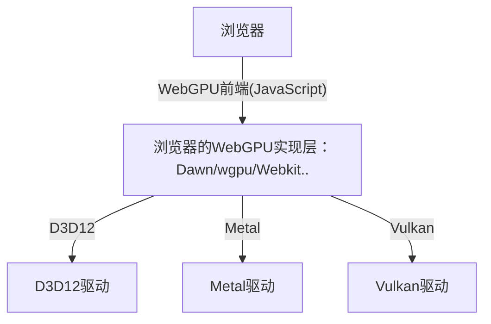
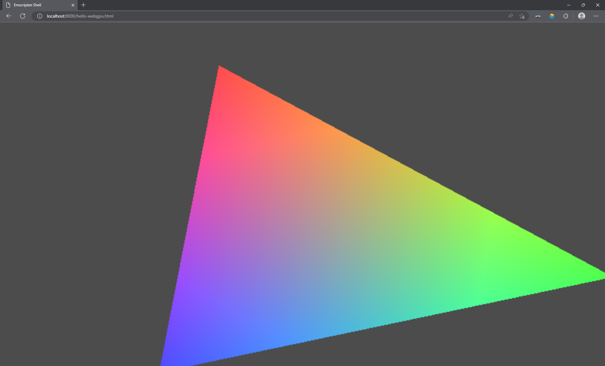

# WebGPU : C/C++

## 更新日志

* 2022/12/19
  >
  >* 创建`WebGPU : Dawn`文档
  >* 创建`概述`章节
  >* 创建`Git Clone Dawn`章节
  >* 创建`浏览器`章节
  >* 创建`Dawn`章节
  >* 创建`Dawn 概览`章节
  >* 创建`文件结构`章节

* 2022/12/23
  >
  >* 创建`C/C++与WebGPU`章节
  >* 更改该文档为`WebGPU : C/C++`
  >* 创建`Emscripten`章节

* 2022/12/26
  >
  >* 创建`Hello-WebGPU`章节

---

[WebGPU标准](https://www.w3.org/TR/webgpu/)

[Google Dawn, a WebGPU implementation](https://dawn.googlesource.com/dawn/)

## 概述

* `WebGPU`是基于下一代图形API(Vulkan/DX12/Metal)设计的网页版图形API标准（注：只有标准没有实现，实现是浏览器制造商的事情）

制造商这不就来了~：

* `Dawn`是`Google`在其[chromium](https://www.chromium.org/chromium-projects/)项目上的`WebGPU`实现。基于`C/C++`

* [wgpu](https://wgpu.rs/)是`FireFox`的`WebGPU`实现，已被整合到了`Firefox`，`Servo`和`Deno`中。基于`Rust`

* `Webkit`是`Apple`的网络开发包内部实现了`WebGPU`，并用于`Safari`中。(本人对苹果平台了解不多)

正常来说`WebGPU`的开发同`WebGL`一样使用`JavaScript`开发，属于前端开发的一部分。而`Dawn`和`wgpu`等严格意义上应该算是在底层图形API上的浏览器抽象层，结构图如下：



如果您是`Web`前端开发的话`JavaScript`的`WebGPU`前端（介于`浏览器`和`浏览器WebGPU实现层`之间）对您来说应该比较熟悉。  
而`Turbo`需要一个`C/C++`的`WebGPU`实现，所以`Dawn`成为首选

## Git Clone `Dawn`

```
git clone https://dawn.googlesource.com/dawn
```

对于国内网络是不能直接访问此链接地址的，需要设置`git代理`

1. 首先你需要有`VPN`或`某些科学工具`
2. 查看代理的地址和端口号
3. 调用如下指令设置`git代理`（注：这里设置的是`http`代理，还有个`socket5`代理，详细信息请查看[google的Dawn挂梯子也Clone不下来](https://forum.orillusion.com/topic/78/google%E7%9A%84dawn%E6%8C%82%E6%A2%AF%E5%AD%90%E4%B9%9Fclone%E4%B8%8D%E4%B8%8B%E6%9D%A5)）

    ```CXX
    git config --global http.proxy http://127.0.0.1:你VPN或科学工具的端口号
    ```

4. 调用`git clone`即可

## 浏览器

由于`WebGPU`是一个新兴标准，大部分浏览器还没有完全适配，目前大部分浏览器的发行版都不支持`WebGPU`，但是可以使用浏览器发布的开发版或者是每日更新版本，这些版本支持`WebGPU`。

由于`Edge`浏览器原生支持`chromium`内核，将使用[Edge Dev版](https://www.microsoftedgeinsider.com/en-us/download)进行学习（`Edge Canary版也是可以的`）

1. 浏览器默认是不开启`WebGPU`支持的
2. 下载安装`Edge Dev版`
3. 后运行`Edge Dev版`访问`url`为`edge://flags/`的地址
4. 搜素`Unsafe WebGPU`标志位特性，开启即可。
5. 访问如下示例进行`WebGPU`测试
    * [webgpu-samples](https://austin-eng.com/webgpu-samples)
    * [yeti](https://www.babylonjs.com/demos/yeti/)
    * [pbrglossy](https://www.babylonjs.com/demos/pbrglossy/)
    * [flighthelmet](https://www.babylonjs.com/demos/flighthelmet/)

## Dawn

`Dawn`是开源跨平台的基于`Chromium`的`WebGPU`实现，在`webgpu.h`中有与`WebGPU`标准更加详细的一一对应声明。

`Dawn`提供如下构建`WebGPU`组件：

* **WebGPU C/C++头文件**，用于应用开发和其他一些构建组件
* **一个“原始的”WebGPU实现**，用于使用平台相关的`GPU`图形`API`
* **一个客户端-服务器WebGPU实现**，用于用于程序的沙盒环境，而不需要接触原始`GPU`图形`API`
* **Tint**，用于编译`WebGPU Shader Language(WGSL)`和与其他着色器互相转换

## Dawn 概览

`Dawn`主要有两个库：`dawn_native`和`dawn_wire`，`Dawn`使用`dawn.json`来描述`WebGPU`标准API，之后将用于生成`c/c++`的头文件，客户端-服务端实现的一部分等等。

### 文件结构

* `dawn.json`: 使用`Json`格式描述`WebGPU`，之后用于生成代码
* `dawn_wire.json`:  包含一些生成`dawn_wire`文件的额外信息，就比如`WebGPU`标准中的一系列`Command`
* `examples`: 一些例子集合(*注：目前没找到该文件夹*)
* `generator`: 包含代码构建和对应的模板. 代码是基于`Jinja2`构建的，并会去解析相应的`JSON`文件.
  * `dawn_json_generator.py`: 用于生成`WebGPU`头文件，客户端-服务端实现等.
  * `templates`: Jinja2 的构建器的模板，子目录下有相应的模板
* `infra`: *注：不知道干啥的，可能是用于查看文件变化的*
* `scripts`: 用于`Dawn`的构建，测试等的一系列文件
* `src`:
  * `dawn`: `Dawn`源码根目录
    * `common`: h通用库并用于 `dawn_native` 和 `dawn_wire`等其他库
    * `fuzzers`: 在`Dawn`中运行`fuzzers`[Clusterfuzz](https://google.github.io/clusterfuzz/).（*注：好像是用来提示潜在`Bug`的*）
    * `native`: `WebGPU`的具体实现. 在本级文件夹下的是展现给用户使用的`前端`，而子文件夹是对应`后端`实现.
      * `<backend>`: 根据不同图形API`后端`的实现, 比如 `d3d12`, `metal` 或 `vulkan`.
    * `tests`:
      * `end2end`: 运行`WebGPU API`的测试程序并且获取一个`GPU`执行.
      * `perf_tests`: `Dawn`的不同使用准则.
      * `unittests`: 内部类的单元测试, 并且扩展`WebGPU API`测试使其不使用`GPU`执行.
        * `validation`: `WebGPU` 不使用`GPU`的验证测试
      * `white_box`: 需要使用`GPU`并且与 `dawn_native` 或 `dawn_wire`进行交互.
    * `wire`: 用于使用`WebGPU`的`客户端-服务器`架构代码.
    * `utils`: 帮助代码用于测试和示例，但是不允许`dawn_native`和`dawn_wire`使用.
    * `platform`: 用于在 `dawn_native` 或 `dawn_wire`中定义接口依赖.
  * `include`: 公共头文件和与子文件夹对应的库. 注意有些文件是动态生成的并不能直接找到.
* `third_party`: 依赖.

## C/C++与WebGPU

跑到`Dawn`的官方群里聊了会儿闲篇，根据群里大佬的说法`Dawn`是在原始图形API的基础上实现的`WebGPU`接口并开放在`webgpu.h`文件中，当在网络端并不会访问原始图形API，所以`Dawn`在页面端并不会做任何有用的事情，而`Emscripten`上有个使用`JavaScript`实现的`WebGPU`，并且也开放在`webgpu.h`中，所以想用`C/C++`使用`WebGPU`在浏览器上绘制，使用`Emscripten`而不是`Dawn`。

## Emscripten

[Emscripten](https://emscripten.org)是一个基于`LLVM`将代码编译到`WebAssembly`的编译工具链，特别是在Web平台上注重程序大小和运行速度。

给我的感觉`Emscripten`是一个编译器，可以将`C/C++`代码编译到`Web`平台，在浏览器上运行。

有关`Emscripten`的下载安装[下载安装说明](https://emscripten.org/docs/getting_started/downloads.html)说的蛮详细的这里就不在赘述。

要说的是，在`./emsdk install latest`这一步，大概率是安装报错不会成功，由于`“玛利亚之墙”`的存在，想让`“巨人”`们进来还是需要`"超大型巨人"`来一脚。同获取`Dawn`一样先设个代理先，[详情请看emsdk对于该问题的Issue](https://github.com/emscripten-core/emsdk/issues/95)

* Windows设置代理

cmd中直接键入如下（同`git`中设置代理差不多）

```CMD
set http_proxy=127.0.0.1:你VPN或科学工具的端口号
set https_proxy=127.0.0.1:你VPN或科学工具的端口号
```

之后再调用`./emsdk install latest`即可

## Hello-WebGPU

`Dawn`官方群中的一位大佬写的小例子[Hello-WebGPU](https://github.com/cwoffenden/hello-webgpu)，支持`Windows`，`Mac`和`Web`，其中网络端就是使用`Emscripten`实现的，而`Windows`和`Mac`端是使用`Dawn`实现的。

1. 首先将[Hello-WebGPU](https://github.com/cwoffenden/hello-webgpu)克隆下来
2. 将`emsdk`路径添加到系统环境变量`path`中
3. 在克隆下来的`hello-webgpu`文件夹下新建`build`文件夹，并在`build`文件夹目录下打开终端
4. 终端输入如下后回车
    ```cmd
    > emcmdprompt.bat
    ```
    将会自动构建`Emscripten`的环境
    *注：有关`emcmdprompt.bat`详情请查看[First things first](https://emscripten.org/docs/getting_started/Tutorial.html#first-things-first)和[Emscripten Windows Command Prompt(emcmdprompt.bat)](https://emscripten.org/docs/tools_reference/emcmdprompt.html#emcmdprompt)*
5. 终端输入如下后回车（使用`mingw`构建，也可以选择`Ninja`等）
    ```cmd
    > emcmake cmake -G "MinGW Makefiles" ..
    ```
    ```cmd
    > mingw32-make
    ```

    *注：`mingw32-make`来自[llvm-mingw](https://github.com/mstorsjo/llvm-mingw/releases)*
6. 将会在`build`下构建`.html`，`.js`，`.wasm`目标文件，说明构建成功
7. 在`build`目录终端中输入如下：
    ```cmd
    > python -m http.server
    ```
    将会起一个`http`本地服务器
    可能的输出：
    ```cmd
    > Serving HTTP on :: port 8000 (http://[::]:8000/) ...
    ```
8. 之后访问`http://localhost:8000/`并点击页面上的`hello-webgpu.html`选项  
*注：请不要访问`http://[::]:8000/`，具体原因请查看[Don't show anything on Edge dev browser](https://github.com/kainino0x/webgpu-cross-platform-demo/issues/13)*

9. 网络端渲染结果：

