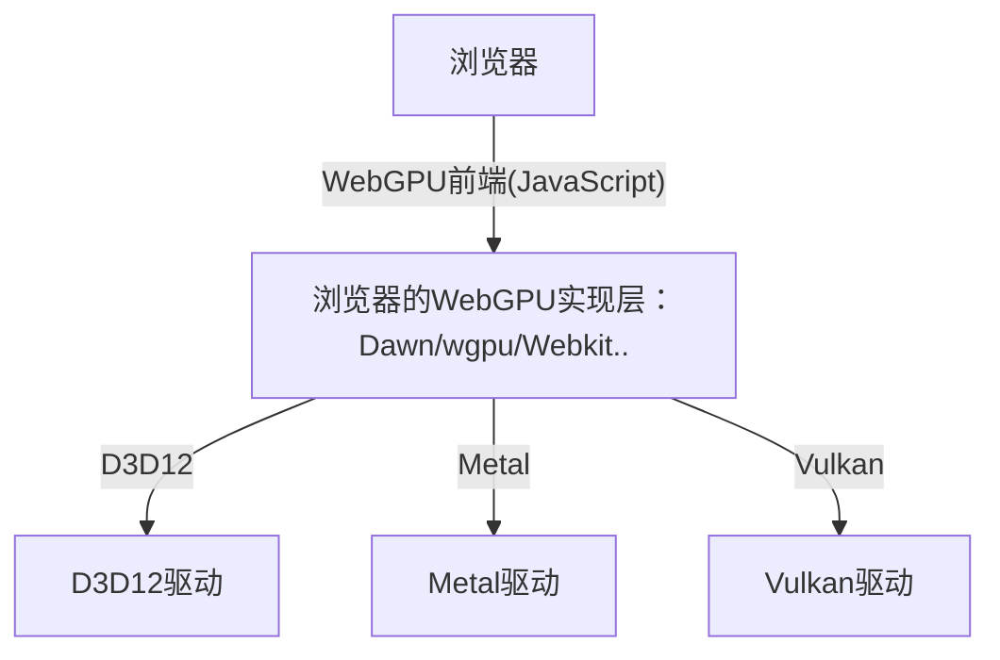

# WebGPU : Dawn

## 更新日志
* 2022/12/19
  >
  >* 创建`WebGPU : Dawn`文档
  >* 创建`概述`章节
  >* 创建`Git Clone Dawn`章节
  >* 创建`浏览器`章节


---

[WebGPU标准](https://www.w3.org/TR/webgpu/)

[Google Dawn, a WebGPU implementation](https://dawn.googlesource.com/dawn/)

## 概述

* `WebGPU`是基于下一代图形API(Vulkan/DX12/Metal)设计的网页版图形API标准（注：只有标准没有实现，实现是浏览器制造商的事情）

制造商这不就来了~：

* `Dawn`是`Google`在其[chromium](https://www.chromium.org/chromium-projects/)项目上的`WebGPU`实现。基于`C/C++`

* [wgpu](https://wgpu.rs/)是`FireFox`的`WebGPU`实现，已被整合到了`Firefox`，`Servo`和`Deno`中。基于`Rust`

* `Webkit`是`Apple`的网络开发包内部实现了`WebGPU`，并用于`Safari`中。(本人对苹果平台了解不多)

正常来说`WebGPU`的开发同`WebGL`一样使用`JavaScript`开发，属于前端开发的一部分。而`Dawn`和`wgpu`等严格意义上应该算是在底层图形API上的浏览器抽象层，结构图如下：



如果您是`Web`前端开发的话`JavaScript`的`WebGPU`前端（介于`浏览器`和`浏览器WebGPU实现层`之间）对您来说应该比较熟悉。  
而`Turbo`需要一个`C/C++`的`WebGPU`实现，所以`Dawn`成为首选

## Git Clone `Dawn`

```
git clone https://dawn.googlesource.com/dawn
```
对于国内网络是不能直接访问此链接地址的，需要设置`git代理`

1. 首先你需要有`VPN`或`某些科学工具`
2. 查看代理的地址和端口号
3. 调用如下指令设置`git代理`（注：这里设置的是`http`代理，还有个`socket5`代理，详细信息请查看[google的Dawn挂梯子也Clone不下来](https://forum.orillusion.com/topic/78/google%E7%9A%84dawn%E6%8C%82%E6%A2%AF%E5%AD%90%E4%B9%9Fclone%E4%B8%8D%E4%B8%8B%E6%9D%A5)）
    ```CXX
    git config --global http.proxy http://127.0.0.1:你VPN或科学工具的端口号
    ```
4. 调用`git clone`即可

## 浏览器

由于`WebGPU`是一个新兴标准，大部分浏览器还没有完全适配，目前大部分浏览器的发行版都不支持`WebGPU`，但是可以使用浏览器发布的开发版或者是每日更新版本，这些版本支持`WebGPU`。

由于`Edge`浏览器原生支持`chromium`内核，将使用[Edge Dev版](https://www.microsoftedgeinsider.com/en-us/download)进行学习（`Edge Canary版也是可以的`）

1. 浏览器默认是不开启`WebGPU`支持的
2. 下载安装`Edge Dev版`
3. 后运行`Edge Dev版`访问`url`为`edge://flags/`的地址
4. 搜素`Unsafe WebGPU`标志位特性，开启即可。
5. 访问如下示例进行`WebGPU`测试
    * [webgpu-samples](https://austin-eng.com/webgpu-samples)
    * [yeti](https://www.babylonjs.com/demos/yeti/)
    * [pbrglossy](https://www.babylonjs.com/demos/pbrglossy/)
    * [flighthelmet](https://www.babylonjs.com/demos/flighthelmet/)

