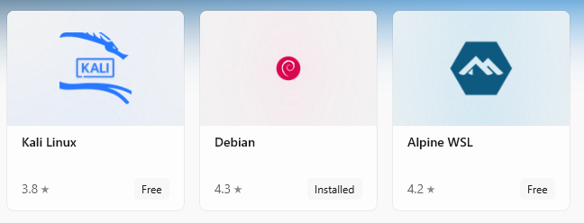

# 常见问题

* Could Not find Vulkan (missing: VULKAN_LIBRARY VULKAN_INCLUDE_DIR)
  * **`原因`**：`cmake`的`find_package(Vulkan REQUIRED)`会去寻找`VULKAN_SDK`环境变量的值，如果没找到则会返回该错误。
  * **`解决方法`**：在环境变量中设置`VULKAN_SDK`环境变量，其值为安装 `Vulkan SDK` 的 `{安装路径}/VulkanSDK/{安装的版本}`

* Could Not find BASH (missing: BASH_EXECUTABLE)
  * **`原因`**：与`Could Not find Vulkan (missing: VULKAN_LIBRARY VULKAN_INCLUDE_DIR)`问题类似，`CMake`中设置`BASH_EXECUTABLE`参数
  * **`解决方法`**：与`Could Not find Vulkan (missing: VULKAN_LIBRARY VULKAN_INCLUDE_DIR)`问题类似，`CMake`中设置`BASH_EXECUTABLE`参数

  *注：`BASH_EXECUTABLE`指的是`git`目录下的`bash.exe`，一般在`{git安装目录}/bin/bash.exe`目录下*

* CMake Error at thirdparty/CMakeList.txt:.. (add_subdirectory)
  * **`原因`**：从`github`上`clone`或是下载的压缩文件有时并不会将第三方库一起下载下来，这会导致`./thirdparty`目录下的各个第三方库为空文件夹。还有可能是我`Turbo`的`git`配置有问题
  * **`解决方法`**：两种方法，随便使用其一即可，推荐方法`2`
    1. 根据`./README.md`中的`Build`章节中的第三方库的链接，将第三方库都下载下来，之后直接替换`./thirdparty`下的文件夹
    2. 在`clone`下来的`Turbo`目录下执行如下指令，将会自动下载对应第三方库

        ```Cmd
        git submodule init
        git submodule update
        ```

* Expression: vector subscript out of range  

  

  * **`原因`**：运行的程序会去读取模型文件（`glTF`文件），如果没找到该模型文件会导致该异常
  * **`解决方法`**：将代码中的模型文件路径指向`./asset/`目录

* Windows Subsystem for Linux has no installed distributions
  * **`原因`**：新版的`KTX-Software`在`Windows`上编译需要`WSL`（`Windows`上的`Linux`子系统）环境
  * **`解决方法`**：有提示下载`WSL`链接`https://aka.ms/wslstore`，如果没有，打开`Microsoft Store`，则手动搜索如下`WSL`系统并选择其中一个下载安装（我选择了下载安装`Debian`）  
    
  之后点击`WIN`键在最近安装处打开下载的`WSL`进行安装激活即可  
  
