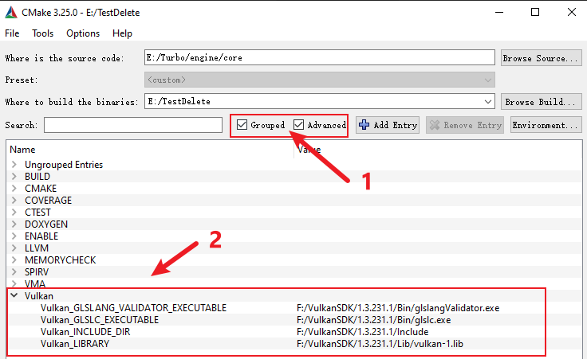

# 常见问题

* Could Not find Vulkan (missing: VULKAN_LIBRARY VULKAN_INCLUDE_DIR)
  * **`原因`**：可能刚安装`Vulkan SDK`，此时`CMake`没有更新相关环境
  * **`解决方法`**：尝试重启电脑 或者 配置`CMake`中如图属性：
    

* Could Not find BASH (missing: BASH_EXECUTABLE)
  * **`原因`**：与`Could Not find Vulkan (missing: VULKAN_LIBRARY VULKAN_INCLUDE_DIR)`问题类似，`CMake`中设置`BASH_EXECUTABLE`参数
  * **`解决方法`**：与`Could Not find Vulkan (missing: VULKAN_LIBRARY VULKAN_INCLUDE_DIR)`问题类似，`CMake`中设置`BASH_EXECUTABLE`参数

* CMake Error at thirdparty/CMakeList.txt:.. (add_subdirectory)
  * **`原因`**：从`github`上`clone`或是下载的压缩文件有时并不会将第三方库一起下载下来，这会导致`./thirdparty`目录下的各个第三方库为空文件夹。还有可能是我`Turbo`的`git`配置有问题
  * **`解决方法`**：根据`./README.md`中的`Build`章节中的第三方库的链接，将第三方库都下载下来，之后直接替换`./thirdparty`下的文件夹
