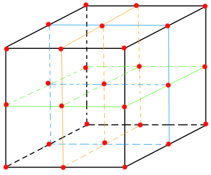

# 体积云

* [GPU Pro 7 体积云](https://zhuanlan.zhihu.com/p/580168048):该篇主要讲云体建模和大致思路。云体光照讲的相对较少。  
* `Revision 2013 - Real-time Volumetric Rendering Course Notes` 翻译中，该篇主要是讲云体光照计算的，如果等不及的话可以看[Clouds physically-based II](https://www.shadertoy.com/view/ldlXzM)，该示例算法与`Revision 2013`的文章相符

## 更新日志

* 2022/11/14
  >
  >* 开始书写此文章
  >* 创建`概述`章节
  >* 创建`噪音`章节
  >* 创建`0 背景`章节
  >* 创建`0.1 噪音`章节
  >* 创建`0.1.1 柏林噪音（Perlin Noise）`章节
  >* 创建`0.1.2 沃利噪音 （Worley Noise）`章节
  >* 创建`0.2 分形（fractal）`章节
  >* 创建`0.2.1 分形布朗运动（Fractal Brownian Motion，简称FBM）`章节
  >* 创建`0.3 光线步进（Raymarch）`章节
  >* 创建`1 云体建模`章节

* 2022/11/15
  >
  >* `0.2.1 分形布朗运动（Fractal Brownian Motion，简称FBM）`新增说明
  >* 优化`0.3 光线步进`章节
  >* 优化`1.1.1 柏林噪音`章节
  >* 创建`1.1.2 FBM算法`章节
  >* 创建`1.1.3 柏林FBM噪音`章节
  >* 更改`1.1.3 柏林FBM噪音`中对`exp2`的解释，之前解释错误，修正
  >* 创建`1.1.4 沃利噪音`章节

* 2022/11/16
  >
  >* 创建`0.1.3 三维噪音纹理`章节
  >* `1.1.2 FBM算法`章节，增加`赫斯特指数`渲染效果图
  >* 创建`1.1.5 沃利FBM噪音`章节
  >* 创建`1.2 柏林-沃利噪音实现`章节
  >* 创建`1.2.1 重映射函数（Remap）`章节

## 概述

体积云（Volumetric Cloud ），使用体积数据进行绘制云的方法。有别于`广告牌`（Billboard，一种将图片展现在一张面片上的技术）和建立`三维模型`（blender，3dmax建模之类的），由于广告牌只适合离玩家很远的地方渲染云体（离近了明显效果太假），而三维建模方式云体数据量又太大，只适合一朵朵的建，不适合覆盖整个穹顶，进而现在的体积云都是基于`噪音数据`(可理解成随机数)和[光线步进](https://adrianb.io/tags/tech_writeup/)（Raymarch，类似于简化版的光线追踪）的方式进行计算渲染。

其中噪音数据用于描述云体的外形，光线步进用于穿透云体进行光照计算。
该篇文章也主要按照云体建模和光照这两部分进行讲解。

## 0 背景

简单讲解一下云体的`噪音数据`和`光线步进`

### 0.1 噪音

噪音，生活中经常听碰到，工地的施工声，大街上的嘈杂声，老旧电视没信号的雪花屏幕等等，这些都是噪音，再直接一点的说，一个噪音就是一个随机的数。但是这些噪音的混乱程度比较高，在一些自然现象中，比如大地的起伏大多都是比较平缓连续的，密集断崖式的还是少数（相对来说），这时噪音就可以用来代表地形的起伏高度（比如`我的世界`这款游戏的地形生成）。这个时候一种不是那么混乱，而且还带有连续性特性的噪音就是我们所需要的，后来`肯·柏林`（Ken Perlin）发明`柏林`（Perlin）噪音算法，该算法生成的噪音比较自然，非常适合模拟地形、火焰之类的自然现象，后被图形学大量使用。再后来史蒂文·沃利（Steven Worley）发明了沃利（Worley）噪音，该算法生成的噪音比较像动物体内的细胞，所以也叫`细胞噪音`

#### 0.1.1 柏林噪音（Perlin Noise）

柏林噪音是属于晶格噪音：有一个方形盒子（晶格），盒子内有一个随机点，盒子的八个角，每个角都存有一个随机向量和该角指向随机点的向量，这两个向量做点乘，得到一个数，之后每个角都做如此操作，会得到八个数，加权，合起来，得到一个数，此数作为噪音值。

#### 0.1.2 沃利噪音 （Worley Noise）

一个平面上随机散布着一些点，这些点叫特征点，走遍整个空间的每个位置，找该位置与哪个特征点最近，最近的那个距离长度作为该空间位置的噪音值。

#### 0.1.3 三维噪音纹理

最简单的噪音纹理是一维的，数学上理解就是一元函数`f(x)`，最简单的噪音就是几个振幅、频率和相位都不一样的`m×sin(ax+b)`和`n×cos(jx+k)`函数的和（注：傅里叶）。

常见的噪音纹理一般是二维的，用于表达一个二维平面内的随机数，而体积云是个三维物体，需要知道某个空间下云体在空间的分布，这时将二维噪音纹理提升一个维度，构建三维噪音纹理，作为云体的体积数据，用于描述云体外形。

### 0.2 分形（fractal）

分形就是宏观看，是其人，细看，还是其人，无论是凑近看还是离远看外貌不变。比如，看树干是比较大的树枝，树干上的岔也是树枝，树枝上的小树枝还是树枝。还有雪花也是分形的

#### 0.2.1 分形布朗运动（Fractal Brownian Motion，简称FBM）

像树这样的分形，大树干是大树枝，树杈是略小一点的树枝，树梢是更小一点的树枝，无论远近，都是树枝，只不过是大小不同，像树这种,可以用不同大小树枝集合来描述其分形，而对于自然界噪音是使用不同频率的噪音叠加来描述其分形，比如山脉，云体，火焰等。这种不同频率噪音的叠加被称作`分形布朗运动`简称`FBM`。`分形布朗`的基本思路就是不同频率的噪音的叠加，这会导致一个非常有意思的现象，每增加一次频率并与之前低频的相加，其结果是在低频的结果上增加细节，而不会破坏低频噪音的形状，就好比揉面团，一开始是一大块，此时可以看成噪音频率很低，在面团上雕花，这时就可以看成低频的噪音加上一个高频噪音的结果，如果再加入更过高频，细节会越来越多。

### 0.3 光线步进（Raymarch）

光线步进，并不等价于光线追踪，简单来说光线步进是光线追踪的简化版，光线步进算法是通过从某一点出发，沿着某一方向，一步步的前进，每走完一步都会在该处计算光照，一般这样计算光照的位置叫做采样点，最后将所有走过的采样点计算结果加在一起，就是此束光的光照结果。

最常见的光线步进在后处理阶段的片元着色器中进行（[ShaderToy](https://www.shadertoy.com/)上的大部分代码都是基于此方法进行的），从相机的位置开始，向每个像素发一条射线，沿着该射线方向步进进行计算。

注：后处理：其实就是在相机前方放块刚好能够铺满整个视界范围的画布，并在该画布上计算每一个位置的颜色值。（一般该画布上都是已经颜色，后处理的意思是在此基础上在再做一些修改）

## 1 云体建模

该章节主要讲使用噪音生成云的外形

### 1.1 柏林-沃利噪音

在使用柏林噪音生成云体后，会明显发现这个云的形状过于平滑，而真实世界中的云上都有一朵朵类似花椰菜，西蓝花的形状的小云朵(分形)，为了营造一朵朵的这种形状，引入了沃利噪音。柏林噪音和沃利噪音相结合柏林-沃利噪音由此诞生

#### 1.1.1 柏林噪音

使用哈希散列表获得随机向量，输入`p`为方盒子八个角的坐标，`hash33`函数将会返回一个随机向量(注：生成随机向量方法还有很多，哈希只是其中一种)

```CXX
#define UI0 1597334673U
#define UI1 3812015801U
#define UI2 uvec2(UI0, UI1)
#define UI3 uvec3(UI0, UI1, 2798796415U)
#define UIF (1.0 / float(0xffffffffU))
vec3 hash33(vec3 p)
{
    uvec3 q = uvec3(ivec3(p)) * UI3;
    q = (q.x ^ q.y ^ q.z) * UI3;
    return -1. + 2. * vec3(q) * UIF;
}
```

---

接下来我们来计算晶格噪音值，还记得柏林噪音是属于晶格噪音的一种吗。

```CXX
//生成晶格噪音值
float gradientNoise(vec3 x, float freq){
```

首先通过将传入的噪音采样点`x`向下取整，确定晶格的起点

```CXX
vec3 p = floor(x);
```

之后再取噪音采样点`x`的小数部分作为晶格内的随机点，这样采样点就不会跑出边长为1的正方体外，这与下面生成边长为1的正方体相对应

```CXX
vec3 w = fract(x);
```

进行5次插值，[iq的文章](https://iquilezles.org/articles/morenoise/)中大致好像是偏导的泰勒展开，集体没细看，一般高阶插值都是为了获得更高精度的结果

```CXX
vec3 u = w * w * w * (w * (w * 6. - 15.) + 10.);
```

获得晶格八个角的随机向量，可以看到晶格是边长为1的正方体

```CXX
vec3 ga = hash33(mod(p + vec3(0., 0., 0.), freq));
vec3 gb = hash33(mod(p + vec3(1., 0., 0.), freq));
vec3 gc = hash33(mod(p + vec3(0., 1., 0.), freq));
vec3 gd = hash33(mod(p + vec3(1., 1., 0.), freq));
vec3 ge = hash33(mod(p + vec3(0., 0., 1.), freq));
vec3 gf = hash33(mod(p + vec3(1., 0., 1.), freq));
vec3 gg = hash33(mod(p + vec3(0., 1., 1.), freq));
vec3 gh = hash33(mod(p + vec3(1., 1., 1.), freq));
```

方格对应的角的随机向量与角到晶格内采样点向量做点乘

```CXX
float va = dot(ga, w - vec3(0., 0., 0.));
float vb = dot(gb, w - vec3(1., 0., 0.));
float vc = dot(gc, w - vec3(0., 1., 0.));
float vd = dot(gd, w - vec3(1., 1., 0.));
float ve = dot(ge, w - vec3(0., 0., 1.));
float vf = dot(gf, w - vec3(1., 0., 1.));
float vg = dot(gg, w - vec3(0., 1., 1.));
float vh = dot(gh, w - vec3(1., 1., 1.));
```

加权插值，返回其结果

```CXX
return va + u.x * (vb - va) + u.y * (vc - va) + u.z * (ve - va) + u.x * u.y * (va - vb - vc + vd) + u.y * u.z * (va - vc - ve + vg) + u.z * u.x * (va - vb - ve + vf) + u.x * u.y * u.z * (-va + vb + vc - vd + ve - vf - vg + vh);
}
```

#### 1.1.2 FBM算法

在真正进入下一节`柏林FBM噪音`之前，想让我们来看看FBM的一般性描述。最原始的FBM就是不同频率的噪音叠加，根据[iq的文章](https://iquilezles.org/articles/fbm/)描述，其中在数学上有个正相关，负相关的特点，当正相关时结果会更大，负相关时结果会更小，控制这种特性的系数叫做`赫斯特指数`(Hurst Exponent)，简写为`H`，该系数在[0,1]范围内，从视觉上看，该系数用于控制噪音的“烈度”或“平滑度”。每当一个更高频叠加时，一般叫这种叠加操作为“增加一个八度”（Octave）。如下图为`赫斯特指数`影响示意图，据图可查看`Turbo`生成的`PerlinWorleyNoiseTest`示例程序。  

  

声明`FBM`函数，其中`x`为`N`维空间的一个采样点，`H`为赫斯特指数。

```CXX
float fbm( in vecN x, in float H )
{   //一开始的噪音初值为0
    float t = 0.0;
    //进行噪音叠加循环，其中numOctaves为要增加几个八度
    for( int i=0; i<numOctaves; i++ )
    {
        //每次增加2倍的频率(不一定只能使用2，也可以是其他数)
        float f = pow( 2.0, float(i) );
        //使用赫斯特指数进行调整
        float a = pow( f, -H );
        //进行高频采样叠加
        t += a*noise(f*x);
    }
    //返回叠加结果
    return t;
}
```

#### 1.1.3 柏林FBM噪音

好了，现在我们已经知道`FBM`咋算了，现在来看看`柏林FBM`算法吧

```CXX
//柏林FBM，其中p为采样点坐标，freq为频率，octaves为要增加的八度
float perlinfbm(vec3 p, float freq, int octaves)
{
    //exp2(x)表示2的x次方，该项为赫斯特指数
    float G = exp2(-.85);
    //一开始的赫斯特指数影响系数为1
    float amp = 1.;
    //一开始的噪音值为0
    float noise = 0.;
    //进行噪音叠加循环，其中octaves为要增加几个八度
    for (int i = 0; i < octaves; ++i)
    {
        //采样晶格噪音，并乘上赫斯特指数影响系数，并进行噪音叠加
        noise += amp * gradientNoise(p * freq, freq);
        //提高频率
        freq *= 2.;
        //更新影响系数
        amp *= G;
    }
    //返回叠加结果
    return noise;
}
```

#### 1.1.4 沃利噪音

之前介绍的沃利噪音是在一个二维平面内进行的，现在将二维提升至三维，大致思路都差不多，一个空间内散落着很多特征点，空间中某一点的噪音值为该点到离其最近的特征点的距离，遍历空间中的所有位置计算该点的噪音，即为三维下的沃利噪音。

为了简化问题，一般会把空间限制在一个正方体空间中，之后横竖从中间平分切开，像二阶魔方一样，这样每条边有3个点（算上没切开之前的角），每个面有9个点，有3个面，一共27个点。如下如所示。  
  
我们将会在这27个点上，每一个点附近生成一个特征点，之后每一个噪音采样点都与这27个点作比较，寻找离得最近的那个特征点与采样点之间的距离，作为该采样点的噪音值。

如下`worleyNoise`沃利噪音函数，其中`uv`采样点，`freq`为频率

```CXX
float worleyNoise(vec3 uv, float freq)
{
    //同柏林噪音一样，采样点向下取整，唯一不同的是这个id点是在盒子的中心的
    vec3 id = floor(uv);
    //同柏林噪音一样，取小数点部分作为采样点，限制采样点范围
    vec3 p = fract(uv);
    //一开始的最小距离大一点，之后用于比较更新
    float minDist = 10000.;

    //如下三个循环就是遍历，就是分别遍历正方体上的27个点
    for (float x = -1.; x <= 1.; ++x)
    {
        for (float y = -1.; y <= 1.; ++y)
        {
            for (float z = -1.; z <= 1.; ++z)
            {
                vec3 offset = vec3(x, y, z);
                //id + offset就是以id为原点，计算周遭27个点的坐标(下文统称红点)
                //在红点处调用hash33(...)，其实就是在算出一个特征点
                //每个红点都有一个特征点
                vec3 h = hash33(mod(id + offset, vec3(freq))) * .5 + .5;
                //h+offset其实就是算的是相对p点特征点的位置，应为p是最终的采样点
                h += offset;
                //计算采样点和特征点的向量，主要是为了算距离
                vec3 d = p - h;
                //其中向量自身的点乘其结果为自身向量长度的平方，这里不开根号的原因是应为开根号和开平方运算，导数都是大于0的，单调递增，平方最大也就意味着开根号也最大，当然，这里开根号也是可以的，只不多平方算的更快
                //更新较小的那个值
                minDist = min(minDist, dot(d, d));
            }
        }
    }
    // 这里1-minDist意思是将结果反过来，从纹理上来说就是黑的变成白的，白的变成黑的，由于原始的沃利噪音细胞部分是黑色的，这不是我们想要的，我们想要细胞部分用于模拟云的花椰菜的形状，结果反过来更加易于计算。
    //返回最小值
    return 1. - minDist;
}
```

#### 1.1.5 沃利FBM噪音

沃利FBM噪音一样，不同频率叠加，唯一不同的是有个权重，权重和为`1`

```CXX
float worleyFbm(vec3 p, float freq)
{
    return 
    worleyNoise(p * freq, freq) * .625 + //原频率×权重
    worleyNoise(p * freq * 2., freq * 2.) * .25 + //二倍频率×权重
    worleyNoise(p * freq * 4., freq * 4.) * .125; //四倍频率×权重
}
```

### 1.2 柏林-沃利噪音实现

#### 1.2.1 重映射函数（Remap）

在介绍`柏林-沃利噪音`实现之前，先来看看重映射函数，这个相对比较简单。  

前提条件：首先定义域`X`（定义域有范围限制，不能是无穷）内某点`x`，定义域`X`范围长度为`lx`。有另一个定义域范围`Y`，定义域`Y`范围长度为`ly`

大致思路如下：

1. `x' = x ÷ lx`得到一个[0,1]的数，其结果为`x`在`lx`上的长度占比`x'`
2. 使用`y' = ly × x'`得到`x`相对于在`ly`范围映射的位置
3. 使用`Y`定义域的最小值`Ymin`与`y'`相加`result = Ymin + y'`，返回`result`即为重映射结果

代码如下：

```CXX
float remap(float x, float xMin, float xMax, float yMin, float yMax)
{
    return (((x - xMin) / (xMax - xMin)) * (yMax - yMin)) + yMin;
}
```

---

## 未完待续
