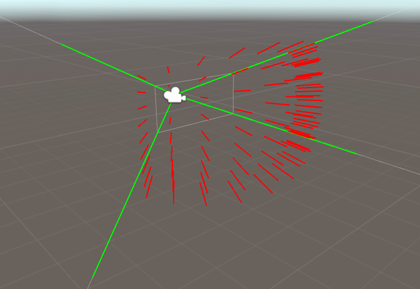
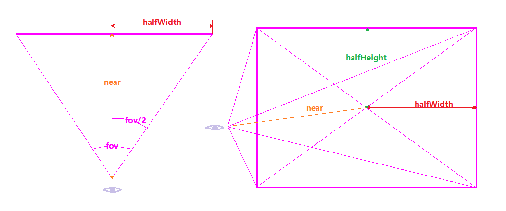
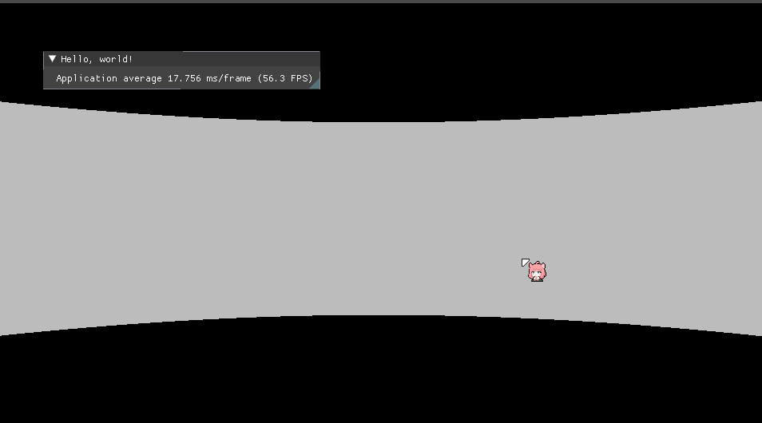
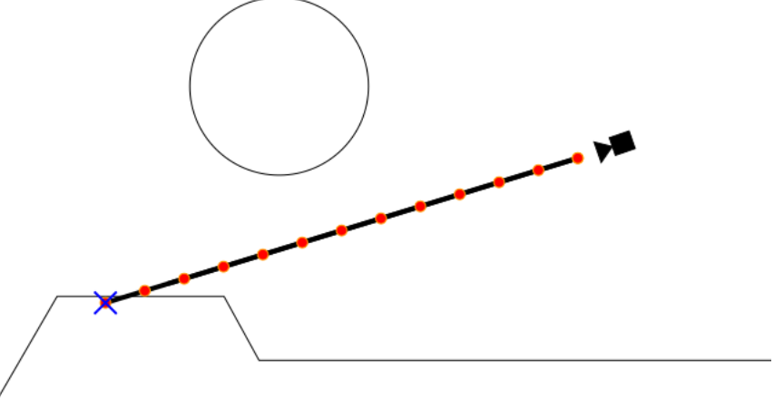
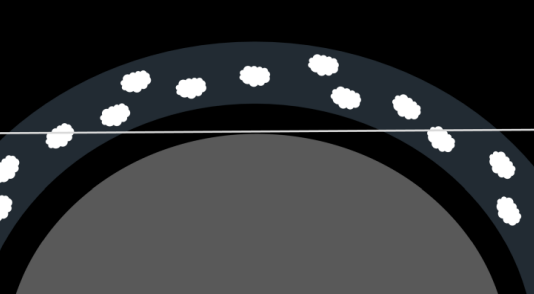
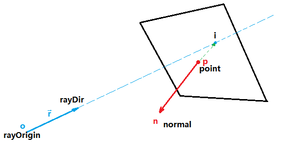
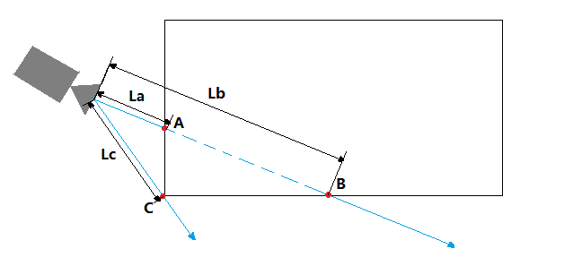
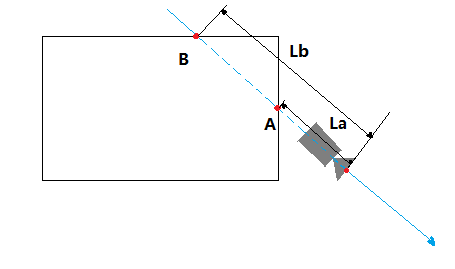
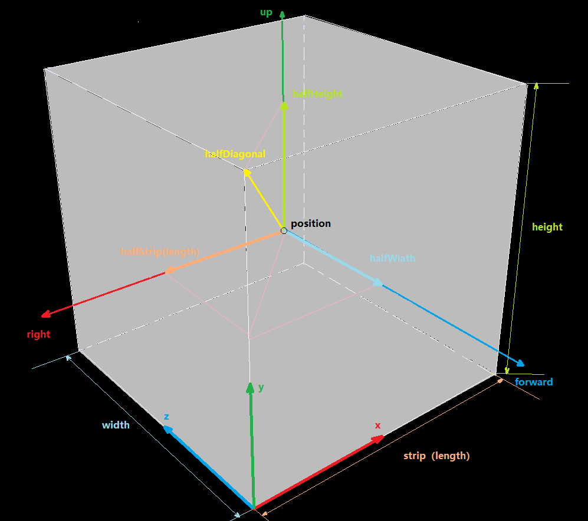

# 体积云

* [GPU Pro 7 体积云](https://zhuanlan.zhihu.com/p/580168048):该篇主要讲云体建模和大致思路。云体光照讲的相对较少。  
* `Revision 2013 - Real-time Volumetric Rendering Course Notes` 翻译中，该篇主要是讲云体光照计算的，如果等不及的话可以看[Clouds physically-based II](https://www.shadertoy.com/view/ldlXzM)，该示例算法与`Revision 2013`的文章相符

## 更新日志

* 2022/11/14
  >
  >* 开始书写此文章
  >* 创建`概述`章节
  >* 创建`噪音`章节
  >* 创建`0 背景`章节
  >* 创建`0.1 噪音`章节
  >* 创建`0.1.1 柏林噪音（Perlin Noise）`章节
  >* 创建`0.1.2 沃利噪音 （Worley Noise）`章节
  >* 创建`0.2 分形（fractal）`章节
  >* 创建`0.2.1 分形布朗运动（Fractal Brownian Motion，简称FBM）`章节
  >* 创建`0.3 光线步进（Raymarch）`章节
  >* 创建`1 云体建模`章节

* 2022/11/15
  >
  >* `0.2.1 分形布朗运动（Fractal Brownian Motion，简称FBM）`新增说明
  >* 优化`0.3 光线步进`章节
  >* 优化`1.1.1 柏林噪音`章节
  >* 创建`1.1.2 FBM算法`章节
  >* 创建`1.1.3 柏林FBM噪音`章节
  >* 更改`1.1.3 柏林FBM噪音`中对`exp2`的解释，之前解释错误，修正
  >* 创建`1.1.4 沃利噪音`章节

* 2022/11/16
  >
  >* 创建`0.1.3 三维噪音纹理`章节
  >* `1.1.2 FBM算法`章节，增加`赫斯特指数`渲染效果图
  >* 创建`1.1.5 沃利FBM噪音`章节
  >* 创建`1.2 柏林-沃利噪音实现`章节
  >* 创建`1.2.1 重映射函数（Remap）`章节
  >* 创建`1.2.2 柏林-沃利三维噪音`章节
  >* 创建`1.3 三维沃利噪音纹理`章节
  >* 创建`2 光照`章节
  >* 创建`2.1 光线步进`章节

* 2022/11/17
  >
  >* 更新`概述`章节中的`光线步进`链接文章，原来没有直指文章。现在已修正。

* 2022/11/18
  >
  >* 创建`2.1.1 后处理（Post Processing）`章节
  >* 创建`2.1.2 光线步进原理`章节

* 2022/11/19
  >
  >* 完善`2.1.2 光线步进原理`章节
  >* 增加`2.1.2.1 光线`章节
  >* 增加`2.1.2.1.1 其他光线算法`章节
  >* 增加`2.1.2.2 步进循环`章节
  >* 增加`2.1.2.1 光线`章节中的代码

* 2022/11/20
  >
  >* 修改`1.1.1 柏林噪音`的错别字
  >* 修改`2.1.2.1.1 其他光线算法`的错别字

* 2022/11/22
  >
  >* 完善`2.1.2.2 步进循环`章节
  >* 增加`2.1.3 包围盒`章节
  >* 增加`2.1.3.1 描述包围盒`章节
  >* 增加`2.1.3.2 包围盒中步进的起点和终点`章节

* 2022/11/23
  >
  >* 完善`2.1.3.2 包围盒中步进的起点和终点`中`射线与平面求交`章节
  >* 增加`2.1.3.2 包围盒中步进的起点和终点`中`点是否在包围盒内`章节

* 2022/11/25
  >
  >* 增加`2.1.3.2 包围盒中步进的起点和终点`中`射线与包围盒交点`章节

* 2022/11/26
  >
  >* 增加`2.1.4 包围盒内光线步进`章节
  >* 增加`2.1.4.1 包围盒内三维纹理采样`章节

* 2023/1/31
  >
  >* 将`2 光照`章节更名为`光线步进与采样`
  >* 创建`3 光照`章节
  >* 创建`3.1 介绍`章节

* 2023/2/1
  >
  >* 创建`3.2 体渲染理论`章节
  >* 创建`3.2.1 体积特性`章节

## 概述

体积云（Volumetric Cloud ），使用体积数据进行绘制云的方法。有别于`广告牌`（Billboard，一种将图片展现在一张面片上的技术）和建立`三维模型`（blender，3dmax建模之类的），由于广告牌只适合离玩家很远的地方渲染云体（离近了明显效果太假），而三维建模方式云体数据量又太大，只适合一朵朵的建，不适合覆盖整个穹顶，进而现在的体积云都是基于`噪音数据`(可理解成随机数)和[光线步进](https://adrianb.io/2016/10/01/raymarching.html)（Raymarch，类似于简化版的光线追踪）的方式进行计算渲染。

其中噪音数据用于描述云体的外形，光线步进用于穿透云体进行光照计算。
该篇文章也主要按照`云体建模`和`光照`这两部分进行讲解。

## 0 背景

简单讲解一下云体的`噪音数据`和`光线步进`

### 0.1 噪音

噪音，生活中经常听碰到，工地的施工声，大街上的嘈杂声，老旧电视没信号的雪花屏幕等等，这些都是噪音，再直接一点的说，一个噪音就是一个随机的数。但是这些噪音的混乱程度比较高，在一些自然现象中，比如大地的起伏大多都是比较平缓连续的，密集断崖式的还是少数（相对来说），这时噪音就可以用来代表地形的起伏高度（比如`我的世界`这款游戏的地形生成）。这个时候一种不是那么混乱，而且还带有连续性特性的噪音就是我们所需要的，后来`肯·柏林`（Ken Perlin）发明`柏林`（Perlin）噪音算法，该算法生成的噪音比较自然，非常适合模拟地形、火焰之类的自然现象，后被图形学大量使用。再后来史蒂文·沃利（Steven Worley）发明了沃利（Worley）噪音，该算法生成的噪音比较像动物体内的细胞，所以也叫`细胞噪音`

#### 0.1.1 柏林噪音（Perlin Noise）

柏林噪音是属于晶格噪音：有一个方形盒子（晶格），盒子内有一个随机点，盒子的八个角，每个角都存有一个随机向量和该角指向随机点的向量，这两个向量做点乘，得到一个数，之后每个角都做如此操作，会得到八个数，加权，合起来，得到一个数，此数作为噪音值。

#### 0.1.2 沃利噪音 （Worley Noise）

一个平面上随机散布着一些点，这些点叫特征点，走遍整个空间的每个位置，找该位置与哪个特征点最近，最近的那个距离长度作为该空间位置的噪音值。

#### 0.1.3 三维噪音纹理

最简单的噪音纹理是一维的，数学上理解就是一元函数`f(x)`，最简单的噪音就是几个振幅、频率和相位都不一样的`m×sin(ax+b)`和`n×cos(jx+k)`函数的和（注：傅里叶）。

常见的噪音纹理一般是二维的，用于表达一个二维平面内的随机数，而体积云是个三维物体，需要知道某个空间下云体在空间的分布，这时将二维噪音纹理提升一个维度，构建三维噪音纹理，作为云体的体积数据，用于描述云体外形。

### 0.2 分形（fractal）

分形就是宏观看，是其人，细看，还是其人，无论是凑近看还是离远看外貌不变。比如，看树干是比较大的树枝，树干上的岔也是树枝，树枝上的小树枝还是树枝。还有雪花也是分形的

#### 0.2.1 分形布朗运动（Fractal Brownian Motion，简称FBM）

像树这样的分形，大树干是大树枝，树杈是略小一点的树枝，树梢是更小一点的树枝，无论远近，都是树枝，只不过是大小不同，像树这种,可以用不同大小树枝集合来描述其分形，而对于自然界噪音是使用不同频率的噪音叠加来描述其分形，比如山脉，云体，火焰等。这种不同频率噪音的叠加被称作`分形布朗运动`简称`FBM`。`分形布朗`的基本思路就是不同频率的噪音的叠加，这会导致一个非常有意思的现象，每增加一次频率并与之前低频的相加，其结果是在低频的结果上增加细节，而不会破坏低频噪音的形状，就好比揉面团，一开始是一大块，此时可以看成噪音频率很低，在面团上雕花，这时就可以看成低频的噪音加上一个高频噪音的结果，如果再加入更过高频，细节会越来越多。

### 0.3 光线步进（Raymarch）

光线步进，并不等价于光线追踪，简单来说光线步进是光线追踪的简化版，光线步进算法是通过从某一点出发，沿着某一方向，一步步的前进，每走完一步都会在该处计算光照，一般这样计算光照的位置叫做采样点，最后将所有走过的采样点计算结果加在一起，就是此束光的光照结果。

最常见的光线步进在后处理阶段的片元着色器中进行（[ShaderToy](https://www.shadertoy.com/)上的大部分代码都是基于此方法进行的），从相机的位置开始，向每个像素发一条射线，沿着该射线方向步进进行计算。

注：后处理：其实就是在相机前方放块刚好能够铺满整个视界范围的画布，并在该画布上计算每一个位置的颜色值。（一般该画布上都是已经有颜色了，后处理的意思是在此基础上在再做一些修改）

## 1 云体建模

该章节主要讲使用噪音生成云的外形

### 1.1 柏林-沃利噪音

在使用柏林噪音生成云体后，会明显发现这个云的形状过于平滑，而真实世界中的云上都有一朵朵类似花椰菜，西蓝花的形状的小云朵(分形)，为了营造一朵朵的这种形状，引入了沃利噪音。柏林噪音和沃利噪音相结合柏林-沃利噪音由此诞生

#### 1.1.1 柏林噪音

使用哈希散列表获得随机向量，输入`p`为方盒子八个角的坐标，`hash33`函数将会返回一个随机向量(注：生成随机向量方法还有很多，哈希只是其中一种)

```CXX
#define UI0 1597334673U
#define UI1 3812015801U
#define UI2 uvec2(UI0, UI1)
#define UI3 uvec3(UI0, UI1, 2798796415U)
#define UIF (1.0 / float(0xffffffffU))
vec3 hash33(vec3 p)
{
    uvec3 q = uvec3(ivec3(p)) * UI3;
    q = (q.x ^ q.y ^ q.z) * UI3;
    return -1. + 2. * vec3(q) * UIF;
}
```

---

接下来我们来计算晶格噪音值，还记得柏林噪音是属于晶格噪音的一种吗。

```CXX
//生成晶格噪音值
float gradientNoise(vec3 x, float freq){
```

首先通过将传入的噪音采样点`x`向下取整，确定晶格的起点

```CXX
vec3 p = floor(x);
```

之后再取噪音采样点`x`的小数部分作为晶格内的随机点，这样采样点就不会跑出边长为1的正方体外，这与下面生成边长为1的正方体相对应

```CXX
vec3 w = fract(x);
```

进行5次插值，[iq的文章](https://iquilezles.org/articles/morenoise/)中大致好像是偏导的泰勒展开，具体没细看，一般高阶插值都是为了获得更高精度的结果

```CXX
vec3 u = w * w * w * (w * (w * 6. - 15.) + 10.);
```

获得晶格八个角的随机向量，可以看到晶格是边长为1的正方体

```CXX
vec3 ga = hash33(mod(p + vec3(0., 0., 0.), freq));
vec3 gb = hash33(mod(p + vec3(1., 0., 0.), freq));
vec3 gc = hash33(mod(p + vec3(0., 1., 0.), freq));
vec3 gd = hash33(mod(p + vec3(1., 1., 0.), freq));
vec3 ge = hash33(mod(p + vec3(0., 0., 1.), freq));
vec3 gf = hash33(mod(p + vec3(1., 0., 1.), freq));
vec3 gg = hash33(mod(p + vec3(0., 1., 1.), freq));
vec3 gh = hash33(mod(p + vec3(1., 1., 1.), freq));
```

方格对应的角的随机向量与角到晶格内采样点向量做点乘

```CXX
float va = dot(ga, w - vec3(0., 0., 0.));
float vb = dot(gb, w - vec3(1., 0., 0.));
float vc = dot(gc, w - vec3(0., 1., 0.));
float vd = dot(gd, w - vec3(1., 1., 0.));
float ve = dot(ge, w - vec3(0., 0., 1.));
float vf = dot(gf, w - vec3(1., 0., 1.));
float vg = dot(gg, w - vec3(0., 1., 1.));
float vh = dot(gh, w - vec3(1., 1., 1.));
```

加权插值，返回其结果

```CXX
return va + u.x * (vb - va) + u.y * (vc - va) + u.z * (ve - va) + u.x * u.y * (va - vb - vc + vd) + u.y * u.z * (va - vc - ve + vg) + u.z * u.x * (va - vb - ve + vf) + u.x * u.y * u.z * (-va + vb + vc - vd + ve - vf - vg + vh);
}
```

#### 1.1.2 FBM算法

在真正进入下一节`柏林FBM噪音`之前，想让我们来看看FBM的一般性描述。最原始的FBM就是不同频率的噪音叠加，根据[iq的文章](https://iquilezles.org/articles/fbm/)描述，其中在数学上有个正相关，负相关的特点，当正相关时结果会更大，负相关时结果会更小，控制这种特性的系数叫做`赫斯特指数`(Hurst Exponent)，简写为`H`，该系数在[0,1]范围内，从视觉上看，该系数用于控制噪音的“烈度”或“平滑度”。每当一个更高频叠加时，一般叫这种叠加操称为“增加一个八度”（Octave）。如下图为`赫斯特指数`影响示意图，具体可查看`Turbo`生成的`PerlinWorleyNoiseTest`示例程序。  

  

声明`FBM`函数，其中`x`为`N`维空间的一个采样点，`H`为赫斯特指数。

```CXX
float fbm( in vecN x, in float H )
{   //一开始的噪音初值为0
    float t = 0.0;
    //进行噪音叠加循环，其中numOctaves为要增加几个八度
    for( int i=0; i<numOctaves; i++ )
    {
        //每次增加2倍的频率(不一定只能使用2，也可以是其他数)
        float f = pow( 2.0, float(i) );
        //使用赫斯特指数进行调整
        float a = pow( f, -H );
        //进行高频采样叠加
        t += a*noise(f*x);
    }
    //返回叠加结果
    return t;
}
```

#### 1.1.3 柏林FBM噪音

好了，现在我们已经知道`FBM`咋算了，现在来看看`柏林FBM`算法吧

```CXX
//柏林FBM，其中p为采样点坐标，freq为频率，octaves为要增加的八度
float perlinfbm(vec3 p, float freq, int octaves)
{
    //exp2(x)表示2的x次方，该项为赫斯特指数
    float G = exp2(-.85);
    //一开始的赫斯特指数影响系数为1
    float amp = 1.;
    //一开始的噪音值为0
    float noise = 0.;
    //进行噪音叠加循环，其中octaves为要增加几个八度
    for (int i = 0; i < octaves; ++i)
    {
        //采样晶格噪音，并乘上赫斯特指数影响系数，并进行噪音叠加
        noise += amp * gradientNoise(p * freq, freq);
        //提高频率
        freq *= 2.;
        //更新影响系数
        amp *= G;
    }
    //返回叠加结果
    return noise;
}
```

#### 1.1.4 沃利噪音

之前介绍的沃利噪音是在一个二维平面内进行的，现在将二维提升至三维，大致思路都差不多，一个空间内散落着很多特征点，空间中某一点的噪音值为该点到离其最近的特征点的距离，遍历空间中的所有位置计算该点的噪音，即为三维下的沃利噪音。

为了简化问题，一般会把空间限制在一个正方体空间中，之后横竖从中间平分切开，像二阶魔方一样，这样每条边有3个点（算上没切开之前的角），每个面有9个点，有3个面，一共27个点。如下如所示。  
  
我们将会在这27个点上，每一个点附近生成一个特征点，之后每一个噪音采样点都与这27个点作比较，寻找离得最近的那个特征点与采样点之间的距离，作为该采样点的噪音值。

如下`worleyNoise`沃利噪音函数，其中`uv`采样点，`freq`为频率

```CXX
float worleyNoise(vec3 uv, float freq)
{
    //同柏林噪音一样，采样点向下取整，唯一不同的是这个id点是在盒子的中心的
    vec3 id = floor(uv);
    //同柏林噪音一样，取小数点部分作为采样点，限制采样点范围
    vec3 p = fract(uv);
    //一开始的最小距离大一点，之后用于比较更新
    float minDist = 10000.;

    //如下三个循环就是分别遍历正方体上的27个点
    for (float x = -1.; x <= 1.; ++x)
    {
        for (float y = -1.; y <= 1.; ++y)
        {
            for (float z = -1.; z <= 1.; ++z)
            {
                vec3 offset = vec3(x, y, z);
                //id + offset就是以id为原点，计算周遭27个点的坐标(下文统称红点)
                //在红点处调用hash33(...)，其实就是在算出一个特征点
                //每个红点都有一个特征点
                vec3 h = hash33(mod(id + offset, vec3(freq))) * .5 + .5;
                //h+offset其实就是算的是相对p点特征点的位置，应为p是最终的采样点
                h += offset;
                //计算采样点和特征点的向量，主要是为了算距离
                vec3 d = p - h;
                //其中向量自身的点乘其结果为自身向量长度的平方，这里不开根号的原因是应为开根号和开平方运算，导数都是大于0的，单调递增，平方最大也就意味着开根号也最大，当然，这里开根号也是可以的，只不多平方算的更快
                //更新较小的那个值
                minDist = min(minDist, dot(d, d));
            }
        }
    }
    // 这里1-minDist意思是将结果反过来，从纹理上来说就是黑的变成白的，白的变成黑的，由于原始的沃利噪音细胞部分是黑色的，这不是我们想要的，我们想要细胞部分用于模拟云的花椰菜的形状，结果反过来更加易于计算。
    //返回最小值
    return 1. - minDist;
}
```

#### 1.1.5 沃利FBM噪音

沃利FBM噪音一样，不同频率叠加，唯一不同的是有个权重，权重和为`1`

```CXX
float worleyFbm(vec3 p, float freq)
{
    return 
    worleyNoise(p * freq, freq) * .625 + //原频率×权重
    worleyNoise(p * freq * 2., freq * 2.) * .25 + //二倍频率×权重
    worleyNoise(p * freq * 4., freq * 4.) * .125; //四倍频率×权重
}
```

### 1.2 柏林-沃利噪音实现

#### 1.2.1 重映射函数（Remap）

在介绍`柏林-沃利噪音`实现之前，先来看看重映射函数，这个相对比较简单。  

前提条件：首先定义域`X`（定义域有范围限制，不能是无穷）内某点`x`，定义域`X`范围长度为`lx`。有另一个定义域范围`Y`，定义域`Y`范围长度为`ly`

大致思路如下：

1. `x' = x ÷ lx`得到一个[0,1]的数，其结果为`x`在`lx`上的长度占比`x'`
2. 使用`y' = ly × x'`得到`x`相对于在`ly`范围映射的位置
3. 使用`Y`定义域的最小值`Ymin`与`y'`相加`result = Ymin + y'`，返回`result`即为重映射结果

代码如下：

```CXX
float remap(float x, float xMin, float xMax, float yMin, float yMax)
{
    return (((x - xMin) / (xMax - xMin)) * (yMax - yMin)) + yMin;
}
```

#### 1.2.2 柏林-沃利三维噪音纹理

我们已经知道柏林噪音、沃利噪音及其相对应的FBM是咋回事了，现在就将柏林噪音与沃利噪音相结合。来生成分辨率为`128×128×128`，像素格式为`R8G8B8A8`（每个分量8位）的三维纹理。其中每个分量存储的数据对于如下：  

* R分量：存储柏林-沃利FBM噪音值
* G分量：单倍频率的沃利FBM噪音值
* B分量：双倍频率的沃利FBM噪音值
* A分量：四倍频率的沃利FBM噪音值

如下`PerlinWorley`函数为计算柏林-沃利噪音，其中`uv`是三维纹理采样坐标，每个轴分量的范围为`[0,1]`，该函数返回坐标为`uv`点的三维纹理像素颜色。

```CXX
vec4 PerlinWorley(vec3 uv)
{
    //声明要返回的颜色值
    vec4 color = vec4(0.0, 0.0, 0.0, 1.0);
    float freq = 4;
    //计算获得uv点的柏林FBM噪音值。由于perlinfbm(...)返回的值范围为[-1,1]，而颜色范围为[0,1]，所以需要使用mix(1,perlinFBM,0.5)函数将噪音映射到[0,1]
    //等价于：float perlin_fbm = (perlinfbm(uv, 4., 7)+1)/2;
    float perlin_fbm = mix(1., perlinfbm(uv, 4., 7), 0.5);
    //这里乘以2再减去1，按照GPU Pro 7的说法是让柏林FBM更具有云的蓬松感
    perlin_fbm = abs(perlin_fbm * 2. - 1.);
    //G、B、A分量存储不同频率的沃利FBM噪音
    color.g += worleyFbm(uv, freq);
    color.b += worleyFbm(uv, freq * 2.);
    color.a += worleyFbm(uv, freq * 4.);
    //柏林-沃利就是柏林FBM噪音在沃利FBM噪音上的重映射，并存储在R分量上，这样两者就结合在一起了。
    color.r += remap(pfbm, 0., 1., color.g, 1.);
    //返回结果
    return color;
}
```

如此遍历整个三维噪音纹理的每个像素，即可获得三维柏林-沃利噪音纹理。

### 1.3 三维沃利噪音纹理

使用柏林-沃利噪音，已经可以描述云体了，但只能说描述了云体的大致形状。如下图所示：  


而云一般没有这么圆润，一般都会有毛毛絮样的边缘，如下图所示：  


为了达到这样的细节，没错，需要在云层的边缘再叠一层高频噪音，已达到絮状的感觉，这时就用到了`三维沃利噪音纹理`。三维柏林-沃利噪音我们已经见过了，三维沃利噪音也就没啥了。三维沃利噪音纹理，分辨率大小为32×32×32，每个像素格式是R8G8B8(RGB三个分量，每个分量8位)，其中：

* R分量：单倍频率的沃利FBM噪音值（非绝对，可适当提高频率）
* G分量：双倍频率的沃利FBM噪音值（非绝对，可适当提高频率）
* B分量：四倍频率的沃利FBM噪音值（非绝对，可适当提高频率）

代码大致如下：

其中`uv`为采样点

```CXX
vec3 WorleyFBM3DNoise(vec3 uv)
{
    vec3 color = vec3(0.0, 0.0, 0.0);
    float freq = 4;//非绝对，可适当提高频率
    color.r += worleyFbm(uv, freq);
    color.g += worleyFbm(uv, freq * 2.);
    color.b += worleyFbm(uv, freq * 4.);
    return color;
}
```

如此遍历整个三维噪音纹理的每个像素，即可获得三维沃利噪音纹理。

## 2 光线步进与采样

现在我们已经通过三维噪音纹理生成了云体的体积数据，接下来将会一步步的由简入繁的通过使用光线步进对三维噪音纹理进行采样来渲染云体。

### 2.1 光线步进

#### 2.1.1 后处理（Post Processing）

为什么要讲后处理，因为光线步进是`后处理`的一种。  
什么是“后”处理，指的是在某一阶段后进行的处理，所谓的某一阶段，最常见的是在一帧的画面渲染完成之后，在这张画面上再做其他的处理，这时一般称为`后处理`，而后处理的实现方式非常简单，在相机的面前（近截平面）上放上一片刚好铺满视界的面片，这是顶点着色器的工作，之后将之前绘制完的图片当成一张采样纹理贴在面片上，这是片元着色器的工作，这样片元着色器就可以遍历每一个纹理坐标进行采样，而这些坐标刚好和屏幕像素一一对应，以此就可以在绘制完图像后再进行一些后处理的加工了。  
常见的后处理比如`泛光(Bloom)`、`HDR`、`动态模糊`和`光线步进`等。

#### 2.1.2 光线步进原理

##### 2.1.2.1 光线

光线步进，是从一个起点出发，向某个方向，前进某个距离。如果以相机位置为起点，向每个像素发射一条光线，这样跟着每根光线进入场景与场景进行交互计算，我们最终可以计算出该像素的颜色信息。而后处理会遍历每一个像素，这正好满足我们的需求和直觉。  



为了计算出这些射线，我们已知如下参数（CPU传递给GPU的）：

1. 相机的世界坐标：cameraPos
2. 相机看向的方向：forwardDir
3. 相机到近截平面的距离: near
4. 相机的视场角：fov
5. 近截平面(或是视界窗口)的横纵比或纵横比: aspect

注：计算光线步进的射线方向，有很多取巧的方式（比如插值等），这里将会使用最通俗易懂的那个方式计算（通俗易懂有时并不是最优解），有关取巧的方式将会在后文讲解。

如下示意图所示：


* `眼睛图标`处为相机起点，相机的世界坐标：cameraPos
* 橘色向量为相机看向的方向：forwardDir（注：下文对于forwardDir都是单位向量）
* 橘色向量虚线部分的长度为近截平面的长度（AB的长度）：near
* 底部紫色弧线为相机水平视场角（这里我们使用水平的，当然您也可以使用纵向的）：fov
* 近截平面上侧的紫色双向箭头为进阶平面的宽度（用于计算aspect）：width
* 近截平面左侧的紫色双向箭头为进阶平面的高度（用于计算aspect）：height

为了计算出每个向外发射的光线向量，我们只需要知道每个`像素的世界坐标`和`相机的世界坐标`，将`像素的世界坐标`减去`相机的世界坐标`就是光线的向量了。

$rayDir=pixelWorldPos-cameraWorldPos$

而`像素的世界坐标`为：从`相机的世界坐标A`点出发走到`B（近截面中心点）`点，再从`B`点走向`近截平面上像素相对于相机的坐标`（世界坐标系下的）。

$pixelWorldPos=\vec{AB}+ \vec{pixelRelativeCameraWorldPos}$

$\vec{AB}=cameraPos+forwardDir \times \mid near \mid$

而`近截平面上像素相对于相机的坐标`意思是，以相机坐标为起点，以相机`向前`、`向上`和`向右`的三个向量作为正交基(三个向量，两两垂直)，表示的像素坐标。

如下图为从相机位置看向近截平面的示意图：


* `cameraRightDir`是相机向右的世界坐标向量
* `cameraUpDir`是相机向上的世界坐标向量
* `w`为像素点`p`的横坐标
* `h`为像素点`p`的纵坐标
* `p`点坐标为`近截平面上像素相对于相机的坐标`，即`pixelRelativeCameraWorldPos`

则`pixelRelativeCameraWorldPos`计算公式为：

$\vec{pixelRelativeCameraWorldPos}=\vec{camerRightDir} \times w +\vec{camerUpDir} \times h$

我们目前手头只有一个`相机看向的方向：forwardDir`，如何才能求出`相机向右：cameraRightDir`和`相机向上：cameraUpDir`呢？答案是:使用`叉乘`。

`叉乘`可以计算出与两个向量都垂直的那个向量。

首先相机向前的向量与一个虚向上的向量做叉乘，这个虚向量一般为`upDir(0,1,0)`

$cameraRightDir=forwardDir \times upDir$

之后`相机看向的方向：forwardDir`再与`相机向右：cameraRightDir`做叉乘，就可算出`相机向上：cameraUpDir`

$cameraUpDir=cameraRightDir \times forwardDir$

这样相机的`向前`、`向上`和`向右`的三个正交基都得到了。

接下来，原式中还有`h`和`w`两个坐标参数，该如何计算呢？这就需要用到`fov`、`near`、`aspect`和`NDC`了

在计算`h`和`w`之前我们先来介绍一下`归一化设备坐标系（Normalized Device Coordinates）`简称`NDC`，简单来说NDC是坐标范围被限制在了在[-1,1]内的坐标空间，一般用于坐标映射。当在屏幕上的映射时NDC一般理解成二维的，NDC空间的（0,0）点代表窗口（视界）中心，（1,1）点代表窗口右上角，（-1，-1）代表左下角，以此类推。

如下图所示：


而对于构建这个坐标系非常的简单，由于在片元着色器中对传入纹理的采样坐标`uv`正好遍历整个视界上的所有像素。而且`uv`的每个分量的范围都在[0,1]之内，只要进行乘2减1的操作即可映射到NDC坐标系中。

$NDCp=(fragUV\times 2)-1$

这样我们就将近截平面上的点都映射到了[-1,1]的NDC空间中。之后只要对NDC空间坐标进行横向和纵向的缩放（近截面的一半宽和一半高）就可以很轻松的计算出像近截平面上像素的坐标。

$p.w=NDCp.NDCw\times(\frac{width}{2})$

$p.h=NDCp.NDCw\times(\frac{height}{2})$

而对于近截面的宽和高，如下图所示：



* `halfWidth`为半宽
* `halfHeight`为半高
* `near`为相机到近截平面的距离

这样`halfWidth`为：

$halfWidth=near\times tan(\frac{fov}{2})$

而我们已经知道了`aspect`（CPU传入GPU的）

$aspect=\frac{height}{height}$

所以`halfHeight`为：

$halfHeight=halfWidth\times aspect$

至此，使用片元着色器遍历所有的像素即可算出所有像素的光线方向`rayDir`

大致代码如下：

```CXX
layout(push_constant) uniform my_push_constants_t//CPU传入GPU的数据
{
    float time;
    float resolutionX;//窗口分辨率宽
    float resolutionY;//窗口分辨率高

    float cameraPosX;//相机位置世界坐标的x分量
    float cameraPosY;//相机位置世界坐标的y分量
    float cameraPosZ;//相机位置世界坐标的z分量

    float lookForwardDirX;//相机看向的向量在世界坐标系下的x分量
    float lookForwardDirY;//相机看向的向量在世界坐标系下的y分量
    float lookForwardDirZ;//相机看向的向量在世界坐标系下的z分量
}my_push_constants;

#define PI 3.1415926

void main()
{
    float iTime = my_push_constants.time;
    vec2 iResolution = vec2(my_push_constants.resolutionX, my_push_constants.resolutionY);
    vec2 fragCoord = vec2(uv.x * iResolution.x, uv.y * iResolution.y);
    vec3 cameraPos = vec3(my_push_constants.cameraPosX,my_push_constants.cameraPosY,my_push_constants.cameraPosZ);
    vec3 lookForwardDir = vec3(my_push_constants.lookForwardDirX,my_push_constants.lookForwardDirY,my_push_constants.lookForwardDirZ);

    vec3 forwardDir = vec3(my_push_constants.lookForwardDirX,my_push_constants.lookForwardDirY,my_push_constants.lookForwardDirZ);
    vec3 upDir=vec3(0,1,0);//虚的向上向量
    vec3 rightDir=cross(forwardDir,upDir);//计算相机向右的向量
    upDir=cross(rightDir,forwardDir);//计算相机向上的向量

    forwardDir=normalize(forwardDir);//归一化
    rightDir=normalize(rightDir);//归一化
    upDir=normalize(upDir);//归一化

    vec2 screen_ndc = vec2(uv.x,1-uv.y)*2-1;//将uv映射到归一化设备坐标系（Normalized Device Corrdinate<NDC>）:[-1,1]

    float near = 0.1;//近截平面的距离
    float aspect= iResolution.y/iResolution.x;//视界的高宽比：aspect=height/width
    float horizontalFov= PI/3.0;//fov为60度

    float screenHalfWidth=near*tan(horizontalFov/2.0);//计算近截平面宽度的一半
    float screenHalfHeight=screenHalfWidth*aspect;//计算近截平面高度的一半

    //从相机位置出发
    vec3 pixel_pos = cameraPos;
    //向前移动近截平面near的长度，到近截平面上
    pixel_pos += forwardDir * near;
    //在近截平面上根据像素坐标偏移、NDC坐标和对应方向向量做偏移
    pixel_pos += rightDir * screen_ndc.x * screenHalfWidth + upDir * screen_ndc.y*screenHalfHeight;

    //射线方向=像素位置-摄像机位置
    vec3 rayDir = pixel_pos-cameraPos;
    rayDir = normalize(rayDir);

    //从camerPos为起点，向rayDir方向进行步进循环
    vec3 color = RayMarch(cameraPos,rayDir);
    outColor = vec4(color, 1.0);
}
```

具体的示例可参考`Turbo`引擎的`RaymarchingTest`示例



###### 2.1.2.1.1 其他光线算法

有一个非常巧妙的方法来简化计算，就是使用顶点着色器传入片元着色器中，在光栅化阶段GPU设备会进行插值的特性。
当将在顶点着色器中传入近截平面的四个角的坐标等数据时，只需要顺便在顶点属性中增加每个顶点对应的射线方向（在CPU端计算，只需要算一个角即可，剩下三个就是对称，对称再对称），这样传入GPU的顶点属性就包括了每个顶点（每个角）的射线向量，之后直接将传入的顶点着色器的射线向量传入片元着色器中得到的对应向量数据就是该像素的光线方向向量。

大致代码如下

```CXX
//CPU
struct VertexData
{
    vec3 pos;
    vec2 uv;
    vec3 rayDir;
    ...
}

vec3 corner0_ray_dir = cal_ray(...);
vec3 corner1_ray_dir = symmetric(corner0_ray_dir,...);
vec3 corner2_ray_dir = symmetric(corner0_ray_dir,...);
vec3 corner3_ray_dir = symmetric(corner0_ray_dir,...);

vector<VertexData> vertex_datas;
vertex_datas.push_back({...,corner0_ray_dir});
vertex_datas.push_back({...,corner1_ray_dir});
vertex_datas.push_back({...,corner2_ray_dir});
vertex_datas.push_back({...,corner3_ray_dir});

context.bindVertexBuffer(vertex_datas);
```

```CXX
//GPU
//vertex shader
layout(...) in vec3 pos;
layout(...) in vec2 uv;
layout(...) in vec3 rayDir;

layout(...) out vec3 RayDir;
void VertexShader()
{
    RayDir = rayDir;
}

//fragment shader
layout(...) in vec3 RayDir
void FragmentShader()
{
    //每个像素的射线向量
    vec3 pixel_ray_dir = RayDir;
}
```

##### 2.1.2.2 步进循环

现在光线方向`rayDir`有了，光线起点`cameraPos`也有了。接下来就可以进入光线步进循环了。

步进循环本质上并不复杂，基本思路就是沿着光线方向向前走，每走一次就是一次步进循环。

大致代码如下：

```CXX
SomeResult RayMarch(vec3 origin,vec3 dir)
{
    SomeResult result;

    const int maxstep = MAX_STEP_COUNT;//最大走几步
    float step = STEP_LENGTH; //一步迈多远
    float distance = 0;//走了多远
    for (int i = 0; i < maxstep; ++i) {
        // 从原点origin，向dir方向，走distance这么长的距离
        vec3 p = origin + dir * distance; 
        //...在p点做一些事情，比如采样之类的，并累积结果
       result += do_something_at_point(p);
        //继续向前迈一步
        distance += step;
    }
    //返回结果
    return result;
}
```



当然步进循环不一定非要是这样的，根据不同的需求，步进循环可以多种多样。

但是有一个最常用的步进循环，就是使用包围盒。包围盒一般会使用一个四方体盒子，在这个盒子内部进行光线步进循环。

还有一种比较常见的是使用一个包围球进行步进循环。在体积云渲染中，为了模拟云层蔓延到地平线，使用了两个球心相同，半径不同的两个包围球来模拟地球大气层的基本形状，并在其中进行光线步进循环。此种包围体我们后面也会介绍。



---

#### 2.1.3 包围盒

包围盒就是个四方体，光线将会在包围盒内部进行步进。随之而来的问题就是，如何描述该包围盒呢？光线在包围盒内进行步进，那在盒子内部步进的起点和终点在哪呢？

##### 2.1.3.1 描述包围盒

* 包围盒是个四方体，必然会有长、宽、高。  
  * 对于描述四方体的长、宽、高，则使用从四方体中心点为起点，以斜对角线上的一个角为终点的向量`halfDiagonal`“半斜向量”，该向量的每个分量分别作为包围盒的半长`halfStrip`、半宽`halfWidth`、半高`halfHeight`。

    注：这里`长`起名叫`strip`，是为了和着色器内置函数`length()`作区分，和示例代码中`长`命名`strip`保持一致
* 盒子会有位置`position`
* 盒子会有姿态，会有一个向量描述其朝向`forward`


这样，我们就可以描述一个包围盒了。

代码如下：

```CXX
struct BoundingBox
{
    vec3 position;
    vec3 forwardDir;
    vec3 halfDiagonalVector;
};
```

##### 2.1.3.2 包围盒中步进的起点和终点

首先能想到的是，起点和终点会在光线与盒子的交点处，求交点，最终回到了，如何求射线与平面的交点问题

> 射线与平面求交

* 射线：一个起点，一个方向
* 平面：一个平面上的点，一个平面法线（点法式）

如下图所示：  


* 射线：`o`点为射线起点`rayOrigin`,向量 $\vec{r}$ 为射线方向`rayDir`。
* 平面：`p`点为平面上一点`point`,向量 $\vec{n}$ 为平面法线`normal`。
* 交点：`i`点为平面与射线的交点

首先刨除当 $\vec{r}$ 和 $\vec{n}$垂直的情况，也就是射线方向平行于平面，将永远不会有交点

由于交点`i`在平面上，所以可知 $\vec{pi}$ 与 $\vec{n}$ 垂直，这样可知：  
① $\vec{pi}* \vec{n}=0$ 注：点乘

又因为点`i`在过射线，加入射线从`o`点出发，沿着向量 $\vec{r}$ 走了 $l$ 距离到达`i`点，这样可知：  
② $i=p+\vec{r}* l$

这样①和②式子联立：
$$
\left\{
\begin{array}{c}
    \vec{pi}*\vec{n}=0 \\
    i=p+\vec{r}* l \\
\end{array}
\right.
$$

首先将②式展开：  
$i=(o_x+r_x l, o_y+r_y l,o_z+r_z l)$  

再将 $\vec{pi}$ 展开  
$\vec{pi}=(i_x-p_x, i_y-p_y, i_z-p_z)$  

其中  
$i_x=o_x+r_x l$  
$i_y=o_y+r_y l$  
$i_z=o_z+r_z l$  

这样$\vec{pi}$ 可展开成③式  
③ $\vec{pi}=(o_x+r_x l-p_x, o_y+r_y l-p_y, o_z+r_z l-p_z)$  

之后③再与 $\vec{n}$ 求点乘等于零进行展开：  
$\vec{pi}*\vec{n}=(o_x+r_x l-p_x)\times n_x+(o_y+r_y l-p_y)\times n_y+(o_z+r_z l-p_z)\times n_z=0$  

最终整理得：  

$l=\frac{\vec{p}*\vec{n}-\vec{o}*\vec{n}}{\vec{r}*\vec{n}}$  注：$\vec{p}$ 为`p`点坐标，$\vec{o}$ 为`o`点坐标，`*`为点乘

知道了 $l$ 就可以由②式求出交点 $i$ 了。

代码如下：

```CXX
//结构体：点法式平面
struct Surface
{
    vec3 point;
    vec3 normal;
};

bool CalRaySurafaceIntersectDistance(vec3 rayOrigin, vec3 rayDir, vec3 surfacePoint, vec3 surfaceNormal, out float distance)
{
    //如果射线方向和平面平行（与平面法线垂直），则永远没有交点
    if (dot(rayDir, surfaceNormal) == 0)
    {
        return false;
    }
    vec3 surface_normal = normalize(surfaceNormal);
    vec3 ray_dir = normalize(rayDir);
    distance = (dot(surfacePoint, surface_normal) - dot(rayOrigin, surface_normal)) / dot(ray_dir, surface_normal);
    return true;
}
```

好了，现在我们能够求出任意平面与射线的交点了，又有个问题，平面无限大，交点可以遍布整个平面，而包围盒的面只是一个平面的很小一部分，该如何判断交点是否在包围盒对应平面内呢？

对于这个问题，可以换个问法：空间中任意一点，如何判断此点是否在包围盒内（包括包围盒面上的点，也算在包围盒）？

> 点是否在包围盒内

这个问题其实很好解决，我们有包围盒的位置和向前的向量，使用向前的向量就可以构建包围盒的正交基（注：同前文计算相机的正交基原理一样），有了正交基，计算以包围盒位置为起点，空间中任一点为终点，计算出一个向量，该向量分别对包围盒的正交基做投影，这样就可以知道该向量在每个轴投影的长，宽，高，只要其中一个分量大于对应的长度或宽度或高度，则该点不在包围盒内，反之则位于包围盒内。

首先计算包围盒的正交基（原理同前文的相机正交基，这里就不再赘述）：

```CXX
//结构体：包围盒的正交基
struct BoudingBoxOrthogonalBasis
{
    vec3 forward;
    vec3 up;
    vec3 right;
};

//获得包围盒的正交基
BoudingBoxOrthogonalBasis GetBoundingBoxOrthogonalBasis(BoundingBox boundingBox)
{
    BoudingBoxOrthogonalBasis result;

    vec3 forward = boundingBox.forwardDir;
    vec3 up = vec3(0, 1, 0);
    vec3 right = cross(forward, up);
    up = cross(right, forward);

    result.forward = normalize(forward);
    result.up = normalize(up);
    result.right = normalize(right);

    return result;
}
```

之后计算包围盒的长宽高，方便后续计算：

```CXX
//结构体：包围盒的尺寸（长宽高）
struct BoundingBoxSize
{
    float strip; // length（length名称和GLSL的length(...)函数重名了，导致报错，改成strip）
    float width;
    float height;
};

//获得包围盒的长宽高
BoundingBoxSize GetBoundingBoxSize(BoundingBox boundingBox)
{
    BoundingBoxSize result;

    vec3 half_diagonal_vector = boundingBox.halfDiagonalVector;

    result.strip = abs(half_diagonal_vector.x) * 2;
    result.width = abs(half_diagonal_vector.z) * 2;
    result.height = abs(half_diagonal_vector.y) * 2;

    return result;
}
```

之后判断点是否在包围盒内

```CXX
bool IsPointInBoundingBox(vec3 point, BoundingBox boundingBox)
{
    //包围盒的位置
    vec3 bounding_box_pos = boundingBox.position;
    //包围盒到Point点的向量
    vec3 bounding_box_to_point_vector = point - bounding_box_pos;
    //获得包围盒的正交基
    BoudingBoxOrthogonalBasis bounding_box_orthogonal_basis = GetBoundingBoxOrthogonalBasis(boundingBox);
    //获得包围盒的长、宽、高
    BoundingBoxSize bounding_box_size = GetBoundingBoxSize(boundingBox);

    vec3 bounding_box_forward = bounding_box_orthogonal_basis.forward;
    vec3 bounding_box_up = bounding_box_orthogonal_basis.up;
    vec3 bounding_box_right = bounding_box_orthogonal_basis.right;

    //目标向量分别向正交基的每个基向量做投影
    float project_bounding_box_forward_length = abs(dot(bounding_box_to_point_vector, bounding_box_forward));
    float project_bounding_box_up_length = abs(dot(bounding_box_to_point_vector, bounding_box_up));
    float project_bounding_box_right_length = abs(dot(bounding_box_to_point_vector, bounding_box_right));

    //计算包围盒半长用于比较
    float bounding_box_half_width = bounding_box_size.width / 2.0;
    float bounding_box_half_height = bounding_box_size.height / 2.0;
    float bounding_box_half_strip = bounding_box_size.strip / 2.0;

    //注意：这里是降噪的关键，GPU浮点计算精度太高，不进行精度降低会有大量噪点
    //没有降噪：https://www.bilibili.com/video/BV1MG4y1Z7jy/?spm_id_from=333.999.0.0
    //降噪矫正：https://www.bilibili.com/video/BV1224y117Nt/?spm_id_from=333.999.0.0
    float little_compensate = 0.0005;
    bounding_box_half_width += little_compensate;
    bounding_box_half_height += little_compensate;
    bounding_box_half_strip += little_compensate;

    //判断是否超出范围，超出了，则返回false
    if (project_bounding_box_forward_length > bounding_box_half_width)
    {
        return false;
    }

    if (project_bounding_box_up_length > bounding_box_half_height)
    {
        return false;
    }

    if (project_bounding_box_right_length > bounding_box_half_strip)
    {
        return false;
    }
    //在盒子内返回true
    return true;
}
```

现在求平面上交点有了，求点是否在平面范围内也有了，接下来就整合在一起，进行射线与包围盒求交

> 射线与包围盒交点

首先是获取包围盒六个面的表，基本思想就是沿着包围盒的正交基的每个轴计算每个面的点和法线。

```CXX
//结构体：包围盒的六个面
struct BoudingBoxSurfaces
{
    Surface positiveForwardSurface;
    Surface negativeForwardSurface;

    Surface positiveUpSurface;
    Surface negativeUpSurface;

    Surface positiveRightSurface;
    Surface negativeRightSurface;
};

//获得包围盒的六个面
BoudingBoxSurfaces GetBoundingBoxSurfaces(BoundingBox boundingBox)
{
    BoudingBoxSurfaces result;

    BoudingBoxOrthogonalBasis bouding_box_orthogonal_basis = GetBoundingBoxOrthogonalBasis(boundingBox);
    BoundingBoxSize bounding_box_size = GetBoundingBoxSize(boundingBox);

    vec3 bounding_box_pos = boundingBox.position;

    float strip = bounding_box_size.strip;
    float width = bounding_box_size.width;
    float height = bounding_box_size.height;

    vec3 forward = bouding_box_orthogonal_basis.forward;
    vec3 up = bouding_box_orthogonal_basis.up;
    vec3 right = bouding_box_orthogonal_basis.right;

    vec3 positive_forward_surface_normal = forward;
    vec3 positive_forward_surface_point = bounding_box_pos + positive_forward_surface_normal * (width / 2.0);

    vec3 negative_forward_surface_normal = -positive_forward_surface_normal;
    vec3 negative_forward_surface_point = bounding_box_pos + negative_forward_surface_normal * (width / 2.0);

    vec3 positive_up_surface_normal = up;
    vec3 positive_up_surface_point = bounding_box_pos + positive_up_surface_normal * (height / 2.0);

    vec3 negative_up_surface_normal = -positive_up_surface_normal;
    vec3 negative_up_surface_point = bounding_box_pos + negative_up_surface_normal * (height / 2.0);

    vec3 positive_right_surface_normal = right;
    vec3 positive_right_surface_point = bounding_box_pos + positive_right_surface_normal * (strip / 2.0);

    vec3 negative_right_surface_normal = -positive_right_surface_normal;
    vec3 negative_right_surface_point = bounding_box_pos + negative_right_surface_normal * (strip / 2.0);

    result.positiveForwardSurface.point = positive_forward_surface_point;
    result.positiveForwardSurface.normal = positive_forward_surface_normal;

    result.negativeForwardSurface.point = negative_forward_surface_point;
    result.negativeForwardSurface.normal = negative_forward_surface_normal;

    result.positiveUpSurface.point = positive_up_surface_point;
    result.positiveUpSurface.normal = positive_up_surface_normal;

    result.negativeUpSurface.point = negative_up_surface_point;
    result.negativeUpSurface.normal = negative_up_surface_normal;

    result.positiveRightSurface.point = positive_right_surface_point;
    result.positiveRightSurface.normal = positive_right_surface_normal;

    result.negativeRightSurface.point = negative_right_surface_point;
    result.negativeRightSurface.normal = negative_right_surface_normal;

    return result;
}
```

现在六个面有了，对这六个面，每个面进行求交运算得出交点，之后判断该交点是否属于包围盒内部，属于包围盒内部的话则保留并进行之后的运算，如果不属于包围盒范围则直接返回，结束计算。

我们的最终目的是求出一条射线在包围盒内步进的启点和终点。

而一条直线与包围盒求交有三种情况

1. 没有交点：此种情况直接结束计算
2. 有一个交点，这种情况只会发生在包围盒的边缘：此种情况直接结束计算。
3. 有两个交点，而有两个交点的情况又分三种

$$
两个交点
\left\{
\begin{array}{c}
    两个交点都在相机前方 \\
    一个点在相机后方，一个点在相机前方 \\
    两个点都在相机后方 \\
\end{array}
\right.
$$

如下图为相机在包围盒外你，面对包围盒



* A点为起点，B点为终点，为两个交点情况,此时La，Lb均为正数
* C为一个交点情况，Lc为正数，此种情况直接结束计算并返回

如下图相机在包围盒内


其中A，B两点为交点，相交于A点的交点由于其La是负值，说明在相机背后，如果交点到相机的距离量为负值，则将负值的那个交点丢弃，换成射线的起点C作为与包围盒的起点，点B作为终点。

如下图相机在包围盒外，背对包围盒



此时A，B两个交点都在相机背后。La和Lb的长度都为负数，此时表示没有交点，直接结束计算即可。

代码大致如下：

```CXX
//结构体：射线与包围盒交点信息
struct BoundingBoxIntersections
{
    vec3 firstInterectionPos;
    vec3 secondInterectionPos;
};


//光线与包围盒求交，并返回所有交点
bool BoundingBoxIntersect(vec3 origin, vec3 dir, BoundingBox boundingBox, out BoundingBoxIntersections intersections)
{
    //获取包围盒的六个面
    BoudingBoxSurfaces bounding_box_surface = GetBoundingBoxSurfaces(boundingBox);

    //计算六个面，每个面是否相交，相交的话将返回交点到射线起点的距离
    //注意：这个返回的距离有正，负的区别
    //正数表示交点在相机前方，负数表示交点在相机后方
    float ray_origin_to_positive_forward_surface_distance = 0;
    bool is_positive_forward_surface_intersect = CalRaySurafaceIntersectDistance(origin, dir, bounding_box_surface.positiveForwardSurface, ray_origin_to_positive_forward_surface_distance);

    float ray_origin_to_negative_forward_surface_distance = 0;
    bool is_negative_forward_surface_intersect = CalRaySurafaceIntersectDistance(origin, dir, bounding_box_surface.negativeForwardSurface, ray_origin_to_negative_forward_surface_distance);

    float ray_origin_to_positive_up_surface_distance = 0;
    bool is_positive_up_surface_intersect = CalRaySurafaceIntersectDistance(origin, dir, bounding_box_surface.positiveUpSurface, ray_origin_to_positive_up_surface_distance);

    float ray_origin_to_negative_up_surface_distance = 0;
    bool is_negative_up_surface_intersect = CalRaySurafaceIntersectDistance(origin, dir, bounding_box_surface.negativeUpSurface, ray_origin_to_negative_up_surface_distance);

    float ray_origin_to_positive_right_surface_distance = 0;
    bool is_positive_right_surface_intersect = CalRaySurafaceIntersectDistance(origin, dir, bounding_box_surface.positiveRightSurface, ray_origin_to_positive_right_surface_distance);

    float ray_origin_to_negative_right_surface_distance = 0;
    bool is_negative_right_surface_intersect = CalRaySurafaceIntersectDistance(origin, dir, bounding_box_surface.negativeRightSurface, ray_origin_to_negative_right_surface_distance);

    //查看是否有交点
    vec3 positive_forward_surface_intersection = vec3(0, 0, 0);
    if (is_positive_forward_surface_intersect)
    {
        //计算交点位置
        positive_forward_surface_intersection = origin + dir * ray_origin_to_positive_forward_surface_distance;
        //查看交点是否在包围盒范围内
        bool is_point_in_bounding_box = IsPointInBoundingBox(positive_forward_surface_intersection, boundingBox);
        if (!is_point_in_bounding_box)
        {
            //如果不在包围盒内部，说明没相交，将相交状态置成false
            is_positive_forward_surface_intersect = false;
        }
    }
    //下同 略
    vec3 negative_forward_surface_intersection = vec3(0, 0, 0);
    if (is_negative_forward_surface_intersect)
    {
        negative_forward_surface_intersection = origin + dir * ray_origin_to_negative_forward_surface_distance;
        bool is_point_in_bounding_box = IsPointInBoundingBox(negative_forward_surface_intersection, boundingBox);
        if (!is_point_in_bounding_box)
        {
            is_negative_forward_surface_intersect = false;
        }
    }

    vec3 positive_up_surface_intersection = vec3(0, 0, 0);
    if (is_positive_up_surface_intersect)
    {
        positive_up_surface_intersection = origin + dir * ray_origin_to_positive_up_surface_distance;
        bool is_point_in_bounding_box = IsPointInBoundingBox(positive_up_surface_intersection, boundingBox);
        if (!is_point_in_bounding_box)
        {
            is_positive_up_surface_intersect = false;
        }
    }

    vec3 negative_up_surface_intersection = vec3(0, 0, 0);
    if (is_negative_up_surface_intersect)
    {
        negative_up_surface_intersection = origin + dir * ray_origin_to_negative_up_surface_distance;
        bool is_point_in_bounding_box = IsPointInBoundingBox(negative_up_surface_intersection, boundingBox);
        if (!is_point_in_bounding_box)
        {
            is_negative_up_surface_intersect = false;
        }
    }

    vec3 positive_right_surface_intersection = vec3(0, 0, 0);
    if (is_positive_right_surface_intersect)
    {
        positive_right_surface_intersection = origin + dir * ray_origin_to_positive_right_surface_distance;
        bool is_point_in_bounding_box = IsPointInBoundingBox(positive_right_surface_intersection, boundingBox);
        if (!is_point_in_bounding_box)
        {
            is_positive_right_surface_intersect = false;
        }
    }

    vec3 negative_right_surface_intersection = vec3(0, 0, 0);
    if (is_negative_right_surface_intersect)
    {
        negative_right_surface_intersection = origin + dir * ray_origin_to_negative_right_surface_distance;
        bool is_point_in_bounding_box = IsPointInBoundingBox(negative_right_surface_intersection, boundingBox);
        if (!is_point_in_bounding_box)
        {
            is_negative_right_surface_intersect = false;
        }
    }

    //统计交点个数
    uint intersection_count = 0;
    if (is_positive_forward_surface_intersect)
    {
        intersection_count = intersection_count + 1;
    }

    if (is_negative_forward_surface_intersect)
    {
        intersection_count = intersection_count + 1;
    }

    if (is_positive_up_surface_intersect)
    {
        intersection_count = intersection_count + 1;
    }

    if (is_negative_up_surface_intersect)
    {
        intersection_count = intersection_count + 1;
    }

    if (is_positive_right_surface_intersect)
    {
        intersection_count = intersection_count + 1;
    }

    if (is_negative_right_surface_intersect)
    {
        intersection_count = intersection_count + 1;
    }

    //如果没有交点，直接返回，结束计算
    if (intersection_count == 0)
    {
        return false;
    }

    //如果交点个数为1，说明在包围盒边缘相交，直接返回，结束计算
    if (intersection_count == 1)
    {
        return false;
    }

    //如果有两个交点
    if (intersection_count == 2)
    {
        //统计两个交点到射线起点的距离量
        float origin_to_surface_distance[2];
        uint index = 0;
        if (is_positive_forward_surface_intersect)
        {
            origin_to_surface_distance[index] = ray_origin_to_positive_forward_surface_distance;
            index = index + 1;
        }

        if (is_negative_forward_surface_intersect)
        {
            origin_to_surface_distance[index] = ray_origin_to_negative_forward_surface_distance;
            index = index + 1;
        }

        if (is_positive_up_surface_intersect)
        {
            origin_to_surface_distance[index] = ray_origin_to_positive_up_surface_distance;
            index = index + 1;
        }

        if (is_negative_up_surface_intersect)
        {
            origin_to_surface_distance[index] = ray_origin_to_negative_up_surface_distance;
            index = index + 1;
        }

        if (is_positive_right_surface_intersect)
        {
            origin_to_surface_distance[index] = ray_origin_to_positive_right_surface_distance;
            index = index + 1;
        }

        if (is_negative_right_surface_intersect)
        {
            origin_to_surface_distance[index] = ray_origin_to_negative_right_surface_distance;
            index = index + 1;
        }

        //得到距离量之间的最小值，和最大值。
        float min_distance = min(origin_to_surface_distance[0], origin_to_surface_distance[1]);
        float max_distance = max(origin_to_surface_distance[0], origin_to_surface_distance[1]);

        //如果两个距离量都大于零，说明交点在相机前方
        if (min_distance > 0 && max_distance > 0)
        {
            intersections.firstInterectionPos = origin + dir * min_distance;
            intersections.secondInterectionPos = origin + dir * max_distance;

            return true;
        }

        //如果一个小于零，一个大于零，说明相机在包围盒内部，将起点设置成射线起点
        if (min_distance < 0 && max_distance > 0)
        {
            intersections.firstInterectionPos = origin;
            intersections.secondInterectionPos = origin + dir * max_distance;

            return true;
        }

        return false;
    }

    return false;
}
```

至此，我们就计算出基于包围盒的光线步进的起点和终点了`BoundingBoxIntersections`，接下来就在包围盒内进行光线步进即可。  
详情可参考`Turbo`引擎的`RayMarchingBoundingBoxTest`示例。


#### 2.1.4 包围盒内光线步进

现在我们已经知道了光线步进循环要计算的起点和终点，现在我们就可以在其包围盒中进行光线步进计算了。

大致代码如下：

```CXX
vec3 RayMarchingBoundingBox(vec3 origin, vec3 dir, BoundingBox boundingBox)
{
    //声明返回结果
    vec3 result = vec3(0, 0, 0);
    BoundingBoxIntersections intersections;
    //判断是否相交并获取交点intersections
    bool is_intersect = BoundingBoxIntersect(origin, dir, boundingBox, intersections);

    //如果有交点，进行光线步进循环
    if (is_intersect)
    {
        //开始位置
        vec3 start_pos = intersections.firstInterectionPos;
        //结束位置
        vec3 end_pos = intersections.secondInterectionPos;
        //最大步数，该值可根据性能调整
        int max_step = 128;
        //计算迈一步需要多长
        float step = abs(length(end_pos - start_pos)) / max_step;
        //起始位置设置成开始位置
        vec3 point = start_pos;
        //开始包围盒内的光线步进循环
        for (int i = 0; i < max_step; ++i)
        {
            //计算当前采样点位置
            point = start_pos + dir * step * i ;

            //<待定，用于在采样点处做计算>
            //...
            //</待定，用于在采样点处做计算>
        }
        return result;
    }

    return result;
}
```

光线步进的重头戏就在`<待定，用于在采样点处做计算>`标签之间，这之间是在步进采样点`point`上做的一系列计算。

在这里我们目前主要是使用`point`到之前生成的三维噪音纹理中采样，而对于三维噪音纹理采样，采样点的范围为[0,1]，所以需要将`point`点坐标映射到[0,1]范围内。而映射算法也很简单，获得`point`对应于包围盒各正交基轴，投影的长宽高，与包围盒的长宽高分别相除即可。为了方便计算我们使用包围盒的右下角为采样坐标系坐标原点，包围盒`forward`的相反向量作为为采样坐标系的`z`轴，包围盒`right`的相反向量作为为采样坐标系的`x`轴，包围盒`up`的量作为为采样坐标系的`y`轴。如下图所示。



代码大致如下

```CXX
// 获取盒子内点相对三维噪音纹理采样点
vec3 GetSamplePointPosition(vec3 point, BoundingBox boundingBox)
{
    vec3 result = vec3(0, 0, 0);

    vec3 bounding_box_pos = boundingBox.position;
    BoundingBoxSize bounding_box_size = GetBoundingBoxSize(boundingBox);
    BoudingBoxOrthogonalBasis bounding_box_orthogonal_basis = GetBoundingBoxOrthogonalBasis(boundingBox);

    vec3 bounding_box_forward = bounding_box_orthogonal_basis.forward;
    vec3 bounding_box_up = bounding_box_orthogonal_basis.up;
    vec3 bounding_box_right = bounding_box_orthogonal_basis.right;

    //计算包围盒左下角位置，作为纹理采样的原点
    vec3 lower_right_corner_pos = bounding_box_pos + bounding_box_forward * (bounding_box_size.width / 2) + bounding_box_up * (-bounding_box_size.height / 2) + bounding_box_right * (bounding_box_size.strip / 2);

    //计算包围盒左下角到采样点的向量lower_right_corner_to_point
    vec3 lower_right_corner_to_point = point - lower_right_corner_pos;

    //计算采样空间的坐标轴
    vec3 lower_right_corner_strip_dir = normalize(bounding_box_right * (-1));
    vec3 lower_right_corner_up_dir = normalize(bounding_box_up * (1));
    vec3 lower_right_corner_width_dir = normalize(bounding_box_forward * (-1));

    //计算lower_right_corner_to_point向量到每个采样空间各个正交基的轴的长度，与之前计算点是否在包围盒内原理相同
    float project_strip = dot(lower_right_corner_to_point, lower_right_corner_strip_dir);
    float project_height = dot(lower_right_corner_to_point, lower_right_corner_up_dir);
    float project_width = dot(lower_right_corner_to_point, lower_right_corner_width_dir);

    //分别除以长、宽、高对应对应长度将采样点分为映射到[0,1]
    //注：非绝对[0,1]，其实这里映射到[0,1]的限制很宽松，可以跑出[0,1]范围
    result = vec3(project_strip / bounding_box_size.strip, project_height / bounding_box_size.height, project_width / bounding_box_size.width);
    return result;
}
```

这样就可以计算出盒子中一点的三维纹理采样坐标了。

如果将之前的`<待定，用于在采样点处做计算>`之间的代码改成如下：

将采样点坐标作为颜色值输出

```CXX
vec3 sample_point = GetSamplePointPosition(point, boundingBox);
return sample_point;
```

将会得到如下结果：

注：色块抖动是`GIF`转换对录像处理了的结果


现在光线步进循环有了，采样点也有了，接下来就是对噪音纹理进行采样了

##### 2.1.4.1 包围盒内三维纹理采样

我们目前主要是对之前计算的柏林-沃利噪音进行采样。  
将`<待定，用于在采样点处做计算>`之间的代码改成如下：

```CXX
//外部传入计算好的柏林-沃利三维噪音
layout(set = 0, binding = 0) uniform texture3D perlinWorleyNoise;
//外部传入的三维纹理采样器
layout(set = 0, binding = 1) uniform sampler mySampler;

//计算采样坐标
vec3 sample_point = GetSamplePointPosition(point, boundingBox);
//进行采样
vec4 fbm = texture(sampler3D(perlinWorleyNoise, mySampler), sample_point, 0);

//其中
//fbm.x为柏林-沃利噪音值
//fbm.yzw分别为不同频率的沃利噪音
float perlin_worley = fbm.x;
vec3 worleys = fbm.yzw;

//叠加FBM
float worly_fbm = worleys.x * 0.625 + worleys.y * 0.125 + worleys.z * 0.25;
float cloud = remap(perlin_worley, worly_fbm - 1., 1., 0., 1.);
//计算云的基础形状
//coverage 为外部传给着色器的范围在[0,1]，用于控制云体覆盖率
cloud = remap(cloud, 1 - coverage, 1., 0., 1.);
```

渲染结果如下：


你会发现会有生硬的一圈圈的条纹状结果，之所以会出现这种现象是因为采样步长都是定长，这就会导致上一步和下一步之间的过渡数据被完全忽略，为了解决此问题，只需要在采样点临域内随机做个位移即可，宏观上看就是采样点随机“抖动”。（还有一种方案是“抖动"射线的起点或者是射线的方向，无论是什么方式，最终都是随机偏移采样点）

我们使用之前的`hash(...)`函数生成一个随机值，以此来抖动采样点。

```CXX
//使用hash(...)函数抖动采样点
//其中vec3(12.256, 2.646, 6.356)随便写的，也可以是其他的
point = start_pos + dir * step * i * hash(dot(point, vec3(12.256, 2.646, 6.356)));
vec3 sample_point = GetSamplePointPosition(point, boundingBox);
```

渲染结果如下：


完整渲染代码如下：

```CXX
vec3 RayMarchingBoundingBox(vec3 origin, vec3 dir, BoundingBox boundingBox, float coverage)
{
    vec3 result = vec3(0, 0, 0);
    BoundingBoxIntersections intersections;
    bool is_intersect = BoundingBoxIntersect(origin, dir, boundingBox, intersections);

    if (is_intersect)
    {
        vec3 start_pos = intersections.firstInterectionPos;
        vec3 end_pos = intersections.secondInterectionPos;

        int max_step = 128;
        float step = abs(length(end_pos - start_pos)) / max_step;
        //光衰系数
        float T = 1.;
        //辐射亮度
        vec3 radiance = vec3(1, 1, 1);

        vec3 point = start_pos;
        for (int i = 0; i < max_step; ++i)
        {
            point = start_pos + dir * step * i * hash(dot(point, vec3(12.256, 2.646, 6.356)));
            vec3 sample_point = GetSamplePointPosition(point, boundingBox);

            vec4 fbm = texture(sampler3D(perlinWorleyNoise, mySampler), sample_point, 0);
            float perlin_worley = fbm.x;
            vec3 worleys = fbm.yzw;
            float worly_fbm = worleys.x * 0.625 + worleys.y * 0.125 + worleys.z * 0.25;
            float cloud = remap(perlin_worley, worly_fbm - 1., 1., 0., 1.);
            cloud = remap(cloud, 1 - coverage, 1., 0., 1.);

            // 魔法函数，用于简化计算光衰
            T *= exp(-cloud * step);
            result += T * radiance / cloud;
        }
        return result;
    }

    return result;
}
```

完整工程请参考`Turbo`的`RayMarchingPerlinWorleyNoise`示例

## 3 光照

*注：该章节主要来源于[Production Volume Rendering SIGGRAPH 2017 Course](./volumePaper.pdf)*

### 3.1 介绍

上一次`SIGGRAPH`体渲染`production volume rendering`课程在2011年举办，之后的一年（Wrenninge 2012）与该课程同名的书籍出版，总结并详细说明了体渲染相关知识。就在轻描淡写间，该领域飞速发展：仅仅六年时间，整个领域发生了翻天覆地的变化，之前提出的技术和方法几乎被完全取代。多亏了技术的进步和设备计算性能的提升，光线追踪取代了扫描线算法作为影视领域的佼佼者。之前曾作为光追的简化版的光线步进，现在在其上运用追踪算法已经稀疏平常，在使用体积缓存和运动模糊技术来预计算光照和多通道技术已成为历史。随之而来的出现了一系列巧妙的符合物理特性的光线传输模型，并达成了一系列的“圣杯”式的技术突破：适用于区域光、多级散射和精确的运动模糊等等效果在短短五年的时间里就应用在无误差的体积渲染中。

对于体渲染研究任然散发着它独有的挑战性，这往往会让光追开发者和研究者望而生畏（怎儿一个“坑”字了得~），体渲染比任何一个几何体渲染都要复杂昂贵。然而使用混合多种方法来解决此难题并不是非常直观，而使用相对较快方法（追踪之类的）虽然无偏、低开销但是方差较大。较慢的方式也许会有偏或是需要一些高开销的步骤，但是有低方差甚至结果无噪音的优良特性。对于追踪进入场景的一束光线，事实上没有最好的方法解决该问题，与此同时对于大量数据描述巨大的体积体意味着传统的运动模糊并不能适用，而且场景的规模和复杂程度千差万别：比如一个复杂的爆炸运算也许会伴随着一个简单的大气计算，而这对于渲染器来如何更有效率的渲染尤为重要。

该课程将会接着上一次课程结尾处开始讲起，不仅解释最近的基础理论，而且会展示实现细节。本文作者有两款商业产品经验（`RenderMan`和`Arnold`）和一个先进的专用渲染器（`Hyperion`），本次将会讲解其中的很多细节。本课程将基于光线追踪进行体渲染讲解，包括所有在未来的电影工作中需要的方方面面，体渲染的基本理论也会进行讲解，将会带领大家理解不同条件下的体渲染，总结优点和缺点为将来的合理使用做储备。有关最近发展的运动模糊，缩减方差，追踪和解决场景复杂度也会进行讲解。

#### 3.1.1 符号对照表

|  符号   | 描述  |
|  ----  | ----  |
| $x$   | 位置 |
| $t$  | 射线前进距离 |
| $w$  | 射线方向 |
| $x_t$  | 射线方向上某一位置： $x_t=x+tw$|
| $\sigma_a(x)$  | 吸收系数（`Absorption coefficient`）|
| $\sigma_s(x)$  | 散射系数 (`Scattering coefficient`)|
| $\sigma_t(x)$  | 消亡系数 (`Extinction coefficient`) $=\sigma_a(x)+\sigma_s(x)$ |
| $\alpha(x)$  | 单散射反照率 $=\sigma_s(x)/\sigma_t(x)$ |
| $f_p(x,w,w')$  | 相函数（`Phase function`）|
| $d$  | 体积积分中的射线长度或域：$0<t<d$|
| $\xi,\zeta$  | 随机数|
| $L(x,w)$  | 沿$w$方向在$x$位置处的辐射亮度（`Radiance`）*注：在2016年的`Physically Based Sky, Atmosphere and Cloud Rendering in Frostbite`的文章中作者称$L(x,w)$为光亮度（`luminance`），此处有冲突。辐射亮度（以瓦特作为研究单元）和光亮度（以流明作为研究单元）是两个不同的物理量*|
| $L_d(x_d,w)$  | 入射边界的辐射亮度|
| $L_e(x_d,w)$  | 发射的辐射亮度|
| $L_s(x_d,w)$  | 沿$w$方向在$x$位置处的外散射辐射亮度|

### 3.2 体渲染理论

#### 3.2.1 体积特性

场景中的“体”以常规思维来说，是一群粒子的集合，比如从原子到分子再到任意大小粒子，再到星系之间辐射亮度传输。由于粒子的平均密度相对较低，而这和粒子与粒子之间的平均距离相比，粒子的大小就显得微不足道了。这是能够进行独立统计的先决条件。这通常发生在任何气态介质中，但这并不适用于像沙子和雪这样的致密粒状介质，这种情况下将会打破之前的先决条件。

如果有光子穿过体积体，将会于体积体中的粒子进行碰撞最终照亮该体积体。这些穿过体积体进行碰撞的光子将会为辐射亮度做出贡献。由于不可能去描述体积体中的每一个粒子，所以使用一种碰撞概率场来描述体积体，这表现为粒子碰撞都是随机的。

光子在体积体中发生碰撞的可能性使用系数$\sigma(x)$进行描述，表示在体积体中穿过每单位距离下的碰撞概率密度。碰撞系数的物理单位与长度成反比（这句话不知道是不是这个意思，原文： `The physical unit of a collision coefficient is inverse length`）。另一种方式是使用平均自由程（`mean free path`，*百度百科：在一定的条件下，一个气体分子在连续两次碰撞之间可能通过的各段自由程的平均值，微粒的平均自由程是指微粒与其他微粒碰撞所通过的平均距离。用符号$\lambda$表示，单位为米*）来评估该系数，用于表示两次碰撞之间的平均距离。通常我们认为该系数是一个与位置有关的函数并随着光谱做适当变化。

---

## 未完待续
